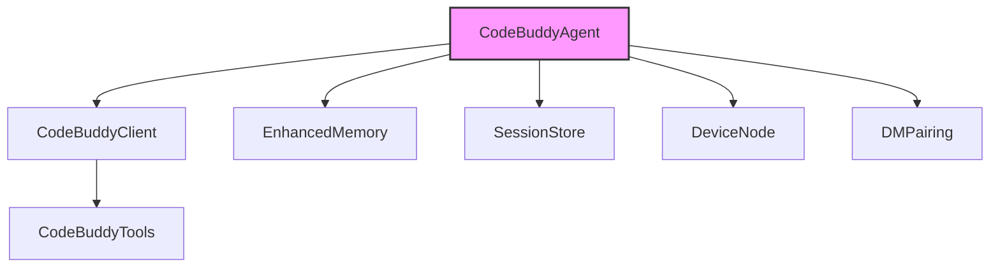

# @phuetz/code-buddy v0.5.0

This documentation provides an architectural overview of the `@phuetz/code-buddy` terminal-based AI coding agent. It is intended for developers and contributors who need to understand the system's modular structure, multi-provider LLM integration, and core operational workflows.

> Open-source multi-provider AI coding agent for the terminal. Supports Grok, Claude, ChatGPT, Gemini, Ollama and LM Studio with 52+ tools, multi-channel messaging, skills system, and OpenClaw-inspired architecture.

@phuetz/code-buddy is a terminal-based AI coding agent built in TypeScript/Node.js. It supports multiple LLM providers (Grok, Claude, ChatGPT, Gemini, Ollama, LM Studio) with automatic failover. The codebase contains 1077 source modules and 907 classes.

## Key Capabilities

- Multi-channel messaging (Telegram, Discord, Slack, WhatsApp, etc.)
- Background daemon with health monitoring
- Voice interaction with wake-word activation
- Sandboxed execution (Docker, OS-level)
- Advanced reasoning (Tree-of-Thought, MCTS)
- Code graph analysis (49110 relationships)
- Automated program repair (fault localization + LLM)
- Agent-to-Agent protocol (Google A2A spec)
- Workflow engine with DAG execution
- Cloud deployment (Fly.io, Railway, Render, GCP)

These capabilities are supported by a robust backend architecture designed for extensibility and high-performance code analysis, allowing the agent to maintain state across complex coding sessions.

## Project Statistics

| Metric | Value |
|--------|-------|
| Version | 0.5.0 |
| Source Modules | 1077 |
| Classes | 907 |
| Code Relationships | 49 110 |
| Dependencies | 35 |
| Dev Dependencies | 23 |

The following breakdown highlights the most critical modules within the repository, ranked by their architectural influence and dependency footprint.

## Core Modules (by architectural importance)

Ranked by PageRank — higher rank means more modules depend on this one:

| Module | PageRank | Importers | Functions | Description |
|--------|----------|-----------|-----------|-------------|
| `src/channels/dm-pairing` | 0.019 | 9 | 19 fns | Messaging channel integrations |
| `src/codebuddy/client` | 0.017 | 10 | 22 fns | Multi-provider LLM API client |
| `src/agent/codebuddy-agent` | 0.013 | 10 | 65 fns | Central agent orchestrator |
| `src/agent/extended-thinking` | 0.010 | 1 | 8 fns | Core agent system |
| `src/memory/enhanced-memory` | 0.009 | 2 | 28 fns | Memory and persistence |
| `src/persistence/session-store` | 0.008 | 6 | 44 fns | Session persistence and restore |
| `src/agent/repo-profiling/cartography` | 0.007 | 1 | 11 fns | Core agent system |
| `src/nodes/device-node` | 0.006 | 2 | 21 fns | Multi-device management |
| `src/codebuddy/tools` | 0.006 | 4 | 12 fns | Tool definitions and RAG selection |
| `src/tools/screenshot-tool` | 0.006 | 3 | 20 fns | Tool implementations |
| `src/agent/repo-profiler` | 0.005 | 3 | 13 fns | Core agent system |
| `src/deploy/cloud-configs` | 0.005 | 2 | 10 fns | Cloud deployment |
| `src/embeddings/embedding-provider` | 0.005 | 2 | 20 fns | Vector embedding generation |
| `src/utils/confirmation-service` | 0.005 | 3 | 21 fns | User approval gate for destructive ops |
| `src/prompts/prompt-manager` | 0.005 | 3 | 17 fns | System prompt construction |
| `src/agent/specialized/agent-registry` | 0.005 | 1 | 29 fns | Specialized agent registry (PDF, SQL, SWE...) |
| `src/agent/thinking/extended-thinking` | 0.005 | 1 | 30 fns | Core agent system |
| `src/memory/coding-style-analyzer` | 0.004 | 2 | 11 fns | Memory and persistence |
| `src/memory/decision-memory` | 0.004 | 1 | 10 fns | Memory and persistence |
| `src/utils/memory-monitor` | 0.004 | 1 | 23 fns | Shared utilities |

### System Architecture Flow

The following diagram illustrates the primary interaction flow between the core agent, memory subsystems, and external communication channels.



> **Key concept:** The `CodeBuddyAgent` acts as the central orchestrator, utilizing `CodeBuddyClient` for LLM interactions and `EnhancedMemory` for state persistence. Modifying these core modules requires careful regression testing due to their high dependency count.

### Component Interfaces

To interact with these modules, developers should utilize the established public interfaces. For instance, the `CodeBuddyAgent` serves as the primary orchestrator for memory and registry initialization. When managing sessions, developers interact with the persistence layer via the `SessionStore` module.

The system relies on a specific technology stack to manage these entry points and facilitate cross-platform compatibility.

## Entry Points

- **`src/server/index`** — HTTP/WebSocket server (Express)
- **`src/index`** — CLI entry point (Commander)

The entry points serve as the bootstrap layer, initializing the necessary managers before handing control to the agent loop.

## Technology Stack

| Category | Technologies |
|----------|-------------|
| CLI Framework | commander |
| Terminal UI | ink, react |
| LLM SDKs | openai, (multi-provider via OpenAI-compatible API) |
| HTTP Server | express, ws, cors |
| Database | better-sqlite3 |
| File Search | @vscode/ripgrep |
| Validation | zod |
| Browser Automation | playwright |
| MCP | @modelcontextprotocol/sdk |
| Testing | vitest |

To begin working with the codebase, follow the standard installation and build procedures outlined below.

## Getting Started

```bash
# Install
npm install

# Build
npm run build

# Development mode
npm run dev

# Run
npm start

# Verify
npm test
```

---

**See also:** [Architecture](./2-architecture.md) · [Subsystems](./3-subsystems.md) · [Tool System](./5-tools.md) · [Security](./6-security.md)

**Key source files:** `src/channels/dm-pairing.ts`, `src/codebuddy/client.ts`, `src/agent/codebuddy-agent.ts`, `src/agent/extended-thinking.ts`, `src/memory/enhanced-memory.ts`, `src/persistence/session-store.ts`, `src/agent/repo-profiling/cartography.ts`, `src/nodes/device-node.ts`