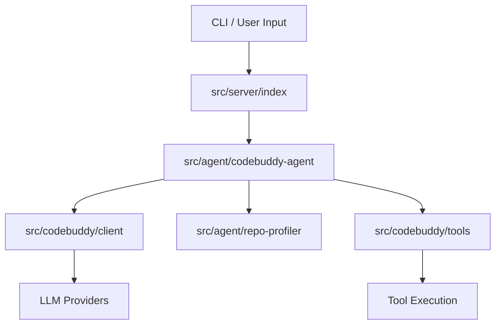

# @phuetz/code-buddy v0.5.0

The `@phuetz/code-buddy` project is a high-performance, terminal-based AI coding agent designed for complex software engineering tasks. This documentation provides an overview of the system architecture, core capabilities, and technical stack, serving as the primary reference for developers integrating with or extending the agent's functionality.

## System Overview

`@phuetz/code-buddy` is a TypeScript/Node.js application that leverages a modular architecture to provide multi-provider LLM support, including Grok, Claude, ChatGPT, Gemini, Ollama, and LM Studio. The system is built to handle sophisticated reasoning tasks, such as automated program repair and code graph analysis, through a robust background daemon and a comprehensive tool-use framework.

> **Key concept:** The `src/codebuddy/client` acts as a unified abstraction layer, enabling automatic failover between providers. This ensures that if a primary LLM API experiences latency or downtime, the agent seamlessly routes requests to a secondary provider without interrupting the user session.

## Key Capabilities

The agent is designed for extensibility, supporting a wide array of operational modes ranging from voice-activated interaction to autonomous multi-agent workflows.

- Multi-channel messaging (Telegram, Discord, Slack, WhatsApp, etc.)
- Background daemon with health monitoring
- Voice interaction with wake-word activation
- Sandboxed execution (Docker, OS-level)
- Advanced reasoning (Tree-of-Thought, MCTS)
- Code graph analysis (49096 relationships)
- Automated program repair (fault localization + LLM)
- Agent-to-Agent protocol (Google A2A spec)
- Workflow engine with DAG execution
- Cloud deployment (Fly.io, Railway, Render, GCP)

## Project Statistics

The following metrics reflect the scale of the codebase and the complexity of the dependency graph maintained within the repository.

| Metric | Value |
|--------|-------|
| Version | 0.5.0 |
| Source Modules | 1076 |
| Classes | 905 |
| Code Relationships | 49 096 |
| Dependencies | 35 |
| Dev Dependencies | 23 |

## Core Modules (by architectural importance)

The core logic is organized by PageRank, identifying the most critical modules that serve as the foundation for the agent's orchestration and reasoning capabilities. Developers should exercise caution when modifying high-rank modules, as changes here propagate across the entire system.

| Module | PageRank | Importers | Description |
|--------|----------|-----------|-------------|
| `src/channels/dm-pairing` | 0.019 | 9 | Messaging channel integrations |
| `src/codebuddy/client` | 0.017 | 10 | Multi-provider LLM API client |
| `src/agent/codebuddy-agent` | 0.013 | 10 | Central agent orchestrator |
| `src/optimization/cache-breakpoints` | 0.010 | 2 | Performance optimization |
| `src/agent/extended-thinking` | 0.010 | 1 | Core agent system |
| `src/memory/enhanced-memory` | 0.009 | 2 | Memory and persistence |
| `src/persistence/session-store` | 0.008 | 6 | Session persistence and restore |
| `src/agent/repo-profiling/cartography` | 0.007 | 1 | Core agent system |
| `src/nodes/device-node` | 0.006 | 2 | Multi-device management |
| `src/codebuddy/tools` | 0.006 | 4 | Tool definitions and RAG selection |
| `src/tools/screenshot-tool` | 0.006 | 3 | Tool implementations |
| `src/agent/repo-profiler` | 0.005 | 3 | Core agent system |
| `src/deploy/cloud-configs` | 0.005 | 2 | Cloud deployment |
| `src/embeddings/embedding-provider` | 0.005 | 2 | Vector embedding generation |
| `src/utils/confirmation-service` | 0.005 | 3 | User approval gate for destructive ops |
| `src/prompts/prompt-manager` | 0.005 | 3 | System prompt construction |
| `src/commands/dev/workflows` | 0.005 | 2 | CLI and slash commands |
| `src/agent/specialized/agent-registry` | 0.005 | 1 | Specialized agent registry (PDF, SQL, SWE...) |
| `src/agent/thinking/extended-thinking` | 0.005 | 1 | Core agent system |
| `src/knowledge/path` | 0.005 | 1 | Code analysis and knowledge graph |

> **Key concept:** The `src/codebuddy/tools` module implements a RAG-based selector that dynamically filters available tools based on the current context, reducing prompt size from 110+ tools to ~15, saving approximately 8,000 tokens per LLM call.

## Entry Points

The system provides two primary entry points for interaction, depending on whether the user is running the agent as a persistent server or a transient CLI utility.

- **`src/server/index`** — HTTP/WebSocket server (Express)
- **`src/index`** — CLI entry point (Commander)

## Technology Stack

The project utilizes a modern TypeScript stack, prioritizing type safety and performance through libraries like `zod` for validation and `better-sqlite3` for local state management.

| Category | Technologies |
|----------|-------------|
| CLI Framework | commander |
| Terminal UI | ink, react |
| LLM SDKs | openai, (multi-provider via OpenAI-compatible API) |
| HTTP Server | express, ws, cors |
| Database | better-sqlite3 |
| File Search | @vscode/ripgrep |
| Validation | zod |
| Browser Automation | playwright |
| MCP | @modelcontextprotocol/sdk |
| Testing | vitest |

The integration of `src/codebuddy/client.ts` ensures that all LLM interactions are standardized, while `src/agent/codebuddy-agent.ts` manages the lifecycle of the agent's reasoning processes.

**See also:** [Architecture](./2-architecture.md) · [Subsystems](./3-subsystems.md) · [Tool System](./5-tools.md) · [Security](./6-security.md)

**Key source files:** `src/channels/dm-pairing.ts`, `src/codebuddy/client.ts`, `src/agent/codebuddy-agent.ts`, `src/optimization/cache-breakpoints.ts`, `src/agent/extended-thinking.ts`, `src/memory/enhanced-memory.ts`, `src/persistence/session-store.ts`, `src/agent/repo-profiling/cartography.ts`