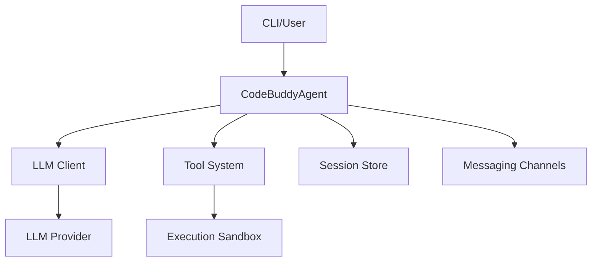

# @phuetz/code-buddy v0.5.0

The `@phuetz/code-buddy` project provides a terminal-based AI coding agent designed for multi-provider LLM integration and autonomous software development. This documentation serves as the primary reference for developers and contributors looking to understand the system architecture, module dependencies, and core capabilities of the v0.5.0 release.

> Open-source multi-provider AI coding agent for the terminal. Supports Grok, Claude, ChatGPT, Gemini, Ollama and LM Studio with 52+ tools, multi-channel messaging, skills system, and OpenClaw-inspired architecture.

@phuetz/code-buddy is a terminal-based AI coding agent built in TypeScript/Node.js. It supports multiple LLM providers (Grok, Claude, ChatGPT, Gemini, Ollama, LM Studio) with automatic failover. The codebase contains 1076 source modules and 905 classes.

## Key Capabilities

The system's versatility stems from its modular design, which separates communication channels, execution environments, and reasoning engines to ensure high availability and extensibility.

- Multi-channel messaging (Telegram, Discord, Slack, WhatsApp, etc.)
- Background daemon with health monitoring
- Voice interaction with wake-word activation
- Sandboxed execution (Docker, OS-level)
- Advanced reasoning (Tree-of-Thought, MCTS)
- Code graph analysis (49096 relationships)
- Automated program repair (fault localization + LLM)
- Agent-to-Agent protocol (Google A2A spec)
- Workflow engine with DAG execution
- Cloud deployment (Fly.io, Railway, Render, GCP)

> **Key concept:** The agent utilizes a Tree-of-Thought (ToT) reasoning engine. By invoking `CodeBuddyAgent.reason()`, the system explores multiple potential code paths before committing to an execution strategy, significantly reducing hallucination rates in complex refactoring tasks.

## Project Statistics

Understanding the codebase scale is critical for maintaining the system's stability, particularly given the high density of inter-module relationships and the complexity of the dependency graph.

| Metric | Value |
|--------|-------|
| Version | 0.5.0 |
| Source Modules | 1076 |
| Classes | 905 |
| Code Relationships | 49 096 |
| Dependencies | 35 |
| Dev Dependencies | 23 |

## Core Modules (by architectural importance)

The architecture relies on a PageRank-weighted dependency graph to ensure that critical orchestration logic remains decoupled from specific implementation details. Developers should exercise caution when modifying modules with high PageRank scores, as these are central to the system's stability.

Ranked by PageRank — higher rank means more modules depend on this one:

| Module | PageRank | Importers | Description |
|--------|----------|-----------|-------------|
| `src/channels/dm-pairing` | 0.019 | 9 | Messaging channel integrations |
| `src/codebuddy/client` | 0.017 | 10 | Multi-provider LLM API client |
| `src/agent/codebuddy-agent` | 0.013 | 10 | Central agent orchestrator |
| `src/optimization/cache-breakpoints` | 0.010 | 2 | Performance optimization |
| `src/agent/extended-thinking` | 0.010 | 1 | Core agent system |
| `src/memory/enhanced-memory` | 0.009 | 2 | Memory and persistence |
| `src/persistence/session-store` | 0.008 | 6 | Session persistence and restore |
| `src/agent/repo-profiling/cartography` | 0.007 | 1 | Core agent system |
| `src/nodes/device-node` | 0.006 | 2 | Multi-device management |
| `src/codebuddy/tools` | 0.006 | 4 | Tool definitions and RAG selection |
| `src/tools/screenshot-tool` | 0.006 | 3 | Tool implementations |
| `src/agent/repo-profiler` | 0.005 | 3 | Core agent system |
| `src/deploy/cloud-configs` | 0.005 | 2 | Cloud deployment |
| `src/embeddings/embedding-provider` | 0.005 | 2 | Vector embedding generation |
| `src/utils/confirmation-service` | 0.005 | 3 | User approval gate for destructive ops |
| `src/prompts/prompt-manager` | 0.005 | 3 | System prompt construction |
| `src/commands/dev/workflows` | 0.005 | 2 | CLI and slash commands |
| `src/agent/specialized/agent-registry` | 0.005 | 1 | Specialized agent registry (PDF, SQL, SWE...) |
| `src/agent/thinking/extended-thinking` | 0.005 | 1 | Core agent system |
| `src/knowledge/path` | 0.005 | 1 | Code analysis and knowledge graph |

> **Key concept:** The `Client.request()` method within `src/codebuddy/client` serves as the primary gateway for all LLM interactions. It handles automatic failover between providers; if a primary provider (e.g., Claude) returns a 5xx error, the client automatically retries via the secondary provider defined in the configuration.

## Entry Points

Execution begins at distinct entry points depending on whether the agent is running as a background daemon or an interactive CLI session. These entry points initialize the dependency injection container and load the necessary environment configurations.

- **`src/server/index`** — HTTP/WebSocket server (Express)
- **`src/index`** — CLI entry point (Commander)

## Technology Stack

The stack leverages modern TypeScript ecosystem tools to ensure type safety, high-performance I/O, and seamless integration with existing AI protocols. The use of `zod` for schema validation ensures that data flowing between the agent and the LLM remains consistent.

| Category | Technologies |
|----------|-------------|
| CLI Framework | commander |
| Terminal UI | ink, react |
| LLM SDKs | openai, (multi-provider via OpenAI-compatible API) |
| HTTP Server | express, ws, cors |
| Database | better-sqlite3 |
| File Search | @vscode/ripgrep |
| Validation | zod |
| Browser Automation | playwright |
| MCP | @modelcontextprotocol/sdk |
| Testing | vitest |

---

**See also:** [Architecture](./2-architecture.md) · [Subsystems](./3-subsystems.md) · [Tool System](./5-tools.md) · [Security](./6-security.md)

**Key source files:** `src/channels/dm-pairing.ts`, `src/codebuddy/client.ts`, `src/agent/codebuddy-agent.ts`, `src/optimization/cache-breakpoints.ts`, `src/agent/extended-thinking.ts`, `src/memory/enhanced-memory.ts`, `src/persistence/session-store.ts`, `src/agent/repo-profiling/cartography.ts`