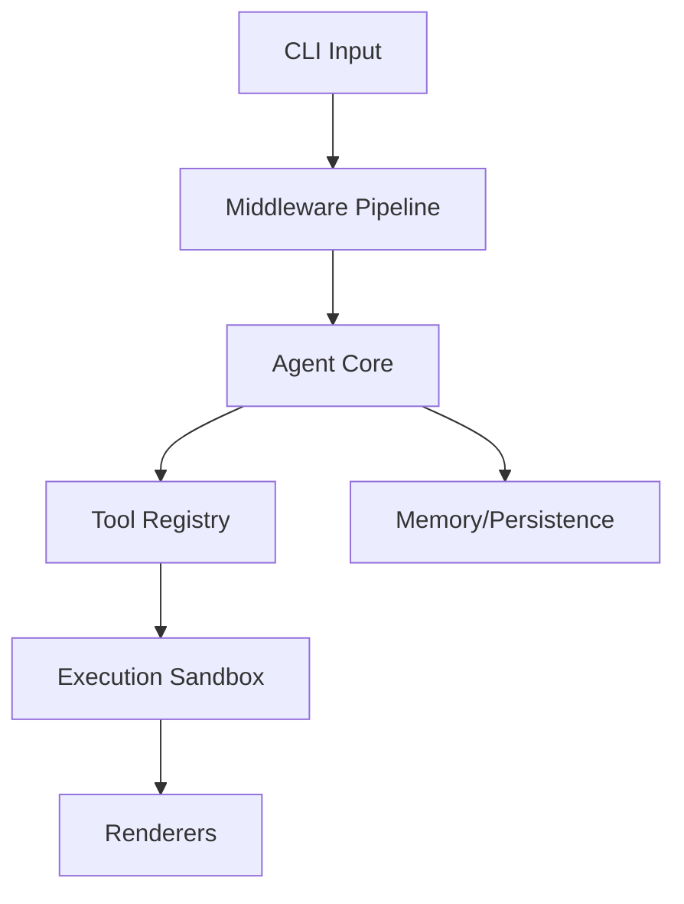

# Development Guide

This guide provides the essential workflows, project structure, and coding standards required to contribute to the `grok-cli` repository. Whether you are adding new tool integrations or modifying core agent logic, following these conventions ensures consistency, maintainability, and compatibility with the existing build pipeline.

## Getting Started

To begin development, clone the repository and install the necessary dependencies. The project supports both Bun and Node.js environments, though Bun is recommended for faster development cycles.

```bash
git clone <repo-url>
cd grok-cli
npm install
npm run dev          # Development mode (Bun)
npm run dev:node     # Development mode (tsx/Node.js)
```

## Build & Development Commands

The project utilizes a comprehensive set of npm scripts to manage the lifecycle of the application, from compilation to testing and linting. Use the following table as a reference for standard development operations.

| Command | Description |
|---------|-------------|
| `npm run build` | `tsc` |
| `npm run build:bun` | `bun run tsc` |
| `npm run build:watch` | `tsc --watch` |
| `npm run clean` | `rm -rf dist coverage .nyc_output *.tsbuildinfo` |
| `npm run dev` | `bun run src/index.ts` |
| `npm run dev:node` | `tsx src/index.ts` |
| `npm run start` | `node dist/index.js` |
| `npm run start:bun` | `bun run dist/index.js` |
| `npm run test` | `vitest run` |
| `npm run test:watch` | `vitest` |
| `npm run test:coverage` | `vitest run --coverage` |
| `npm run lint` | `eslint . --ext .js,.jsx,.ts,.tsx` |
| `npm run lint:fix` | `eslint . --ext .js,.jsx,.ts,.tsx --fix` |
| `npm run format` | `prettier --write "src/**/*.{ts,tsx,js,jsx,json,md}"` |
| `npm run format:check` | `prettier --check "src/**/*.{ts,tsx,js,jsx,json,md}"` |
| `npm run typecheck` | `tsc --noEmit` |
| `npm run typecheck:watch` | `tsc --noEmit --watch` |
| `npm run check:circular` | `npx tsx scripts/check-circular-deps.ts` |
| `npm run validate` | `npm run lint && npm run typecheck && npm test` |
| `npm run install:bun` | `bun install` |

Once the environment is configured, it is helpful to understand the high-level organization of the codebase to locate specific modules.

## Project Structure

The `src/` directory is organized by domain, separating core agent logic from infrastructure, UI, and external integrations. The following tree outlines the primary directories and their responsibilities.

```
src/
├── acp                  # Acp (1 files)
├── advanced             # Advanced (8 files)
├── agent                # Core agent system (167 files)
├── agents               # Agents (1 files)
├── analytics            # Usage analytics and cost tracking (12 files)
├── api                  # Api (2 files)
├── app                  # App (3 files)
├── auth                 # Auth (5 files)
├── automation           # Automation (2 files)
├── benchmarks           # Benchmarks (1 files)
├── browser              # Browser (4 files)
├── browser-automation   # Browser automation (7 files)
├── cache                # Cache (8 files)
├── canvas               # Canvas (9 files)
├── channels             # Messaging channel integrations (60 files)
├── checkpoints          # Undo and snapshots (5 files)
├── cli                  # Cli (5 files)
├── cloud                # Cloud (1 files)
├── codebuddy            # LLM client and tool definitions (15 files)
├── collaboration        # Collaboration (4 files)
├── commands             # CLI and slash commands (76 files)
├── concurrency          # Concurrency (3 files)
├── config               # Configuration management (22 files)
├── context              # Context window management (54 files)
├── copilot              # Copilot (1 files)
├── daemon               # Background daemon service (8 files)
├── database             # Database management (11 files)
├── deploy               # Cloud deployment (2 files)
├── desktop              # Desktop (1 files)
├── desktop-automation   # Desktop automation (12 files)
├── docs                 # Documentation generation (3 files)
├── doctor               # Doctor (1 files)
├── elevated-mode        # Elevated mode (1 files)
├── email                # Email (4 files)
├── embeddings           # Embeddings (2 files)
├── encoding             # Encoding (4 files)
├── errors               # Error handling (7 files)
├── events               # Events (6 files)
├── export               # Export (1 files)
├── extensions           # Extensions (1 files)
├── fcs                  # Fcs (9 files)
├── features             # Features (1 files)
├── gateway              # Gateway (4 files)
├── git                  # Git (1 files)
├── hardware             # Hardware (2 files)
├── hooks                # Execution hooks (22 files)
├── ide                  # Ide (2 files)
├── identity             # Identity (1 files)
├── inference            # Inference (3 files)
├── infrastructure       # Infrastructure (5 files)
├── input                # Input (8 files)
├── integrations         # External service integrations (28 files)
├── intelligence         # Intelligence (6 files)
├── interpreter          # Interpreter (9 files)
├── knowledge            # Code analysis and knowledge graph (26 files)
├── learning             # Learning (2 files)
├── location             # Location (1 files)
├── logging              # Logging (2 files)
├── lsp                  # Lsp (3 files)
├── mcp                  # Model Context Protocol servers (14 files)
├── media                # Media (1 files)
├── memory               # Memory and persistence (15 files)
├── metrics              # Metrics (2 files)
├── middleware           # Middleware pipeline (4 files)
├── models               # Models (2 files)
├── modes                # Modes (2 files)
├── networking           # Networking (3 files)
├── nodes                # Multi-device management (7 files)
├── observability        # Logging, metrics, tracing (6 files)
├── offline              # Offline (2 files)
├── openclaw             # Openclaw (1 files)
├── optimization         # Performance optimization (7 files)
├── orchestration        # Orchestration (5 files)
├── output               # Output (1 files)
├── performance          # Performance (6 files)
├── permissions          # Permissions (0 files)
├── persistence          # Persistence (6 files)
├── personas             # Personas (2 files)
├── plugins              # Plugin system (12 files)
├── presence             # Presence (1 files)
├── prompts              # Prompts (5 files)
├── protocols            # Agent protocols (A2A) (1 files)
├── providers            # LLM provider adapters (12 files)
├── queue                # Queue (5 files)
├── registry             # Registry (0 files)
├── renderers            # Output rendering (18 files)
├── rules                # Rules (1 files)
├── sandbox              # Execution sandboxing (7 files)
├── scheduler            # Scheduler (4 files)
├── screen               # Screen (0 files)
├── screen-capture       # Screen capture (3 files)
├── scripting            # Scripting (9 files)
├── sdk                  # Sdk (1 files)
├── search               # Search and indexing (5 files)
├── security             # Security and validation (45 files)
├── server               # HTTP/WebSocket server (24 files)
├── services             # Services (10 files)
├── session-pruning      # Session pruning (3 files)
├── sidecar              # Sidecar (1 files)
├── skills               # Skill registry and marketplace (13 files)
├── skills-registry      # Skills registry (1 files)
├── streaming            # Streaming response handling (13 files)
├── sync                 # Sync (6 files)
├── talk-mode            # Talk mode (8 files)
├── tasks                # Tasks (2 files)
├── telemetry            # Telemetry (1 files)
├── templates            # Templates (5 files)
├── testing              # Testing (5 files)
├── themes               # Themes (5 files)
├── tools                # Tool implementations (128 files)
├── tracks               # Tracks (4 files)
├── tts                  # Tts (0 files)
├── types                # TypeScript type definitions (8 files)
├── ui                   # Terminal UI components (24 files)
├── undo                 # Undo (2 files)
├── utils                # Shared utilities (84 files)
├── versioning           # Versioning (4 files)
├── voice                # Voice and TTS (5 files)
├── webhooks             # Webhooks (1 files)
├── wizard               # Wizard (1 files)
├── workflows            # Workflow DAG engine (8 files)
├── workspace            # Workspace (2 files)
└── index.ts            # Entry point
```

To visualize how these components interact, consider the following data flow diagram representing the core execution path from CLI input to tool execution.



> **Key concept:** The `Agent` core acts as the central orchestrator, delegating tasks to the `Tool Registry` and managing state via `Memory` and `Middleware` to ensure consistent execution across different modes.

## Coding Conventions

Adherence to strict coding standards is enforced to maintain code quality across the repository. All contributors must follow these guidelines:

*   **TypeScript strict mode:** Enabled to prevent runtime type errors.
*   **Semicolons:** Required for all statements.
*   **ESM modules:** The project uses `"type": "module"` for native ESM support.

## Testing

The testing suite is built on **Vitest** with `happy-dom` to simulate browser environments where necessary. Tests should be co-located with their source files (e.g., `src/agent/core.test.ts`) or placed in the `tests/` directory for integration suites.

*   **Run all tests:** `npm test`
*   **Development mode:** `npm run test:watch`
*   **Coverage report:** `npm run test:coverage`
*   **Validation:** `npm run validate` (executes linting, type checking, and testing)

## Extension Points

The system is designed to be modular, allowing for the easy addition of new capabilities. When extending the system, ensure you register your new components in the appropriate registry files to make them discoverable by the core agent.

*   **Tools:** Add new implementations in `src/tools/`, register them in `src/tools/registry/`, and define metadata in `src/tools/metadata.ts`.
*   **Channels:** Add new messaging integrations in `src/channels/`.
*   **Plugins:** Add new plugins in `src/plugins/`.

---

**See also:** [Overview](./1-overview.md) · [Architecture](./2-architecture.md) · [Subsystems](./3-subsystems.md) · [Tool System](./5-tools.md)

**Key source files:** `src/tools/.ts`, `src/tools/registry/.ts`, `src/tools/metadata.ts`, `src/channels/.ts`, `src/plugins/.ts`