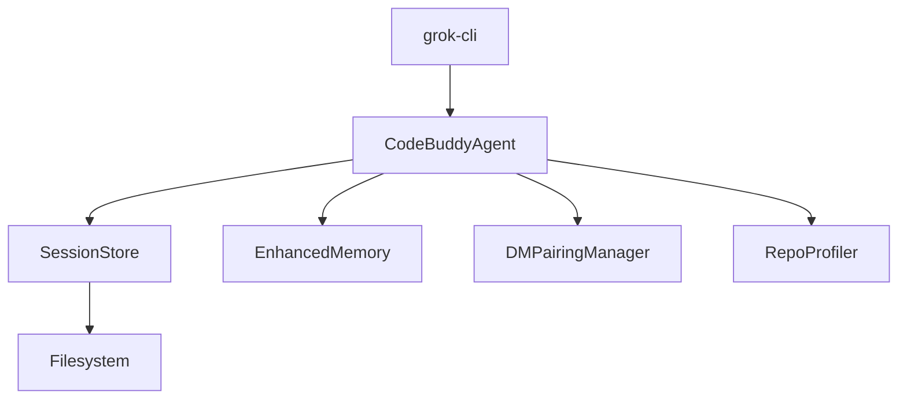
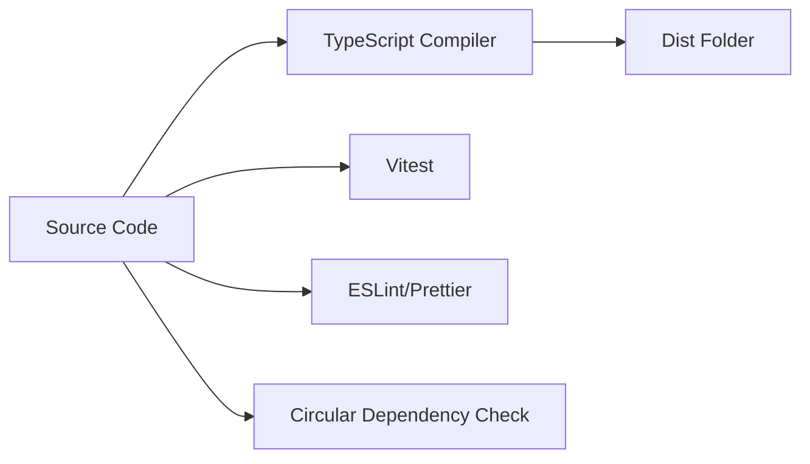
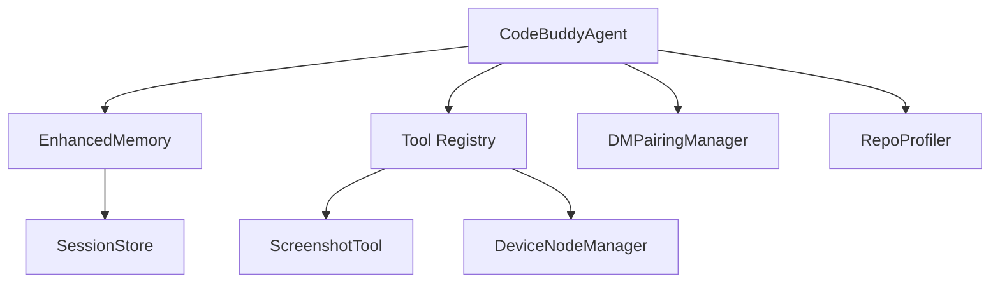
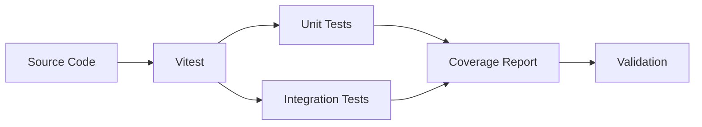
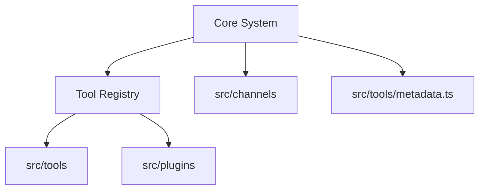

# Development Guide


# Getting Started

This section provides the foundational steps for setting up the `grok-cli` development environment. Developers should follow these instructions to initialize the local repository, install dependencies, and launch the runtime, which is a prerequisite for modifying core components such as the `CodeBuddyAgent` or the `DMPairingManager`.

```bash
git clone <repo-url>
cd grok-cli
npm install
npm run dev          # Development mode (Bun)
npm run dev:node     # Development mode (tsx/Node.js)
```

Once the environment is configured, the system initializes various subsystems to manage state, memory, and tool integration. Understanding the startup sequence is critical for debugging initialization failures in the agent registry or session persistence layers.



> **Key concept:** The `CodeBuddyAgent.initializeAgentRegistry()` method acts as the central orchestrator during startup, dynamically loading skills and memory providers to ensure the agent is context-aware before the first user interaction.

After the development server is active, the application lifecycle begins by verifying the environment state. The system relies on `CodeBuddyAgent.initializeAgentSystemPrompt()` to set the initial behavior and `SessionStore.ensureSessionsDirectory()` to verify that the local filesystem is ready for persistence. If you are working on connectivity features, ensure that `DMPairingManager.requiresPairing()` is evaluated correctly during the initial handshake to prevent unauthorized access to the agent's toolset.

# Build & Development Commands

This section outlines the standard build, test, and development lifecycle commands for the project. Developers should familiarize themselves with these scripts to ensure consistent environment configuration, code quality, and successful deployment across different runtime targets like Node.js and Bun.



The following table details the available npm scripts used to manage the project lifecycle, from initial compilation to final validation.

| Command | Description |
|---------|-------------|
| `npm run build` | `tsc` |
| `npm run build:bun` | `bun run tsc` |
| `npm run build:watch` | `tsc --watch` |
| `npm run clean` | `rm -rf dist coverage .nyc_output *.tsbuildinfo` |
| `npm run dev` | `bun run src/index.ts` |
| `npm run dev:node` | `tsx src/index.ts` |
| `npm run start` | `node dist/index.js` |
| `npm run start:bun` | `bun run dist/index.js` |
| `npm run test` | `vitest run` |
| `npm run test:watch` | `vitest` |
| `npm run test:coverage` | `vitest run --coverage` |
| `npm run lint` | `eslint . --ext .js,.jsx,.ts,.tsx` |
| `npm run lint:fix` | `eslint . --ext .js,.jsx,.ts,.tsx --fix` |
| `npm run format` | `prettier --write "src/**/*.{ts,tsx,js,jsx,json,md}"` |
| `npm run format:check` | `prettier --check "src/**/*.{ts,tsx,js,jsx,json,md}"` |
| `npm run typecheck` | `tsc --noEmit` |
| `npm run typecheck:watch` | `tsc --noEmit --watch` |
| `npm run check:circular` | `npx tsx scripts/check-circular-deps.ts` |
| `npm run validate` | `npm run lint && npm run typecheck && npm test` |
| `npm run install:bun` | `bun install` |

While these commands facilitate the build process, the underlying system relies on specific architectural modules to manage state, memory, and tool integration. Understanding how these components interact is critical when debugging build failures or extending core functionality.

> **Key concept:** The `npm run check:circular` command is a critical gatekeeper in the CI/CD pipeline. It prevents complex dependency cycles that can cause runtime initialization failures in core modules like `CodeBuddyAgent` or `DMPairingManager`.

The build process ensures that core modules are correctly compiled and linked. When developing features that interact with the agent's core, ensure that initialization methods such as `CodeBuddyAgent.initializeAgentRegistry()` and `SessionStore.createSession()` are properly handled within the build artifacts. Additionally, profiling tools like `RepoProfiler.getProfile()` rely on the integrity of the generated code graph, which is validated during the `npm run build` process.

# Project Structure

This section outlines the `src/` directory structure, which serves as the architectural blueprint for the codebase. Understanding this organization is critical for developers to locate specific logic, manage dependencies, and contribute effectively to the modular system.

```
src/
├── acp                  # Acp (1 files)
├── advanced             # Advanced (8 files)
├── agent                # Core agent system (167 files)
├── agents               # Agents (1 files)
├── analytics            # Usage analytics and cost tracking (12 files)
├── api                  # Api (2 files)
├── app                  # App (3 files)
├── auth                 # Auth (5 files)
├── automation           # Automation (2 files)
├── benchmarks           # Benchmarks (1 files)
├── browser              # Browser (4 files)
├── browser-automation   # Browser automation (7 files)
├── cache                # Cache (8 files)
├── canvas               # Canvas (9 files)
├── channels             # Messaging channel integrations (60 files)
├── checkpoints          # Undo and snapshots (5 files)
├── cli                  # Cli (5 files)
├── cloud                # Cloud (1 files)
├── codebuddy            # LLM client and tool definitions (15 files)
├── collaboration        # Collaboration (4 files)
├── commands             # CLI and slash commands (76 files)
├── concurrency          # Concurrency (3 files)
├── config               # Configuration management (22 files)
├── context              # Context window management (54 files)
├── copilot              # Copilot (1 files)
├── daemon               # Background daemon service (8 files)
├── database             # Database management (11 files)
├── deploy               # Cloud deployment (2 files)
├── desktop              # Desktop (1 files)
├── desktop-automation   # Desktop automation (12 files)
├── docs                 # Documentation generation (4 files)
├── doctor               # Doctor (1 files)
├── elevated-mode        # Elevated mode (1 files)
├── email                # Email (4 files)
├── embeddings           # Embeddings (2 files)
├── encoding             # Encoding (4 files)
├── errors               # Error handling (7 files)
├── events               # Events (6 files)
├── export               # Export (1 files)
├── extensions           # Extensions (1 files)
├── fcs                  # Fcs (9 files)
├── features             # Features (1 files)
├── gateway              # Gateway (4 files)
├── git                  # Git (1 files)
├── hardware             # Hardware (2 files)
├── hooks                # Execution hooks (22 files)
├── ide                  # Ide (2 files)
├── identity             # Identity (1 files)
├── inference            # Inference (3 files)
├── infrastructure       # Infrastructure (5 files)
├── input                # Input (8 files)
├── integrations         # External service integrations (28 files)
├── intelligence         # Intelligence (6 files)
├── interpreter          # Interpreter (9 files)
├── knowledge            # Code analysis and knowledge graph (26 files)
├── learning             # Learning (2 files)
├── location             # Location (1 files)
├── logging              # Logging (2 files)
├── lsp                  # Lsp (3 files)
├── mcp                  # Model Context Protocol servers (14 files)
├── media                # Media (1 files)
├── memory               # Memory and persistence (15 files)
├── metrics              # Metrics (2 files)
├── middleware           # Middleware pipeline (4 files)
├── models               # Models (2 files)
├── modes                # Modes (2 files)
├── networking           # Networking (3 files)
├── nodes                # Multi-device management (7 files)
├── observability        # Logging, metrics, tracing (6 files)
├── offline              # Offline (2 files)
├── openclaw             # Openclaw (1 files)
├── optimization         # Performance optimization (7 files)
├── orchestration        # Orchestration (5 files)
├── output               # Output (1 files)
├── performance          # Performance (6 files)
├── permissions          # Permissions (0 files)
├── persistence          # Persistence (6 files)
├── personas             # Personas (2 files)
├── plugins              # Plugin system (12 files)
├── presence             # Presence (1 files)
├── prompts              # Prompts (5 files)
├── protocols            # Agent protocols (A2A) (1 files)
├── providers            # LLM provider adapters (12 files)
├── queue                # Queue (5 files)
├── registry             # Registry (0 files)
├── renderers            # Output rendering (18 files)
├── rules                # Rules (1 files)
├── sandbox              # Execution sandboxing (7 files)
├── scheduler            # Scheduler (4 files)
├── screen               # Screen (0 files)
├── screen-capture       # Screen capture (3 files)
├── scripting            # Scripting (9 files)
├── sdk                  # Sdk (1 files)
├── search               # Search and indexing (5 files)
├── security             # Security and validation (45 files)
├── server               # HTTP/WebSocket server (24 files)
├── services             # Services (10 files)
├── session-pruning      # Session pruning (3 files)
├── sidecar              # Sidecar (1 files)
├── skills               # Skill registry and marketplace (13 files)
├── skills-registry      # Skills registry (1 files)
├── streaming            # Streaming response handling (13 files)
├── sync                 # Sync (6 files)
├── talk-mode            # Talk mode (8 files)
├── tasks                # Tasks (2 files)
├── telemetry            # Telemetry (1 files)
├── templates            # Templates (5 files)
├── testing              # Testing (5 files)
├── themes               # Themes (5 files)
├── tools                # Tool implementations (128 files)
├── tracks               # Tracks (4 files)
├── tts                  # Tts (0 files)
├── types                # TypeScript type definitions (8 files)
├── ui                   # Terminal UI components (24 files)
├── undo                 # Undo (2 files)
├── utils                # Shared utilities (84 files)
├── versioning           # Versioning (4 files)
├── voice                # Voice and TTS (5 files)
├── webhooks             # Webhooks (1 files)
├── wizard               # Wizard (1 files)
├── workflows            # Workflow DAG engine (8 files)
├── workspace            # Workspace (2 files)
└── index.ts            # Entry point
```

While the directory structure provides a high-level overview of the filesystem, the actual system behavior is driven by specific, highly-coupled modules. The following architectural components represent the core logic engines that facilitate agent operations, memory management, and tool execution.

### Architectural Data Flow

The following diagram illustrates the relationship between the core agent, memory, and tool subsystems.



> **Key concept:** The `CodeBuddyAgent` acts as the central orchestrator, utilizing `CodeBuddyAgent.initializeSkills` and `CodeBuddyAgent.initializeAgentRegistry` to dynamically load capabilities, effectively decoupling the core agent logic from specific tool implementations.

### Core Agent and Client Logic
The agent system is anchored by `CodeBuddyAgent`, which manages the lifecycle of the AI interaction. It relies on `CodeBuddyClient` to interface with various LLM providers, ensuring that model capabilities are validated before execution.

*   **Agent Initialization:** Use `CodeBuddyAgent.initializeAgentSystemPrompt()` to set the behavioral context and `CodeBuddyAgent.setRunId()` to track execution state.
*   **Client Validation:** Before invoking an LLM, ensure the model is supported via `CodeBuddyClient.validateModel()` and check for tool support using `CodeBuddyClient.probeToolSupport()`.

### Memory and Persistence
State management is handled through a combination of session persistence and long-term memory storage. This ensures that the agent maintains context across restarts and complex workflows.

*   **Session Management:** `SessionStore.saveSession()` and `SessionStore.loadSession()` are the primary methods for handling chat history.
*   **Memory Operations:** `EnhancedMemory.store()` is used to persist information, while `EnhancedMemory.calculateImportance()` determines the relevance of stored data to the current context.

### Tooling and Channel Integration
The system extends its capabilities through a robust tool registry and channel management system. This allows the agent to interact with external hardware, capture screen data, and manage direct messaging pairings.

*   **Channel Security:** `DMPairingManager.approve()` and `DMPairingManager.revoke()` manage the authorization state of direct messaging channels.
*   **Hardware Interaction:** `ScreenshotTool.capture()` provides visual context, while `DeviceNodeManager.pairDevice()` handles the lifecycle of connected hardware nodes.

### Profiling and Optimization
To maintain performance within the context window, the system employs profiling and optimization strategies. These components analyze the codebase and manage the "thinking" budget of the agent.

*   **Code Profiling:** `RepoProfiler.getProfile()` generates the necessary context graph for the agent to understand the repository structure.
*   **Extended Thinking:** Use `ExtendedThinkingManager.setTokenBudget()` to control the depth of reasoning, and `ExtendedThinkingManager.toggle()` to enable or disable extended thinking capabilities dynamically.

## Coding Conventions

- TypeScript strict mode
- Semicolons
- ESM modules (`"type": "module"`)


# Testing

The testing infrastructure ensures system reliability through a comprehensive suite of unit and integration tests. Developers should utilize these tools to verify changes before submission, as the CI pipeline enforces strict coverage and validation requirements to prevent regressions in core functionality.



- Framework: **Vitest** with happy-dom
- Tests in `tests/` and co-located `src/**/*.test.ts`
- Run: `npm test` (all), `npm run test:watch` (dev)
- Coverage: `npm run test:coverage`
- Validate: `npm run validate` (lint + typecheck + test)

> **Key concept:** The `npm run validate` command acts as a gatekeeper, executing linting, type checking, and the full test suite in a single pass to ensure architectural integrity before merging.

### Component-Specific Testing

When testing core modules, ensure that stateful components are properly initialized and that lifecycle methods are exercised. For instance, verify session persistence by invoking `SessionStore.createSession()` followed by `SessionStore.saveSession()` to confirm data integrity during state transitions.

Beyond standard unit tests, developers must validate agent behavior and memory initialization. When testing the agent's setup, use `CodeBuddyAgent.initializeAgentSystemPrompt()` to ensure the system prompt is correctly configured, and verify memory state with `EnhancedMemory.initialize()` to ensure the agent has access to the required context before running inference.

### Integration and Mocking

The system relies on `happy-dom` to simulate browser environments, which is particularly useful for testing UI-adjacent logic or tool execution. When testing tool integration, ensure that the registry is correctly populated by calling `initializeToolRegistry()` and verifying that the resulting toolset matches expected capabilities.

For modules involving external device communication or transport layers, utilize the `DeviceNodeManager` to simulate connection states. Always verify that `DeviceNodeManager.createTransport()` and `DeviceNodeManager.pairDevice()` are tested in isolation to prevent side effects from leaking into the broader test suite.

## Extension Points

The system is designed with a modular architecture that prioritizes extensibility through well-defined entry points. By adhering to these patterns, developers can introduce new functionality—ranging from specialized tools to communication channels—without introducing regressions into the core agent logic.

- Add new tools in `src/tools/`
- Register tools in `src/tools/registry/`
- Add metadata in `src/tools/metadata.ts`
- Add channels in `src/channels/`
- Add plugins in `src/plugins/`



When implementing new tools, the system relies on the registry pattern to maintain consistency across the runtime. Developers should utilize `initializeToolRegistry` to bootstrap the environment and `getMCPManager` to handle Model Context Protocol integrations. The conversion process is strictly handled by `convertMCPToolToCodeBuddyTool` and `convertPluginToolToCodeBuddyTool`, which normalize external definitions into the internal format used by the agent.

> **Key concept:** The tool registry acts as the central orchestrator for all capabilities. By utilizing `initializeToolRegistry` and `addMCPToolsToCodeBuddyTools`, developers ensure that new tools are correctly serialized and available to the agent runtime without modifying core logic.

Beyond tool integration, the channel architecture allows for flexible communication interfaces. These channels are managed independently, ensuring that adding a new transport layer does not impact the existing tool execution flow.

---

**See also:** [Overview](./1-overview.md) · [Architecture](./2-architecture.md) · [Subsystems](./3-subsystems.md) · [Tool System](./5-tools.md)

**Key source files:** `src/tools/.ts`, `src/tools/registry/.ts`, `src/tools/metadata.ts`, `src/channels/.ts`, `src/plugins/.ts`