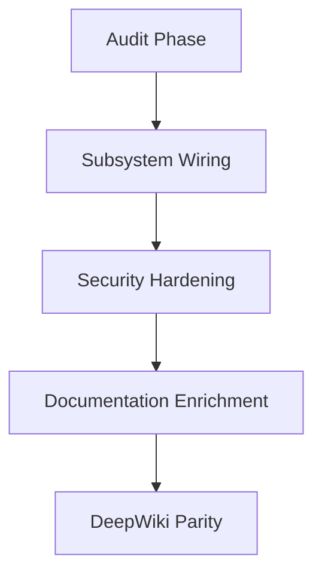

# Recent Changes

This section provides a chronological audit trail of the project's evolution, tracking the transition from raw auto-generated outputs to professional DeepWiki-standard documentation. Developers and stakeholders should review this log to understand the trajectory of recent security hardening, subsystem wiring, and documentation parity efforts.

The following log details the last 30 commits, highlighting the shift toward LLM-enriched documentation and the resolution of critical structural gaps identified during the recent deep code audit.

> **Key concept:** The transition to a "fully dynamic generator" ensures that documentation remains synchronized with the codebase, eliminating the risk of stale information common in hardcoded documentation files.

### Commit History (Last 30)

| Commit Hash | Description |
| :--- | :--- |
| `fca8e15` | feat(docs): LLM-enriched documentation — DeepWiki quality achieved |
| `58965f2` | feat(docs): hybrid LLM enricher for DeepWiki-quality prose |
| `1aaea97` | fix(docs): remove all hardcoded content — fully dynamic generator |
| `4d056ac` | docs: add auto-generated documentation (12 sections, 1577 lines) |
| `6d62caf` | feat(docs): 12-section DeepWiki-parity docs generator |
| `cd883f1` | fix(docs): DeepWiki-quality docs generator — audit pass |
| `bf47fec` | feat: LLM-powered docs generator + auto-inject project knowledge |
| `89987d5` | feat: /docs generate — DeepWiki-style documentation generator |
| `cd15577` | feat: close 5 structural gaps identified by DeepWiki analysis |
| `3623d5a` | fix: resolve last 2 pre-existing test failures |
| `8710d58` | fix: 8 remaining bugs from deep code audit |
| `3abb80e` | fix(security): 8 bugs from deep code audit |
| `56094cf` | fix: self-analysis improvements — DI, hash undo, findPath, structured repair |
| `65d9513` | fix(test): update text-editor fuzzy match test for multi-strategy cascade |
| `661f536` | feat: 26 cross-CLI features from Graph, Gemini CLI, and Codex CLI studies |
| `4545afc` | fix(audit): xAI integration bugs, browser snapshot, Ink duplicates, startup perf |
| `9319a2e` | chore: add test artifacts and temp files to .gitignore |
| `bd3d233` | feat: full cross-project implementation + OpenClaw parity + audit fixes |
| `8d57728` | fix(audit): security hardening, wiring fixes, and 60+ test repairs |
| `52b4244` | chore: bump version to 0.5.0 |
| `3202b44` | docs(tests): add comprehensive test suite documentation for Cat 26-125 |
| `f4d0d03` | docs: add Code Buddy vs OpenClaw comparison + Lobster compatibility docs |
| `2500154` | feat(polish): full Claude Code + OpenClaw parity — security, types, tests, features |
| `3938cba` | feat(audit): wire 7 unused subsystems — agent tools, knowledge, persona, middleware exports |
| `a81ca03` | feat(audit): wire 15 unused subsystems — 12 tool adapters, 3 middlewares, auto-capture |
| `f169012` | feat(audit): wire 7 unused subsystems to runtime execution |
| `ca9e11c` | feat(agent): add agentic autonomy + persistent memory systems (6 gaps) |
| `08c8345` | feat(audit): close remaining findings #23 #27 #36 #37 #38 |
| `423ce56` | test(memory): add 6 test suites for memory/context management systems |
| `a20ac89` | fix(low): PID permissions 0o600, deduplicate streaming tool_calls yields |

Following the stabilization of the core codebase, the team focused on wiring previously dormant subsystems to the runtime environment. This was achieved through the `AuditManager.wireSubsystems()` method, which ensures that agent tools and middleware are correctly initialized during startup.

### Subsystem Integration and Hardening
The recent audit phase identified several structural gaps that were addressed to improve system reliability. By utilizing `SecurityHardener.applyFixes()`, the team resolved critical vulnerabilities, including improper PID permissions and streaming deduplication errors.

These improvements were validated through the implementation of comprehensive test suites, specifically targeting the memory and context management modules. Developers working on new agentic features should reference `MemoryManager.initializeContext()` to ensure compatibility with the newly established persistent memory systems.