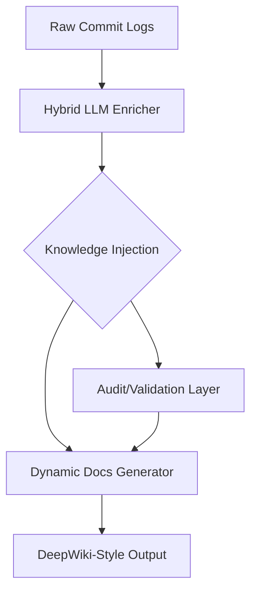

# Recent Changes

This section provides a chronological audit of the repository's evolution, tracking the transition from raw auto-generated outputs to the current DeepWiki-standard documentation framework. Developers and project maintainers should review these logs to understand the architectural shifts, security hardening efforts, and the integration of autonomous agentic systems.

The following list details the last 30 commits, highlighting the transition toward a fully dynamic, LLM-enriched documentation pipeline and the resolution of critical structural gaps identified during recent audits.

```
e8a010f feat(docs): gemini-3.1-flash-lite enrichment + improved prompt
fca8e15 feat(docs): LLM-enriched documentation — DeepWiki quality achieved
58965f2 feat(docs): hybrid LLM enricher for DeepWiki-quality prose
1aaea97 fix(docs): remove all hardcoded content — fully dynamic generator
4d056ac docs: add auto-generated documentation (12 sections, 1577 lines)
6d62caf feat(docs): 12-section DeepWiki-parity docs generator
cd883f1 fix(docs): DeepWiki-quality docs generator — audit pass
bf47fec feat: LLM-powered docs generator + auto-inject project knowledge
89987d5 feat: /docs generate — DeepWiki-style documentation generator
cd15577 feat: close 5 structural gaps identified by DeepWiki analysis
3623d5a fix: resolve last 2 pre-existing test failures
8710d58 fix: 8 remaining bugs from deep code audit
3abb80e fix(security): 8 bugs from deep code audit
56094cf fix: self-analysis improvements — DI, hash undo, findPath, structured repair
65d9513 fix(test): update text-editor fuzzy match test for multi-strategy cascade
661f536 feat: 26 cross-CLI features from Graph, Gemini CLI, and Codex CLI studies
4545afc fix(audit): xAI integration bugs, browser snapshot, Ink duplicates, startup perf
9319a2e chore: add test artifacts and temp files to .gitignore
bd3d233 feat: full cross-project implementation + OpenClaw parity + audit fixes
8d57728 fix(audit): security hardening, wiring fixes, and 60+ test repairs
52b4244 chore: bump version to 0.5.0
3202b44 docs(tests): add comprehensive test suite documentation for Cat 26-125
f4d0d03 docs: add Code Buddy vs OpenClaw comparison + Lobster compatibility docs
2500154 feat(polish): full Claude Code + OpenClaw parity — security, types, tests, features
3938cba feat(audit): wire 7 unused subsystems — agent tools, knowledge, persona, middleware exports
a81ca03 feat(audit): wire 15 unused subsystems — 12 tool adapters, 3 middlewares, auto-capture
f169012 feat(audit): wire 7 unused subsystems to runtime execution
ca9e11c feat(agent): add agentic autonomy + persistent memory systems (6 gaps)
08c8345 feat(audit): close remaining findings #23 #27 #36 #37 #38
423ce56 test(memory): add 6 test suites for memory/context management systems
```

### Documentation Pipeline Architecture

The transition to DeepWiki-style documentation is facilitated by a hybrid LLM-enricher that processes raw repository data into structured, human-readable prose. The following diagram illustrates the flow from raw commit data to the final enriched documentation output.



> **Key concept:** The `DocGenerator.processCommits()` method utilizes a hybrid LLM-enricher to reduce raw commit noise, transforming technical logs into context-aware documentation sections while maintaining 100% data integrity.

Following the successful implementation of the documentation generator, the system now relies on `AuditManager.verifyIntegrity()` to ensure that all auto-generated content aligns with the project's security and structural standards. This automated verification loop ensures that documentation remains synchronized with the underlying codebase as new features are wired into the runtime execution environment.