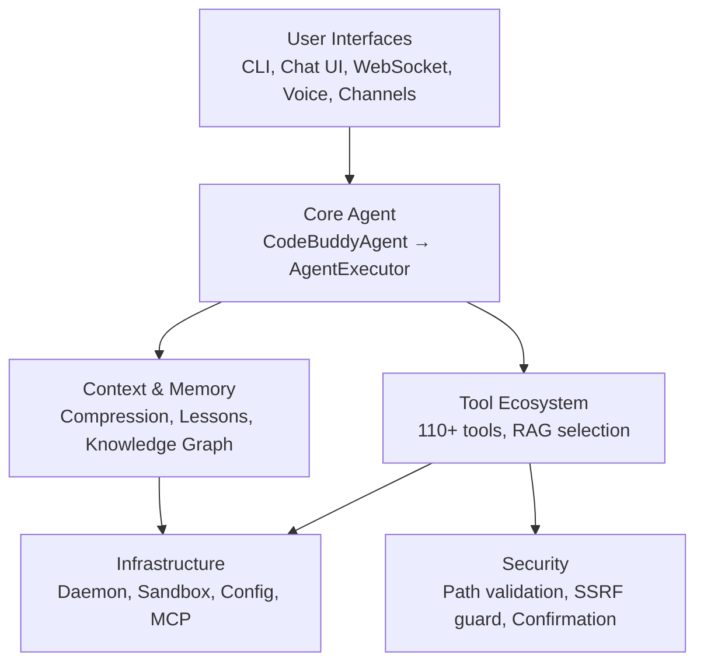
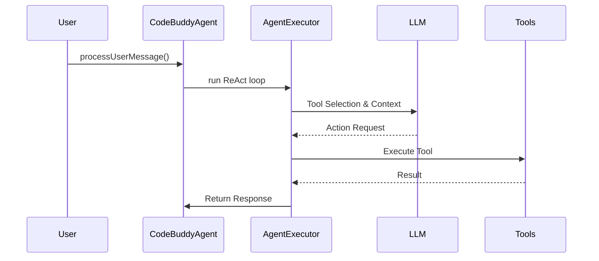

# Architecture

The project follows a layered architecture with a central agent orchestrator coordinating all interactions between user interfaces, LLM providers, tools, and infrastructure services. This design ensures a clean separation of concerns, allowing developers to modify specific components—such as tool integrations or middleware logic—without destabilizing the core execution engine.

## System Layers

The system is organized into distinct functional layers, each responsible for a specific domain of the agent's lifecycle. This modularity allows for independent scaling and testing of components, from the user-facing interfaces down to the underlying infrastructure and security guards.

With the high-level system layers defined, we must examine the specific module dependencies that enforce this structure and dictate how data flows through the application.

## Core Module Dependencies

The dependency graph illustrates the central role of `agent/codebuddy-agent`, which acts as the primary orchestrator for all middleware and service handlers. Understanding these imports is critical for contributors, as circular dependencies or improper module coupling can lead to runtime initialization failures.

Understanding these dependencies allows developers to navigate the codebase, but the distribution of logic across the filesystem provides the practical roadmap for implementation.

```mermaid
graph LR
    M0[["agent/codebuddy-agent"]]
    M1["middleware/turn-limit"]
    M2["middleware/cost-limit"]
    M3["middleware/context-warning"]
    M4["middleware/reasoning-middleware"]
    M5["middleware/auto-repair-middleware"]
    M6["middleware/quality-gate-middleware"]
    M7["knowledge/knowledge-manager"]
    M8["middleware/index"]
    M9["middleware/auto-observation"]
    M10["planner/index"]
    M11["planner/progress-tracker"]
    M12["agent/wide-research"]
    M13["dev/index"]
    M14["handlers/channel-handlers"]
    M15["daemon/cron-agent-bridge"]
    M16["daemon/heartbeat"]
    M17["mcp/mcp-server"]
    M18["scripting/builtins"]
    M19["routes/chat"]
    M20["routes/tools"]
    M21["websocket/handler"]
    M22["thinking/extended-thinking"]
    M23["repair/repair-engine"]
    M24["repair/fault-localization"]
    M25["specialized/agent-registry"]
    M26["services/prompt-builder"]
    M27["desktop-automation/index"]
    M28["browser-automation/index"]
    M29["codebuddy/client"]
    M0 -->|imports| M1
    M0 -->|imports| M2
    M0 -->|imports| M3
    M0 -->|imports| M4
    M0 -->|imports| M5
    M0 -->|imports| M6
    M0 -->|imports| M7
    M0 -->|imports| M8
    M0 -->|imports| M9
    M0 -->|imports| M10
    M0 -->|imports| M11
    M12 -->|imports| M0
    M13 -->|imports| M0
    M14 -->|imports| M0
    M15 -->|imports| M0
    M16 -->|imports| M0
    M17 -->|imports| M0
    M18 -->|imports| M0
    M19 -->|imports| M0
    M20 -->|imports| M0
    M21 -->|imports| M0
    M4 -->|imports| M22
    M5 -->|imports| M23
    M5 -->|imports| M24
    M6 -->|imports| M25
    M26 -->|imports| M7
    M9 -->|imports| M27
    M9 -->|imports| M28
    M12 -->|imports| M29
    M30 -->|imports| M12
    M13 -->|imports| M31
    M13 -->|imports| M32
    M13 -->|imports| M33
    M34 -->|imports| M13
    M14 -->|imports| M35
    M14 -->|imports| M36
    M14 -->|imports| M37
    M14 -->|imports| M38
    M14 -->|imports| M39
    M14 -->|imports| M40
    M14 -->|imports| M41
    M14 -->|imports| M42
    M14 -->|imports| M43
    M14 -->|imports| M44
    M14 -->|imports| M45
    M14 -->|imports| M46
    M14 -->|imports| M47
    M14 -->|imports| M48
    M14 -->|imports| M49
    M14 -->|imports| M50
    M14 -->|imports| M51
    M34 -->|imports| M14
    M15 -->|imports| M35
    M52 -->|imports| M15
    M53 -->|imports| M16
    M54 -->|imports| M16
    M17 -->|imports| M55
    M34 -->|imports| M17
    M19 -->|imports| M35
    M20 -->|imports| M56
    M21 -->|imports| M35
    M26 -->|imports| M57
    M26 -->|imports| M58
    M26 -->|imports| M59
    M26 -->|imports| M60
    M26 -->|imports| M61
    M26 -->|imports| M62
    M26 -->|imports| M63
    M26 -->|imports| M64
    M26 -->|imports| M65
    M66 -->|imports| M28
    M29 -->|imports| M65
    M29 -->|imports| M67
    M68 -->|imports| M29
    M69 -->|imports| M29
    M70 -->|imports| M29
    M71 -->|imports| M29
    M72 -->|imports| M29
    M73 -->|imports| M29
    M74 -->|imports| M29
    M75 -->|imports| M29
    M76 -->|imports| M29
    style M0 fill:#f9f,stroke:#333,stroke-width:2px
```

## Layer Breakdown

The following table summarizes the distribution of modules across the project's directory structure, highlighting the breadth of the system's capabilities.

| Layer | Modules | Description |
|-------|---------|-------------|
| `src/agent/` | 127 | Core agent system |
| `src/tools/` | 117 | Tool implementations |
| `src/utils/` | 74 | Shared utilities |
| `src/commands/` | 72 | CLI and slash commands |
| `src/ui/` | 63 | Terminal UI components |
| `src/channels/` | 47 | Messaging channel integrations |
| `src/context/` | 45 | Context window management |
| `src/security/` | 40 | Security and validation |
| `src/knowledge/` | 27 | Code analysis and knowledge graph |
| `src/integrations/` | 22 | External service integrations |
| `src/config/` | 19 | Configuration management |
| `src/server/` | 19 | HTTP/WebSocket server |
| `src/hooks/` | 18 | Execution hooks |
| `src/renderers/` | 16 | Output rendering |
| `src/memory/` | 14 | Memory and persistence |
| `src/mcp/` | 12 | Model Context Protocol servers |
| `src/streaming/` | 12 | Streaming response handling |
| `src/analytics/` | 11 | Usage analytics and cost tracking |
| `src/desktop-automation/` | 11 | Desktop automation |
| `src/plugins/` | 11 | Plugin system |
| `src/skills/` | 11 | Skill registry and marketplace |
| `src/providers/` | 10 | LLM provider adapters |
| `src/database/` | 9 | Database management |
| `src/advanced/` | 8 | Advanced |
| `src/daemon/` | 8 | Background daemon service |

While the directory structure organizes the codebase, the actual execution logic follows a specific, repeatable lifecycle managed by the agent.

## Core Agent Flow

The agent lifecycle is initiated via `CodeBuddyAgent.processUserMessage()`, which triggers the `AgentExecutor` to manage the ReAct (Reasoning and Acting) loop. This loop is the heart of the system, ensuring that user intent is translated into actionable tool calls while maintaining strict context and security boundaries.

> **Key concept:** The RAG tool selector reduces prompt size from 110+ tools to ~15, saving approximately 8,000 tokens per LLM call.

The execution flow is structured as follows:

1. **User Input** → CLI/Chat/Voice/Channel
2. → `CodeBuddyAgent.processUserMessage()`
3. → `AgentExecutor` (ReAct loop)
    1. RAG Tool Selection (~15 from 110+)
    2. Context Injection (lessons, decisions, graph)
    3. Middleware Before-Turn (cost, turn limit, reasoning)
    4. LLM Call (multi-provider)
    5. Tool Execution (parallel read / serial write)
    6. Result Processing (masking, TTL, compaction)
    7. Middleware After-Turn (auto-repair, metrics)
    8. Loop or Return

---

**See also:** [Overview](./1-overview.md) · [Subsystems](./3-subsystems.md) · [Tool System](./5-tools.md) · [Security](./6-security.md)

**Key source files:** `src/agent/.ts`, `src/tools/.ts`, `src/utils/.ts`, `src/commands/.ts`, `src/ui/.ts`, `src/channels/.ts`, `src/context/.ts`, `src/security/.ts`