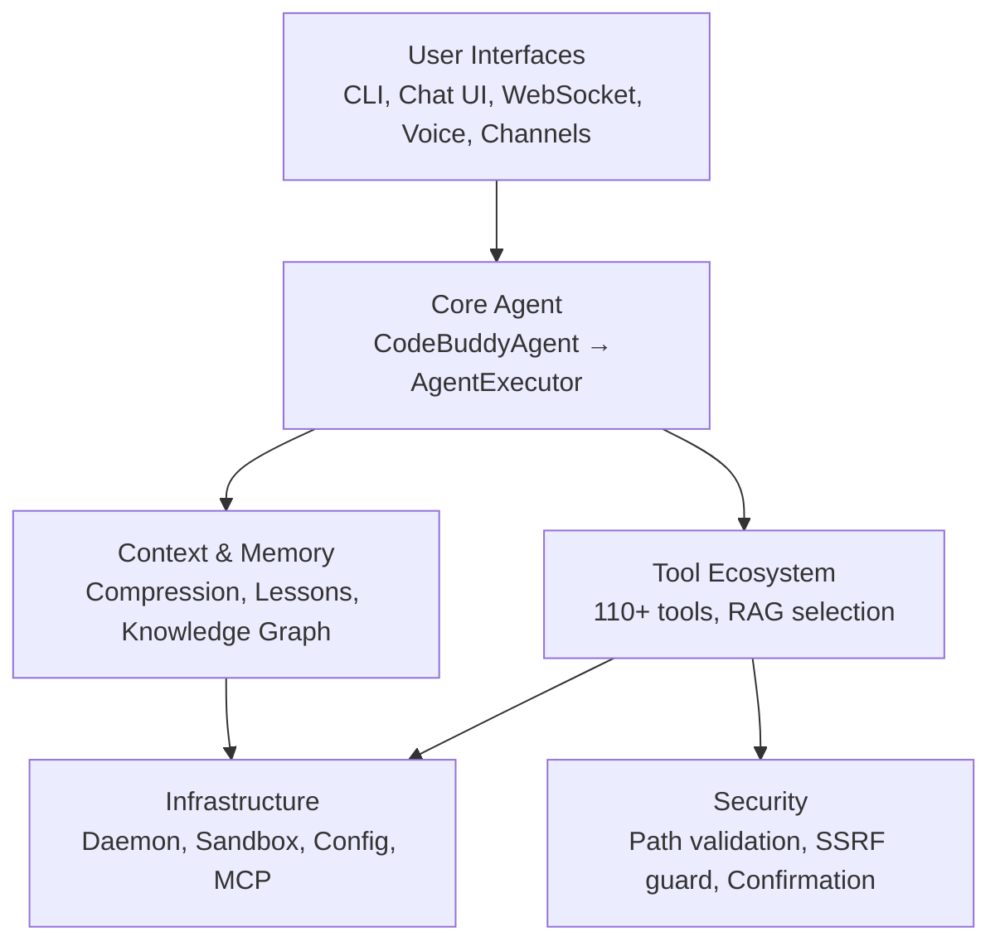
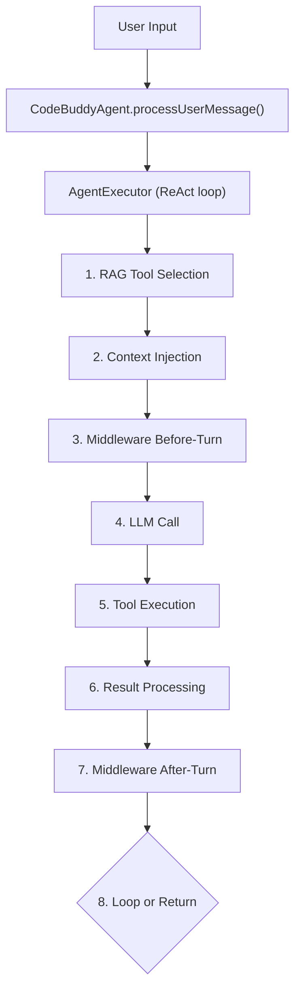

# Architecture

The project follows a modular, layered architecture designed to decouple the core reasoning engine from infrastructure, UI, and external tool integrations. This structure ensures that the agent orchestrator can scale across diverse environments while maintaining strict security and context management boundaries. This documentation is intended for core contributors and system architects who need to understand the dependency graph and execution lifecycle of the agent.

## System Layers

The system is organized into functional layers that facilitate a clean separation of concerns. The `Core Agent` acts as the central nervous system, delegating tasks to the `Tool Ecosystem` and `Context & Memory` modules while enforcing policies through the `Security` layer.

The interaction between these layers is governed by the `AgentExecutor`, which orchestrates the ReAct loop to ensure that every action is validated against the security layer before execution.

## Core Module Dependencies

The dependency graph below illustrates the relationship between the `agent/codebuddy-agent` and its supporting middleware and service modules. This modular approach allows for the injection of specialized logic, such as `middleware/quality-gate-middleware` or `middleware/auto-repair-middleware`, without modifying the core agent loop.

```mermaid
graph LR
    M0[["agent/codebuddy-agent"]]
    M1["middleware/turn-limit"]
    M2["middleware/cost-limit"]
    M3["middleware/context-warning"]
    M4["middleware/reasoning-middleware"]
    M5["middleware/auto-repair-middleware"]
    M6["middleware/quality-gate-middleware"]
    M7["knowledge/knowledge-manager"]
    M8["middleware/index"]
    M9["middleware/auto-observation"]
    M10["planner/index"]
    M11["planner/progress-tracker"]
    M12["agent/wide-research"]
    M13["dev/index"]
    M14["handlers/channel-handlers"]
    M15["daemon/cron-agent-bridge"]
    M16["daemon/heartbeat"]
    M17["mcp/mcp-server"]
    M18["scripting/builtins"]
    M19["routes/chat"]
    M20["routes/tools"]
    M21["websocket/handler"]
    M22["thinking/extended-thinking"]
    M23["repair/repair-engine"]
    M24["repair/fault-localization"]
    M25["specialized/agent-registry"]
    M26["services/prompt-builder"]
    M27["desktop-automation/index"]
    M28["browser-automation/index"]
    M29["codebuddy/client"]
    M0 -->|imports| M1
    M0 -->|imports| M2
    M0 -->|imports| M3
    M0 -->|imports| M4
    M0 -->|imports| M5
    M0 -->|imports| M6
    M0 -->|imports| M7
    M0 -->|imports| M8
    M0 -->|imports| M9
    M0 -->|imports| M10
    M0 -->|imports| M11
    M12 -->|imports| M0
    M13 -->|imports| M0
    M14 -->|imports| M0
    M15 -->|imports| M0
    M16 -->|imports| M0
    M17 -->|imports| M0
    M18 -->|imports| M0
    M19 -->|imports| M0
    M20 -->|imports| M0
    M21 -->|imports| M0
    M4 -->|imports| M22
    M5 -->|imports| M23
    M5 -->|imports| M24
    M6 -->|imports| M25
    M26 -->|imports| M7
    M9 -->|imports| M27
    M9 -->|imports| M28
    M12 -->|imports| M29
    M30 -->|imports| M12
    M13 -->|imports| M31
    M13 -->|imports| M32
    M13 -->|imports| M33
    M34 -->|imports| M13
    M14 -->|imports| M35
    M14 -->|imports| M36
    M14 -->|imports| M37
    M14 -->|imports| M38
    M14 -->|imports| M39
    M14 -->|imports| M40
    M14 -->|imports| M41
    M14 -->|imports| M42
    M14 -->|imports| M43
    M14 -->|imports| M44
    M14 -->|imports| M45
    M14 -->|imports| M46
    M14 -->|imports| M47
    M14 -->|imports| M48
    M14 -->|imports| M49
    M14 -->|imports| M50
    M14 -->|imports| M51
    M34 -->|imports| M14
    M15 -->|imports| M35
    M52 -->|imports| M15
    M53 -->|imports| M16
    M54 -->|imports| M16
    M17 -->|imports| M55
    M34 -->|imports| M17
    M19 -->|imports| M35
    M20 -->|imports| M56
    M21 -->|imports| M35
    M26 -->|imports| M57
    M26 -->|imports| M58
    M26 -->|imports| M59
    M26 -->|imports| M60
    M26 -->|imports| M61
    M26 -->|imports| M62
    M26 -->|imports| M63
    M26 -->|imports| M64
    M26 -->|imports| M65
    M66 -->|imports| M28
    M29 -->|imports| M65
    M29 -->|imports| M67
    M68 -->|imports| M29
    M69 -->|imports| M29
    M70 -->|imports| M29
    M71 -->|imports| M29
    M72 -->|imports| M29
    M73 -->|imports| M29
    M74 -->|imports| M29
    M75 -->|imports| M29
    M76 -->|imports| M29
    style M0 fill:#f9f,stroke:#333,stroke-width:2px
```

## Layer Breakdown

The following table summarizes the distribution of modules across the codebase. This organization allows developers to quickly locate logic based on the domain, such as `src/security/` for policy enforcement or `src/agent/` for core orchestration.

| Layer | Modules | Description |
|-------|---------|-------------|
| `src/agent/` | 127 | Core agent system |
| `src/tools/` | 117 | Tool implementations |
| `src/utils/` | 74 | Shared utilities |
| `src/commands/` | 72 | CLI and slash commands |
| `src/ui/` | 63 | Terminal UI components |
| `src/channels/` | 47 | Messaging channel integrations |
| `src/context/` | 45 | Context window management |
| `src/security/` | 40 | Security and validation |
| `src/knowledge/` | 27 | Code analysis and knowledge graph |
| `src/integrations/` | 22 | External service integrations |
| `src/config/` | 19 | Configuration management |
| `src/server/` | 19 | HTTP/WebSocket server |
| `src/hooks/` | 18 | Execution hooks |
| `src/renderers/` | 16 | Output rendering |
| `src/memory/` | 14 | Memory and persistence |
| `src/mcp/` | 12 | Model Context Protocol servers |
| `src/streaming/` | 12 | Streaming response handling |
| `src/analytics/` | 11 | Usage analytics and cost tracking |
| `src/desktop-automation/` | 11 | Desktop automation |
| `src/plugins/` | 11 | Plugin system |
| `src/skills/` | 11 | Skill registry and marketplace |
| `src/providers/` | 10 | LLM provider adapters |
| `src/database/` | 9 | Database management |
| `src/advanced/` | 8 | Advanced |
| `src/daemon/` | 8 | Background daemon service |

## Core Agent Flow

The lifecycle of a user request is handled by the `CodeBuddyAgent.processUserMessage()` method. This method initializes the `AgentExecutor`, which manages the ReAct loop, ensuring that the agent remains within defined operational bounds while effectively utilizing available tools.

> **Key concept:** The RAG tool selector reduces prompt size from 110+ tools to ~15, saving approximately 8,000 tokens per LLM call.

The `AgentExecutor` ensures that all tool outputs are processed through a series of middleware checks, including `middleware/quality-gate-middleware` and `middleware/auto-repair-middleware`, before returning the final response to the user.

---

**See also:** [Overview](./1-overview.md) · [Subsystems](./3-subsystems.md) · [Tool System](./5-tools.md) · [Security](./6-security.md)

**Key source files:** `src/agent/.ts`, `src/tools/.ts`, `src/utils/.ts`, `src/commands/.ts`, `src/ui/.ts`, `src/channels/.ts`, `src/context/.ts`, `src/security/.ts`