# Subsystems

Detected **44** architectural subsystems (modularity: 0.741)


## src (16 modules)

This section provides a detailed overview of the core modules located within the `src` directory. These components are fundamental to the system's operation, encompassing critical functionalities such as resource management, performance optimization, security enforcement, and agent coordination. Developers working on the application's foundational logic, performance enhancements, or security infrastructure will find this information essential.

The `src/utils/memory-monitor` module is crucial for maintaining system stability by tracking and reporting real-time memory usage. It ensures the application operates within defined resource limits, preventing potential memory exhaustion issues. Its core operations involve initiating monitoring processes, capturing system snapshots, and evaluating current memory usage against predefined thresholds to trigger alerts or corrective actions.

Beyond resource monitoring, the system employs sophisticated mechanisms for performance and integration. `src/optimization/model-routing` intelligently directs requests to the most appropriate models based on various criteria, while `src/optimization/latency-optimizer` actively works to minimize response times across diverse operations, enhancing overall system responsiveness. Concurrently, the `src/mcp/mcp-client` module provides the necessary infrastructure for robust communication with Multi-Channel Protocol (MCP) servers, facilitating seamless integration with external services and tools.

> **Key concept:** The `src/security/sandbox` module implements critical isolation mechanisms, confining untrusted code execution to prevent unauthorized access or system compromise. This sandboxing is crucial for safely executing external tools and user-provided code, mitigating risks associated with arbitrary code execution.

Further enhancing system resilience and operational flexibility, other essential modules manage agent behaviors and contextual information. `src/agent/agent-mode` is responsible for managing the various operational states of autonomous agents, while `src/agent/execution/repair-coordinator` handles error recovery and self-correction during complex agent execution flows. Contextual data is managed by `src/context/context-manager-v2`, which ensures consistent and relevant information is available across different components. Finally, `src/hooks/lifecycle-hooks` provides general-purpose integration points for system events, with `src/hooks/moltbot-hooks` offering specific extensions for the Moltbot system.

### Agent Coordination and Channel Security

The architecture relies heavily on the `src/channels/dm-pairing` and `src/agent/codebuddy-agent` modules to maintain secure, stateful interactions. When establishing new connections, the system utilizes `DMPairingManager.checkSender()` to validate origin integrity before allowing message exchange. Simultaneously, the agent lifecycle is managed through `CodeBuddyAgent.initializeMemory()`, which prepares the agent's workspace and ensures that all necessary decision-making contexts are loaded.

Transitioning from agent initialization to active task execution, the system leverages specialized profiling and memory management to maintain high performance.

### Memory Persistence and Repository Profiling

Efficient resource utilization is achieved through the `src/memory/enhanced-memory` and `src/persistence/session-store` modules. The system uses `EnhancedMemory.store()` to cache critical state information, ensuring that agent context is preserved across restarts. When sessions are finalized, `SessionStore.saveSession()` commits the interaction history to disk, allowing for seamless recovery.

> **Key concept:** The `src/agent/repo-profiling/cartography` module automates the discovery of source directories, significantly reducing manual configuration overhead when initializing new repositories. By using `RepoProfiler.getProfile()`, the system can build a comprehensive context pack that informs agent decision-making.

### Tooling and Device Integration

The final layer of the `src` architecture involves external hardware and tool integration. The `src/nodes/device-node` module acts as the interface for physical hardware, where `DeviceNodeManager.pairDevice()` handles the handshake process for new peripherals. For visual tasks, the `src/tools/screenshot-tool` provides direct access to system display buffers, utilizing `ScreenshotTool.capture()` to generate visual context for the agent.

The following list details these and other significant modules within the `src` directory, ordered by their architectural rank:

- **src/utils/memory-monitor** (rank: 0.004, 23 functions)
- **src/optimization/model-routing** (rank: 0.003, 13 functions)
- **src/optimization/latency-optimizer** (rank: 0.003, 23 functions)
- **src/mcp/mcp-client** (rank: 0.003, 29 functions)
- **src/security/sandbox** (rank: 0.002, 12 functions)
- **src/agent/agent-mode** (rank: 0.002, 9 functions)
- **src/agent/execution/repair-coordinator** (rank: 0.002, 24 functions)
- **src/context/context-manager-v2** (rank: 0.002, 39 functions)
- **src/hooks/lifecycle-hooks** (rank: 0.002, 17 functions)
- **src/hooks/moltbot-hooks** (rank: 0.002, 0 functions)
- ... and 6 more

The following Mermaid diagram illustrates the conceptual data flow between the agent initialization, memory storage, and session persistence layers.

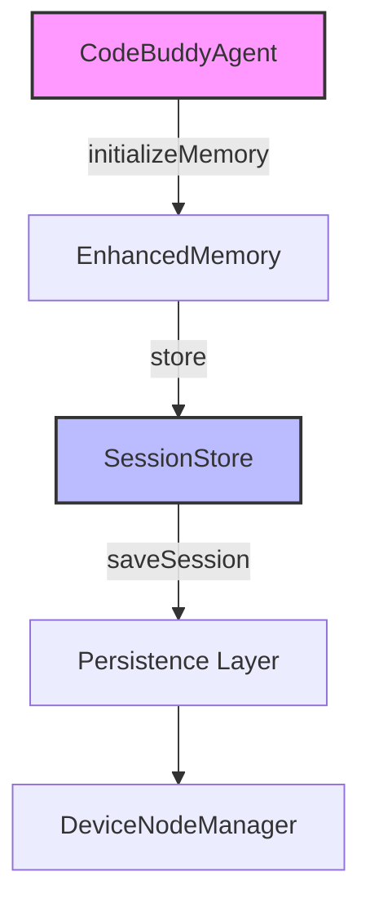

## src (51 modules)

The `src` directory serves as the core of the application, encapsulating the primary logic for agent operations, communication channels, utility services, and persistence mechanisms. This section details the most architecturally significant modules within `src`, providing insights into their responsibilities and interconnections. Understanding these modules is essential for developers working on agent behavior, tool integration, or system-level enhancements, as these components dictate the lifecycle and operational boundaries of the entire system.

- **src/agent/codebuddy-agent** (rank: 0.013, 65 functions)
This module contains the central orchestrator for the CodeBuddy agent. It is responsible for initializing the agent's operational context, including memory, skills, and the registry of specialized agents. Key functions like `CodeBuddyAgent.initializeMemory()`, `CodeBuddyAgent.initializeAgentRegistry()`, and `CodeBuddyAgent.initializeSkills()` are defined here, setting up the agent's capabilities and operational environment. The agent's current operational context can be managed via `CodeBuddyAgent.setRunId()`, which is critical for session tracking.

Beyond the core agent orchestration, the system relies on robust communication channels to facilitate interactions.

- **src/channels/index** (rank: 0.007, 0 functions)
This module acts as the entry point and aggregator for various communication channels within the system. It provides a unified interface for managing interactions, ensuring that different parts of the application can communicate effectively and securely. By centralizing channel management, it reduces coupling between the agent logic and specific communication protocols.

For critical operations, user confirmation is often required, which is handled by a dedicated service.

- **src/utils/confirmation-service** (rank: 0.005, 21 functions)
The confirmation service provides a standardized mechanism for requesting and processing user confirmations. This is critical for operations that require explicit user consent, enhancing security and user control over agent actions. It ensures that high-impact operations are gated by a verification step before execution.

The agent's capabilities are further extended through a system of specialized agents, managed by a dedicated registry.

- **src/agent/specialized/agent-registry** (rank: 0.005, 29 functions)
This module manages the registration and lifecycle of specialized agents. It allows the system to dynamically discover and utilize different agent types, each tailored for specific tasks, promoting modularity and extensibility in agent design. The `CodeBuddyAgent.initializeAgentRegistry()` method relies on this component to populate the available specialized agents.

To tackle complex problems, the agent can engage in extended thinking processes, which are configured and managed separately.

- **src/agent/thinking/extended-thinking** (rank: 0.005, 30 functions)
This module implements advanced thinking capabilities for the agent, allowing for more complex reasoning and problem-solving. It includes mechanisms for managing token budgets and enabling or disabling extended thought processes, as seen in methods like `ExtendedThinkingManager.isEnabled()` and `ExtendedThinkingManager.getTokenBudget()`. The `ExtendedThinkingManager.toggle()` method allows dynamic control over this feature.

> **Key concept:** Extended thinking allows the agent to allocate additional computational resources and prompt tokens for deeper analysis, improving the quality of responses for complex problems at the cost of increased latency and token usage.

The agent's ability to interact with external systems and perform actions is facilitated by a comprehensive tool registry.

- **src/tools/registry** (rank: 0.004, 10 functions)
The tool registry is responsible for cataloging and providing access to all available tools that the agent can utilize. This central registry ensures that tools are properly initialized and discoverable by the agent's decision-making processes, often through functions like `initializeToolRegistry()`. It acts as the bridge between the agent's abstract intent and the concrete execution of external capabilities.

Complementing the tools, the agent also possesses a set of learned skills, organized within a dedicated hub.

- **src/skills/hub** (rank: 0.004, 27 functions)
The skills hub serves as a central repository for the agent's learned skills. It aggregates and organizes various capabilities, allowing the agent to efficiently access and apply the appropriate skill for a given task. This hub structure ensures that skill retrieval is performant and scalable as the agent's repertoire grows.

The formal definition and management of these skills are handled by the skills registry.

- **src/skills/registry** (rank: 0.004, 27 functions)
Complementing the skills hub, the skills registry manages the formal registration and metadata of each skill. This ensures that skills are properly defined, versioned, and integrated into the agent's operational framework, supporting the `CodeBuddyAgent.initializeSkills()` process. It provides the necessary validation layer to ensure only compatible skills are loaded into the agent's runtime.

To understand and improve agent performance, the system incorporates analytics for tool usage.

- **src/analytics/tool-analytics** (rank: 0.003, 23 functions)
This module is dedicated to collecting and analyzing usage data for the tools employed by the agent. It provides insights into tool effectiveness, common usage patterns, and potential areas for optimization, contributing to continuous improvement of the agent's capabilities. By tracking these metrics, developers can identify underutilized tools or bottlenecks in the agent's decision-making loop.

Finally, to ensure robustness, the agent includes mechanisms for identifying and addressing operational faults.

- **src/agent/repair/fault-localization** (rank: 0.003, 17 functions)
The fault localization module assists in identifying the root cause of errors or failures within the agent's execution. By pinpointing problematic components or steps, it facilitates more efficient debugging and repair processes, enhancing the agent's robustness. This module is essential for maintaining system stability in complex, multi-step agent workflows.

- ... and 41 more

The following diagram illustrates the high-level relationships between the core `CodeBuddyAgent` and its essential supporting components within the `src` directory.

```mermaid
graph TD
    A[CodeBuddyAgent] -->|initializeMemory()| B[EnhancedMemory]
    A -->|setRunId()| C[SessionStore]
    A -->|initializeAgentRegistry()| D[AgentRegistry]
    A -->|initializeSkills()| E[SkillsHub]
    A -->|uses| F[ToolRegistry]
    B -->|load/save memories| C
```

## src (4 modules)

This section details core modules within the `src` directory that are fundamental to the system's prompt management, custom agent loading, and command-line interface (CLI) operations. Understanding these components is crucial for developers looking to extend the agent's capabilities, customize its conversational prompts, or integrate new CLI commands, as they form the backbone of the system's interactive and extensible features.

The `src` directory houses several critical modules that enable the system's dynamic behavior and extensibility. These include the `prompt-manager` for handling conversational prompts, the `custom-agent-loader` for integrating user-defined agents, and modules for managing CLI and slash commands. Each plays a distinct role in defining how the system interacts with users and integrates new functionalities.

- **src/prompts/prompt-manager** (rank: 0.005, 17 functions)

The `prompt-manager` module is responsible for the dynamic loading and management of all prompts used by the system. It ensures that the agent has access to the correct conversational context and instructions, whether they are built-in or user-defined. This module plays a vital role in maintaining the quality and relevance of agent interactions by providing a centralized, versionable source for all prompt definitions.

> **Key concept:** The `prompt-manager` centralizes prompt definitions, allowing for consistent prompt engineering practices and enabling dynamic updates without requiring core agent code changes. This modularity supports rapid iteration on conversational flows and agent personas, ensuring that the

# src (7 modules)

This section details key modules within the `src` directory that are fundamental to the system's operation, focusing on context management, knowledge provision, and agent execution. Understanding these components is crucial for developers extending the agent's capabilities, integrating new data sources, or optimizing performance, as they form the backbone of how the agent perceives and interacts with its environment.

The `src/context` modules are responsible for managing various aspects of the agent's operational environment. `src/context/jit-context` dynamically provides Just-In-Time context, ensuring that relevant information is available precisely when needed without unnecessary overhead. This dynamic provisioning helps in optimizing memory usage and processing time by only loading context when it is actively required. Complementing this, `src/context/workspace-context` maintains the overall state and configuration of the current workspace, offering a unified view for agent operations and ensuring consistency across different tasks.

For security and privacy, `src/context/tool-output-masking` plays a critical role in data handling.

> **Key concept:** `src/context/tool-output-masking` automatically redacts sensitive information from tool outputs before they are processed by the agent or presented to the user, enhancing data privacy and reducing exposure risks. This module ensures compliance with data protection policies by preventing the leakage of confidential data.

Beyond context management, the system relies on persistent memory and profiling to maintain long-term coherence and structural awareness. By leveraging components like `EnhancedMemory.loadMemories()`, the system restores previous states, while `RepoProfiler.getProfile()` provides the structural analysis required for deep code understanding, ensuring the agent operates with a comprehensive view of the repository.

Building upon the foundational context management, the agent further leverages specialized modules to construct and maintain its understanding of the codebase. The `src/knowledge` modules are dedicated to this purpose. `src/knowledge/code-graph-context-provider` extracts and provides structured information from the project's code graph, enabling the agent to reason about code structure, dependencies, and relationships. This detailed understanding is crucial for tasks like code analysis, refactoring, and intelligent navigation. This knowledge base is kept current by `src/knowledge/graph-updater`, which ensures the code graph reflects the latest changes in the repository, maintaining an up-to-date representation of the project's architecture.

With a robust understanding of its environment and codebase established, the agent proceeds to execute its core operational logic, with careful monitoring of its performance. The agent's core operational logic is encapsulated within `src/agent/execution/agent-executor`. This module orchestrates the execution of agent actions, managing the lifecycle of tool calls, reasoning steps, and interaction with various system components. It ensures that agent tasks are performed efficiently and in the correct sequence. To monitor and improve these operations, `src/observability/tool-metrics` collects vital performance data and usage statistics for all executed tools, providing insights into agent efficiency and potential bottlenecks. This data is essential for debugging, performance optimization, and understanding agent behavior.

The following modules are part of the core `src` directory:

-   **src/context/jit-context** (rank: 0.002, 2 functions)
-   **src/context/tool-output-masking** (rank: 0.002, 3 functions)
-   **src/context/workspace-context** (rank: 0.002, 4 functions)
-   **src/knowledge/code-graph-context-provider** (rank: 0.002, 9 functions)
-   **src/knowledge/graph-updater** (rank: 0.002, 1 functions)
-   **src/observability/tool-metrics** (rank: 0.002, 9 functions)
-   **src/agent/execution/agent-executor** (rank: 0.002, 25 functions)

The diagram below illustrates a conceptual self-referential process, potentially indicating a caching mechanism or a state that can be cleared and re-initialized within the system. This pattern is often seen in components like `src/context/jit-context` to ensure data freshness and efficient resource utilization.

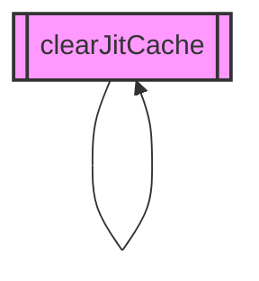

## src (14 modules)

The `src` directory serves as the primary repository for the application's core logic and foundational components. It encapsulates critical functionalities ranging from AI model interaction and performance optimization to agent reasoning and system-level integrations. Understanding the modules within `src` is essential for developers seeking to extend the system's capabilities or debug its operational flow, as these modules define the fundamental behaviors and interfaces of the application.

-   **src/codebuddy/client** (rank: 0.017, 22 functions)
    The `src/codebuddy/client` module is central to managing interactions with various Large Language Models (LLMs). It provides an abstraction layer for communicating with AI providers, handling model-specific capabilities, and ensuring compatibility. Functions like `CodeBuddyClient.validateModel()` are used to verify model configurations, while `CodeBuddyClient.probeToolSupport()` determines an LLM's ability to utilize specific tools. The module also handles model identification through `CodeBuddyClient.isGeminiModelName()` and `CodeBuddyClient.isLocalInference()`, ensuring that the client correctly routes requests based on the underlying infrastructure.

    > **Key concept:** The `CodeBuddyClient.probeToolSupport()` method dynamically assesses an LLM's function-calling capabilities, allowing the system to adapt tool availability based on the connected model's features and ensuring efficient resource utilization by only offering relevant tools.

Beyond managing direct LLM interactions, the system also implements sophisticated strategies to optimize performance and cost, particularly for frequently accessed models.

-   **src/optimization/cache-breakpoints** (rank: 0.010, 3 functions)
    The `src/optimization/cache-breakpoints` module focuses on enhancing the efficiency of LLM calls, particularly for models like Anthropic. It provides mechanisms to introduce stable cache breakpoints, which are critical for reducing redundant computations and token usage in iterative agentic workflows. Key functions include `injectAnthropicCacheBreakpoints()` for modifying prompts to leverage caching and `isAnthropicModel()` for conditional logic to apply these optimizations only when relevant. Additionally, the module exposes `buildStableDynamicSplit()` to handle complex prompt segmentation, ensuring that cache breakpoints are applied at logical boundaries.

    > **Key concept:** `injectAnthropicCacheBreakpoints()` strategically modifies prompts to ensure cache hits for stable parts of the conversation, significantly reducing token consumption and improving response times for supported models by avoiding re-computation of identical segments.

Optimizing individual LLM calls is complemented by advanced agentic reasoning capabilities, managed by the extended thinking module, which allows for more complex problem-solving.

-   **src/agent/extended-thinking** (rank: 0.010, 8 functions)
    The `src/agent/extended-thinking` module empowers agents with advanced, multi-step reasoning capabilities. It allows for the dynamic allocation and management of token budgets for complex thought processes, enabling agents to perform deeper analysis before generating a final response. Functions like `ExtendedThinkingManager.isEnabled()` check the current state of extended thinking, while `ExtendedThinkingManager.setTokenBudget()` allows for programmatic control over resource allocation. Developers can retrieve the current configuration via `ExtendedThinkingManager.getThinkingConfig()` or access the singleton instance using `getExtendedThinking()` to adjust reasoning parameters at runtime.

    > **Key concept:** Extended thinking allows agents to allocate a dedicated token budget for internal deliberation, enabling more complex problem-solving by simulating deeper thought processes before committing to an action or response, thereby improving the quality and accuracy of agent outputs.

These sophisticated agent capabilities often rely on secure and controlled access to the underlying computing environment, which is provided by a set of interpreter modules.

-   **src/interpreter/computer/browser** (rank: 0.003, 15 functions)
-   **src/interpreter/computer/files** (rank: 0.003, 33 functions)
-   **src/interpreter/computer/os** (rank: 0.003, 9 functions)
    These three modules collectively form the core of the system's sandboxed interpreter, providing controlled access to the host environment. `src/interpreter/computer/browser` manages web browsing capabilities, `src/interpreter/computer/files` handles file system operations, and `src/interpreter/computer/os` provides operating system-level interactions. This modular design ensures that agent actions are executed within defined boundaries, enhancing security and predictability by isolating potentially risky operations.

The interpreter's capabilities are leveraged by various system components, including specialized command modules designed for specific tasks.

-   **src/commands/research/index** (rank: 0.002, 3 functions)
    This module defines and orchestrates commands specifically designed for research tasks. It integrates with the interpreter to execute queries, process information, and synthesize findings, providing a structured approach to information gathering and analysis within the agent's workflow.

Beyond executing commands, agents also benefit from dynamic prompt generation and refinement, which helps in formulating more effective queries.

-   **src/agent/prompt-suggestions** (rank: 0.002, 10 functions)
    The `src/agent/prompt-suggestions` module is responsible for generating contextually relevant prompt suggestions, aiding users and agents in formulating effective queries. It analyzes current conversational state and available tools to offer intelligent recommendations, streamlining interaction and improving the quality of LLM inputs by guiding users towards optimal phrasing.

To further customize and extend system behavior, a robust hook system is in place, allowing developers to inject custom logic without modifying core components.

-   **src/hooks/advanced-hooks** (rank: 0.002, 18 functions)
-   **src/hooks/smart-hooks** (rank: 0.002, 10 functions)
    These modules implement the system's extensible hook architecture. `src/hooks/advanced-hooks` provides a set of powerful, low-level hooks for deep system integration and modification, offering fine-grained control over application behavior. In contrast, `src/hooks/smart-hooks` offers higher-level, more abstract hooks designed for common extension patterns, simplifying the process of adding custom functionality. Together, they enable developers to inject custom logic at various points in the application lifecycle without altering core code.

-   ... and 4 more

The following diagram illustrates the high-level data flow between the core client, the agent, and the execution environment.

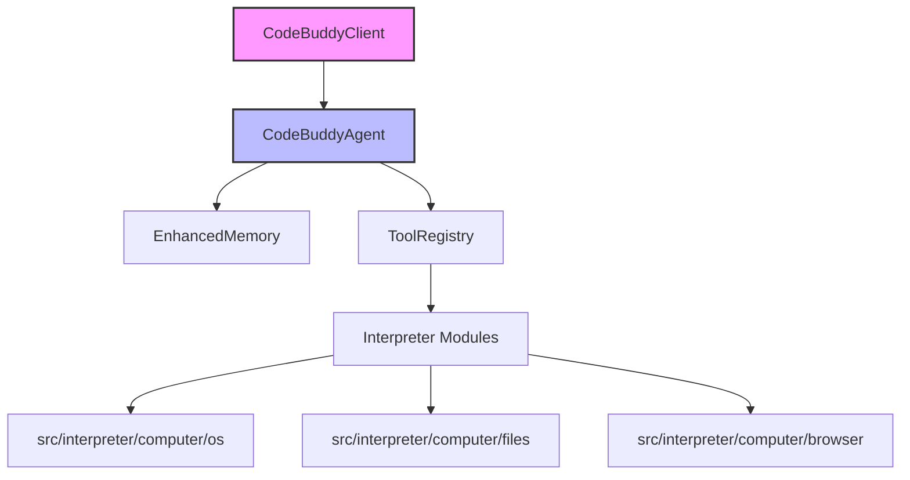

# src (2 modules)

This section details two critical modules within the `src` directory that govern the agent's operational logic: `planning-flow` and `commands/flow`. These modules are fundamental to how the agent formulates its actions, integrates developer-defined commands, and manages its interaction with the underlying system. Understanding their structure is essential for anyone looking to extend agent capabilities or debug its decision-making processes.

-   **src/agent/flow/planning-flow** (rank: 0.003, 12 functions)
-   **src/commands/flow** (rank: 0.002, 2 functions)

The initial overview highlights the core responsibilities of these modules. To further illustrate their interdependencies and the flow of control, particularly concerning the agent's planning and command execution, the following Mermaid diagram visualizes the primary interactions.

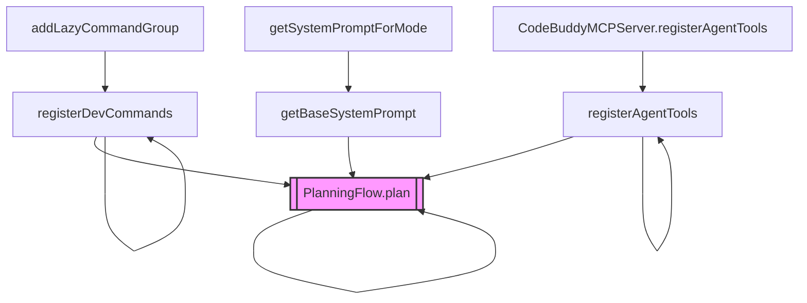

> **Key concept:** The `PlanningFlow.plan()` method serves as the core orchestrator for the agent's decision-making process. It integrates registered developer commands and agent tools, along with dynamic system prompts, to formulate a coherent sequence of actions, ensuring the agent operates within defined boundaries and capabilities.

Building upon the conceptual understanding of the planning flow, the subsequent details elaborate on the specific functions and their roles in orchestrating the agent's behavior.

The `PlanningFlow.plan()` method is responsible for initiating the agent's planning cycle. This involves calling functions like `registerDevCommands()` to make developer-specific commands available and `registerAgentTools()` to integrate various tools the agent can utilize, often leveraging the `initializeToolRegistry()` function for comprehensive tool setup. Furthermore, it interacts with prompt generation mechanisms, such as `getBaseSystemPrompt()`, which may further refine its behavior by calling `getSystemPromptForMode()` to adapt to different operational contexts. This prompt generation is crucial, aligning with the agent's overall system prompt initialization, as seen in `CodeBuddyAgent.initializeAgentSystemPrompt()`. The registration of agent tools is often delegated to specialized components like `CodeBuddyMCPServer.registerAgentTools()`, ensuring a modular approach to tool management.

To ensure the agent remains responsive and accurate during these planning phases, the system integrates with the broader agent ecosystem. Before executing complex tasks, the planning flow validates model capabilities using `CodeBuddyClient.probeToolSupport()` and `CodeBuddyClient.performToolProbe()`. This ensures that the agent does not attempt to utilize tools that the current model, such as one validated via `CodeBuddyClient.validateModel()`, cannot support. 

Additionally, when the agent requires persistent context to inform its planning, it interfaces with `EnhancedMemory.store()` to maintain state across sessions. This ensures that the planning flow is consistently informed by historical interactions and user preferences, allowing for a more cohesive and context-aware execution strategy.

# src (12 modules)

The `src` directory serves as the primary repository for core system modules, encompassing automation, deployment, and environmental interaction logic. This section details the architectural components responsible for bridging the gap between high-level agent logic and low-level system execution, which is essential for developers maintaining or extending the system's operational capabilities.

- **src/tools/screenshot-tool** (rank: 0.006, 20 functions)
The `src/tools/screenshot-tool` module provides robust capabilities for capturing screen content across various operating systems. Its primary function, `ScreenshotTool.capture()`, orchestrates the capture process, delegating to OS-specific implementations like `ScreenshotTool.captureMacOS()`, `ScreenshotTool.captureLinux()`, and `ScreenshotTool.captureWindows()`, with specialized handling for WSL environments via `ScreenshotTool.isWSL()`. This module ensures that visual information from the user's environment can be programmatically accessed and processed.

> **Key concept:** The `ScreenshotTool` abstracts OS-specific screen capture complexities, providing a unified `ScreenshotTool.capture()` interface that dynamically adapts to the underlying operating system, including specialized handling for WSL environments.

Beyond visual capture, the system integrates a suite of tools designed for broader interaction with the user's environment and for managing deployment. These modules collectively empower the system to perform complex operations, from interpreting visual data to controlling desktop applications.

- **src/deploy/cloud-configs** (rank: 0.005, 10 functions)
- **src/browser-automation/index** (rank: 0.004, 0 functions)
- **src/desktop-automation/index** (rank: 0.003, 0 functions)
- **src/tools/ocr-tool** (rank: 0.003, 12 functions)
- **src/agent/middleware/auto-observation** (rank: 0.003, 6 functions)
- **src/deploy/nix-config** (rank: 0.003, 3 functions)
- **src/tools/computer-control-tool** (rank: 0.003, 78 functions)
- **src/tools/deploy-tool** (rank: 0.003, 8 functions)
- **src/tools/registry/misc-tools** (rank: 0.002, 51 functions)
- ... and 2 more

The following modules provide the specialized logic required for environmental perception, system control, and infrastructure management. These components are critical for maintaining the system's ability to operate autonomously within diverse host environments.

Modules like `src/tools/ocr-tool` enable optical character recognition, allowing the system to interpret text from images. The `src/tools/computer-control-tool` offers extensive capabilities for direct system interaction and automation, facilitating programmatic control over various system functions. For managing application lifecycle, `src/tools/deploy-tool` provides functionalities for deploying components, and `src/tools/registry/misc-tools` aggregates a wide array of general-purpose utilities that support diverse operational needs.

These interaction and utility tools are complemented by modules that define and manage the system's deployment infrastructure, ensuring consistent and reproducible environments. The `src/deploy/cloud-configs` module manages configurations for cloud-based deployments, ensuring consistent and secure provisioning across various cloud platforms. This abstraction layer allows the system to remain agnostic of the underlying infrastructure provider, facilitating multi-cloud strategies. Similarly, `src/deploy/nix-config` provides specialized configurations for Nix-based environments, supporting reproducible builds and declarative system management.

Further enhancing system capabilities are modules dedicated to automation and agent observation, providing the foundational layers for intelligent interaction with both local and remote environments. Modules such as `src/browser-automation/index` and `src/desktop-automation/index` provide foundational interfaces for programmatic control of web browsers and desktop applications, respectively. By leveraging these interfaces, the agent can perform complex web-based tasks, such as data extraction or form submission, without manual intervention. These modules are critical for automating user workflows and interacting with graphical interfaces. Additionally, `src/agent/middleware/auto-observation` enhances agent capabilities by providing middleware for automated environmental observation, allowing agents to perceive and react to changes in their operational context.

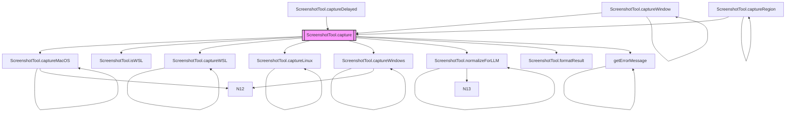

# src (20 modules)

The `src` directory serves as the foundational layer for the system's operational logic, encompassing a wide array of modules that define core functionalities. This section specifically delves into the `src/tools/registry` modules, which are critical for equipping agents with the capabilities to interact with external systems and execute complex tasks. Developers looking to extend agent behaviors, integrate new services, or understand the system's operational breadth should familiarize themselves with these definitions.

Building upon this foundational role, the `src/tools/registry` sub-directory is meticulously organized into specialized modules, each dedicated to a distinct domain of interaction. These modules encapsulate the logic for interacting with various external systems and performing specific actions. For instance, `src/tools/registry/bash-tools` provides capabilities for shell command execution, while `src/tools/registry/browser-tools` enables web interaction. The sheer variety, from `git-tools` for version control to `kubernetes-tools` for container orchestration, underscores the system's versatility.

> **Key concept:** The modular design of the `src/tools/registry` allows for dynamic loading and management of agent capabilities, ensuring that agents can access a wide array of specialized functions without being burdened by unnecessary overhead. The `initializeToolRegistry()` function, found in `src/codebuddy/tools`, is critical for setting up this ecosystem.

-   **src/tools/registry/index** (rank: 0.004, 1 functions)
-   **src/tools/registry/attention-tools** (rank: 0.002, 11 functions)
-   **src/tools/registry/bash-tools** (rank: 0.002, 10 functions)
-   **src/tools/registry/browser-tools** (rank: 0.002, 18 functions)
-   **src/tools/registry/control-tools** (rank: 0.002, 6 functions)
-   **src/tools/registry/docker-tools** (rank: 0.002, 10 functions)
-   **src/tools/registry/git-tools** (rank: 0.002, 10 functions)
-   **src/tools/registry/knowledge-tools** (rank: 0.002, 21 functions)
-   **src/tools/registry/kubernetes-tools** (rank: 0.002, 10 functions)
-   **src/tools/registry/memory-tools** (rank: 0.002, 16 functions)
-   ... and 10 more

Beyond standard tool execution, the registry architecture facilitates the conversion of diverse tool formats into a unified interface. By utilizing `convertMCPToolToCodeBuddyTool()` and `convertPluginToolToCodeBuddyTool()`, the system normalizes disparate tool definitions, ensuring compatibility across the agent's execution environment. This abstraction layer is essential for maintaining a consistent API surface area regardless of the underlying tool source, whether it originates from a local plugin or an external Model Context Protocol (MCP) server.

The modularity of the tool registry is further supported by a robust lifecycle management process, particularly during initialization. The following diagram illustrates the key steps involved in discovering and registering tools, highlighting how the system ensures agents have access to a comprehensive and well-organized set of capabilities. The `createAllToolsAsync` operation is fundamental, orchestrating the discovery and setup of all available tools. This often includes processes like `createAliasTools`, which generates user-friendly aliases for complex tool functions, simplifying agent interaction. The system leverages a central tool registry, initialized by functions such as `initializeToolRegistry()`, to catalog these tools. This registry is then accessed by components responsible for executing agent actions, ensuring that the appropriate tool is invoked when needed. Furthermore, the system supports extensibility through `addMCPToolsToCodeBuddyTools()` and `addPluginToolsToCodeBuddyTools()`, allowing for dynamic integration of external toolsets.

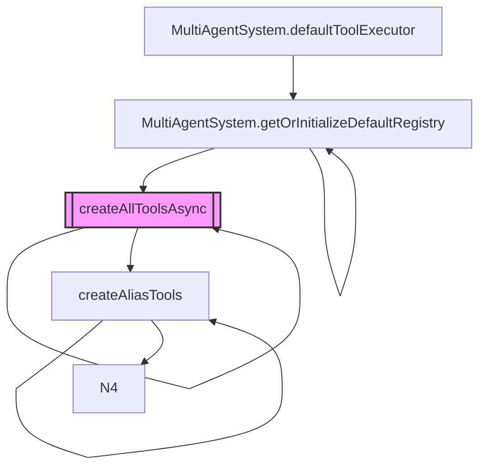

## src (4 modules)

This section details core modules responsible for agent observation and background daemon management within the `src` directory. Understanding these components is crucial for enabling the agent's autonomous interaction with its environment and ensuring the stability of long-running system processes. Developers working on agent perception, event handling, or system services will find this information essential for extending or debugging core functionalities.

The `src/agent/observer` sub-directory contains modules that implement the agent's perception capabilities. The `event-trigger` module is responsible for detecting and dispatching significant events within the system or user interface. These events are then coordinated by the `observer-coordinator`, which manages various observation streams and ensures timely processing. The `screen-observer` module specifically focuses on capturing and interpreting visual information from the user's screen, providing the agent with a crucial input channel for understanding its operational context. This observational data is vital for the agent's decision-making processes, often feeding into components like `CodeBuddyAgent.initializeMemory()` to update the agent's understanding of the environment.

> **Key concept:** The agent's observation system leverages an event-driven architecture, where `event-trigger` acts as the publisher and `observer-coordinator` as the subscriber manager, ensuring loose coupling and extensibility for new observation types.

```mermaid
graph TD
    A[User Interaction/System Event] --> B(src/agent/observer/event-trigger);
    B --> C(src/agent/observer/observer-coordinator);
    C --> D(src/agent/observer/screen-observer);
    D --> E[Agent Perception & Memory];
    E -- Updates --> F(CodeBuddyAgent.initializeMemory());
    G[System Startup/Shutdown] --> H(src/daemon/daemon-lifecycle);
    H -- Manages --> I[Background Services];
```

Beyond the immediate processing of observational data, the system requires a stable runtime environment to host these services. The daemon lifecycle management ensures that these background processes remain resilient across system states.

Complementing the agent's active observation, the `src/daemon/daemon-lifecycle` module is critical for managing background processes. It handles the startup, shutdown, and overall lifecycle of persistent services, ensuring that core functionalities are available and resilient. This module is foundational for maintaining the system's operational integrity, especially for long-running tasks that require continuous background execution. By abstracting the lifecycle management, it allows developers to register new services without needing to manually handle process signals or cleanup routines.

- **src/agent/observer/event-trigger** (rank: 0.003, 11 functions)
- **src/agent/observer/observer-coordinator** (rank: 0.003, 8 functions)
- **src/agent/observer/screen-observer** (rank: 0.003, 9 functions)
- **src/daemon/daemon-lifecycle** (rank: 0.002, 10 functions)

## src (21 modules)

The `src` directory encapsulates the core implementation logic of the system, housing foundational modules critical for agent intelligence, memory management, and system configuration. Understanding these components is essential for developers working on the agent's cognitive functions, personalization features, or overall operational stability, as they directly influence the agent's ability to learn, adapt, and interact effectively.

Central to the agent's ability to retain and utilize information is the `src/memory/enhanced-memory` module. This component manages the agent's long-term memory, enabling it to store, retrieve, and process past interactions, project details, and user profiles. Key operations include `EnhancedMemory.initialize()` for setting up memory structures, and methods like `EnhancedMemory.loadMemories()`, `EnhancedMemory.loadProjects()`, `EnhancedMemory.loadUserProfile()`, and `EnhancedMemory.loadSummaries()` for populating the agent's context.

> **Key concept:** Enhanced memory is crucial for maintaining conversational context and project awareness across sessions. By persistently storing and intelligently retrieving information, it allows the agent to exhibit coherent, personalized, and contextually relevant behavior, significantly improving user experience and task completion rates.

The following diagram illustrates the initialization and loading processes within the `EnhancedMemory` module, showcasing how the system populates its cognitive context upon startup:

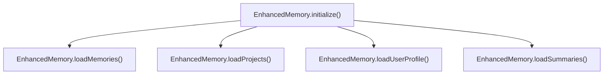

Beyond long-term memory, the system relies on specialized channels and agent-specific logic to process real-time interactions and tool execution. The `src/channels/dm-pairing` module manages secure communication and pairing, utilizing `DMPairingManager.checkSender()` and `DMPairingManager.approve()` to validate interactions, while `src/codebuddy/client` handles model-specific logic, such as `CodeBuddyClient.validateModel()` and `CodeBuddyClient.probeToolSupport()`, ensuring the agent selects the appropriate inference path for the current task.

For repository-level operations, the `src/agent/repo-profiler` module provides deep insights into the codebase, with `RepoProfiler.getProfile()` and `RepoProfiler.computeProfile()` serving as the primary entry points for context generation. Furthermore, the `src/tools/screenshot-tool` provides visual context capabilities, leveraging `ScreenshotTool.capture()` and `ScreenshotTool.captureMacOS()` to bridge the gap between visual input and agent reasoning.

> **Key concept:** The `RepoProfiler` and `ScreenshotTool` modules decouple heavy computational tasks from the main execution loop, allowing the agent to maintain responsiveness while performing complex repository analysis or visual processing.

While memory management forms the cognitive foundation, the `src` directory also encompasses modules that define the agent's external presentation and operational parameters. The `src/personas/persona-manager` module facilitates the definition and application of distinct agent personas, allowing for tailored interaction styles and behavioral patterns. Concurrently, `src/utils/settings-manager` provides a robust interface for managing application-wide configurations and user preferences, ensuring adaptability and consistent operation across different environments.

These foundational components, alongside others, contribute to the overall intelligence and adaptability of the system. The following list provides a comprehensive overview of the most architecturally significant modules within the `src` directory, detailing their importance and functional scope:

- **src/memory/enhanced-memory** (rank: 0.009, 28 functions)
- **src/memory/coding-style-analyzer** (rank: 0.004, 11 functions)
- **src/memory/decision-memory** (rank: 0.004, 10 functions)
- **src/personas/persona-manager** (rank: 0.003, 22 functions)
- **src/utils/settings-manager** (rank: 0.003, 32 functions)
- **src/agent/operating-modes** (rank: 0.002, 27 functions)
- **src/config/model-tools** (rank: 0.002, 3 functions)
- **src/context/bootstrap-loader** (rank: 0.002, 7 functions)
- **src/context/precompaction-flush** (rank: 0.002, 6 functions)
- **src/memory/auto-capture** (rank: 0.002, 15 functions)
- ... and 11 more

These modules collectively form the operational backbone of the system, enabling sophisticated agent behaviors, personalized user experiences, and dynamic adaptation to various tasks and environments. Their robust design ensures that the agent can effectively manage its internal state, interact intelligently, and maintain system integrity.

# src (5 modules)

The `src` directory encapsulates the core logic and foundational components of the system, ranging from agent-specific functionalities like repository profiling and code cartography to essential utilities and tool registries. Understanding these modules is crucial for developers working on agent behavior, system performance, or integrating new capabilities, as they define how the system perceives its environment and executes tasks.

### src/agent/repo-profiling/cartography

This module is responsible for mapping the codebase structure, providing a detailed understanding of the project's architecture and file relationships. It acts as the foundational layer for the agent's contextual awareness, enabling intelligent navigation and decision-making. The `runCartography()` function orchestrates the entire mapping process, initiating the discovery of project files and their interconnections. It leverages helper functions such as `normalizeSrcDirs()` to standardize source directories, ensuring consistent path resolution, and `walkAllFiles()` to efficiently traverse the filesystem. Furthermore, the `scanFileStats()` function gathers critical metadata for individual files, contributing to a comprehensive codebase profile that informs subsequent agent operations.

To optimize the traversal process, the module utilizes `autoDetectSourceDirs()` to identify relevant project roots and `deduplicatePaths()` to prevent redundant processing. During the recursive traversal, the system employs `walk()` to navigate the directory tree, while `walkIfNew()` ensures that only unvisited paths are processed, significantly reducing I/O overhead.

> **Key concept:** Code cartography, driven by `runCartography()`, generates a dynamic, graph-based representation of the codebase, enabling the agent to understand project structure and dependencies without explicit human input. This process is vital for the agent's ability to contextualize tasks and operate effectively within complex projects.

Building upon the structural insights provided by the cartography module, the repository profiler then synthesizes this raw data into actionable intelligence for the agent.

### src/agent/repo-profiler

Building upon the insights generated by the cartography module, `src/agent/repo-profiler` is dedicated to creating and managing detailed profiles of the repository. These profiles are critical for the agent to make informed decisions and efficiently navigate the codebase, serving as a high-level summary of the project's components and their relationships. The `RepoProfiler.getProfile()` method retrieves the current repository profile, providing a cached view of the codebase. When updates are required, `RepoProfiler.computeProfile()` is responsible for generating or updating this profile based on the latest codebase analysis, often triggered by changes detected by the cartography process. The `RepoProfiler.refresh()` method ensures that the agent's understanding of the repository remains current, invalidating stale caches and initiating re-computation as needed.

To maintain performance, the profiler utilizes `RepoProfiler.loadCache()` to check for existing data and `RepoProfiler.isCacheStale()` to determine if a full re-scan is necessary. Once the analysis is complete, `RepoProfiler.saveCodeGraph()` persists the state, while `RepoProfiler.loadCodeGraph()` restores it for subsequent sessions. For complex tasks, `RepoProfiler.buildContextPack()` aggregates the necessary metadata to provide the agent with a focused view of the relevant codebase segments.

> **Key concept:** The repository profile, managed by `RepoProfiler`, acts as the agent's internal model of the codebase, abstracting complex file system details into a structured, queryable format. This enables efficient context retrieval and reduces the computational overhead of repeated file system scans.

The following diagram illustrates the data flow and key interactions within the repository profiling process, highlighting how cartography feeds into the profiler's operations.

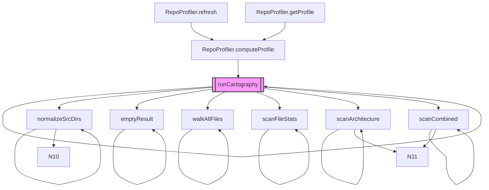

While repository profiling focuses on understanding the external environment, the system also requires robust internal mechanisms for tracking its own operations and performance.

### src/observability/run-store

Beyond understanding the codebase, the system requires robust mechanisms for tracking its own operations and agent interactions. The `src/observability/run-store` module provides functionalities for logging and persisting execution runs, offering critical insights into agent behavior, decision-making processes, and overall system performance. This module is essential for debugging complex agent workflows, auditing historical interactions, and analyzing the long-term effectiveness of agent strategies and tool usage. It serves as a central repository for operational telemetry.

By maintaining a persistent record of execution states, the system enables developers to replay specific agent runs, facilitating the identification of edge cases and performance bottlenecks. This observability layer is integral to the feedback loop that drives continuous improvement in agent reliability.

To ensure a consistent and reliable starting point for these operations, the system provides dedicated utilities for project initialization.

### src/utils/init-project

To ensure a consistent and reliable operational environment, the `src/utils/init-project` module provides a collection of utilities for initializing new projects. These functions are crucial for setting up the foundational structure and configurations required for both human developers and autonomous agents to begin work. They handle essential setup tasks, apply default configurations, and perform dependency checks, streamlining the onboarding process for new development efforts or agent-driven tasks by ensuring all prerequisites are met.

Proper initialization is a prerequisite for the agent's ability to interact with the environment safely. By standardizing the project setup, this module minimizes configuration drift and ensures that the agent operates within a predictable, well-defined workspace.

Once a project is initialized, the agent can leverage various tools, including specialized ones tailored for educational purposes.

### src/tools/registry/lessons-tools

Finally, the `src/tools/registry/lessons-tools` module manages a specialized set of tools designed specifically for educational content and interactive lessons. This registry ensures that specific functionalities required for tutorials, guided learning paths, and interactive demonstrations are properly defined, made accessible to the agent, and seamlessly integrated into its broader tool-use capabilities. These tools often provide simplified interfaces or focused functionalities to facilitate learning and experimentation within a controlled environment.

By isolating educational tools within this registry, the system maintains a clean separation between production-grade utilities and instructional components. This architecture allows for the dynamic loading of lesson-specific tools without cluttering the primary tool registry, ensuring that the agent remains performant while supporting diverse use cases.

## src/agent/specialized/swe-agent (2 modules)

The `src/agent/specialized/swe-agent` directory defines the specialized architecture required for autonomous software engineering tasks. This system is intended for developers integrating automated coding, refactoring, or debugging workflows into the broader agent ecosystem, ensuring that specialized logic remains isolated from general-purpose agent operations.

The architecture is partitioned into two primary modules to separate core execution logic from system integration requirements.

The specialized SWE agent system is comprised of the following modules:

-   **src/agent/specialized/swe-agent** (rank: 0.004, 8 functions)
-   **src/agent/specialized/swe-agent-adapter** (rank: 0.002, 7 functions)

The `src/agent/specialized/swe-agent` module encapsulates the core logic for executing software engineering workflows, orchestrating interactions with various tools and models. The `src/agent/specialized/swe-agent-adapter` module provides the necessary interface, translating system-wide requests into SWE agent-specific operations and ensuring seamless integration into the broader agent ecosystem.

By decoupling the agent's internal execution from the external adapter interface, the system maintains high modularity and allows for independent updates to the underlying engineering models without impacting the host environment.

> **Key concept:** Specialized agents, such as the SWE agent, are designed to handle complex, domain-specific tasks by leveraging fine-tuned models and tailored toolsets. This approach significantly improves performance and accuracy for specific domains compared to general-purpose agents, by focusing their capabilities on a narrower problem space.

Internal data flow and component interactions within the SWE agent system are critical for its operation, especially concerning specialized functionalities like entity extraction. The following diagram illustrates a key aspect of this interaction, showing how the entity extractor is configured.

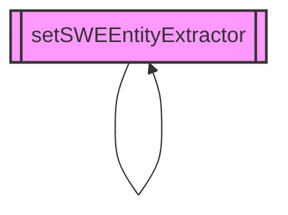

## src (6 modules)

This section details the core modules within the `src` directory, focusing on components critical for agent orchestration, context management, and advanced tooling. Understanding these modules is essential for developers extending the agent's capabilities, integrating new tools, or optimizing its understanding of the codebase.

The `src` directory houses fundamental building blocks that enable the system to process information, execute complex tasks, and interact with various environments. The modules listed below represent key areas of functionality:

*   **src/agent/subagents** (rank: 0.002, 20 functions)
    This module is responsible for managing and orchestrating specialized subagents, allowing for the decomposition of complex tasks into smaller, more manageable units. Subagents can be designed to handle specific domains or types of problems, improving overall efficiency and accuracy. The `Subagent.run()` method is central to initiating and managing the execution flow of these specialized agents, coordinating their actions to achieve broader objectives.

Building upon the agent orchestration capabilities, the system also requires a robust understanding of the underlying codebase to perform intelligent operations.

*   **src/context/codebase-map** (rank: 0.002, 12 functions)
    This module focuses on generating and maintaining an internal representation of the project's codebase. This codebase map provides structured context, enabling agents to understand the relationships between files, functions, and classes. It is a critical input for tasks requiring deep code understanding, complementing the work done by `RepoProfiler.computeProfile()` and `RepoProfiler.loadCodeGraph()` to build a comprehensive view of the repository.

To ensure the continuity and efficiency of agent operations, this valuable contextual information must be persistently stored.

*   **src/knowledge/code-graph-persistence** (rank: 0.002, 3 functions)
    This module handles the serialization and deserialization of the codebase map and other knowledge graphs, ensuring that this valuable contextual information can be efficiently stored and retrieved across sessions. This persistence mechanism is vital for maintaining state and avoiding redundant computation, similar to how `RepoProfiler.saveCodeGraph()` operates to preserve the code graph for future use.

> **Key concept:** The persistent codebase map, managed by `src/context/codebase-map` and `src/knowledge/code-graph-persistence`, significantly reduces the need for repeated code analysis, allowing agents to quickly access and leverage deep project understanding, which is crucial for efficient context retrieval and decision-making.

Beyond internal knowledge representation, agents often require dynamic execution environments to test hypotheses or perform immediate computations.

*   **src/tools/js-repl** (rank: 0.002, 12 functions)
    This module provides an interactive JavaScript Read-Eval-Print Loop (REPL) environment, allowing agents to execute JavaScript code dynamically within a sandboxed context. This tool is invaluable for testing code snippets, querying data, or performing computations during agent execution, offering a direct interface for programmatic interaction.

For more complex code manipulation tasks, the system provides tools for coordinated modifications.

*   **src/tools/multi-edit** (rank: 0.002, 4 functions)
    The `multi-edit` module facilitates the application of multiple, coordinated code modifications across different files or sections of a project. This capability is essential for refactoring tasks, applying consistent changes, or implementing features that span several parts of the codebase, ensuring atomicity and consistency across changes.

Finally, to empower agents with a broad range of capabilities, a centralized system for managing available tools is indispensable.

*   **src/tools/registry/advanced-tools** (rank: 0.002, 33 functions)
    This module serves as a central registry for advanced tools available to the agent. It aggregates and manages a diverse set of utilities beyond basic file operations, enabling the agent to perform complex actions. This registry works in conjunction with mechanisms like `initializeToolRegistry()` and `addPluginToolsToCodeBuddyTools()` to ensure all available tools are discoverable and usable by the agent's decision-making processes.

The following diagram illustrates the relationship between the repository profiling, persistence, and tool registry components:

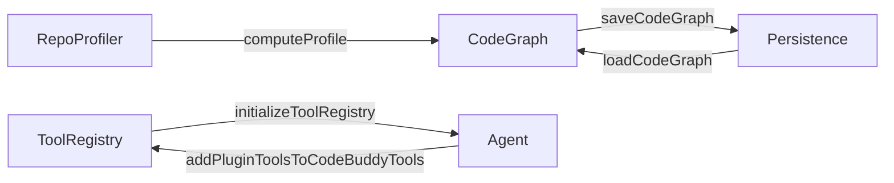

# src/browser-automation (4 modules)

The `src/browser-automation` module group provides the foundational components for programmatic interaction with web browsers. This functionality is critical for enabling AI agents to perform tasks requiring web access, such as data extraction, UI testing, and automated workflows. Understanding these modules is essential for developers extending the system's web interaction capabilities or debugging browser-related issues, as they form the backbone of all automated web interactions.

This module group is composed of several specialized components that collectively manage browser instances, user profiles, network interactions, and visual feedback, ensuring robust and controllable web automation.

-   **src/browser-automation/profile-manager** (rank: 0.003, 4 functions)
    The `profile-manager` module is responsible for the creation, loading, and persistence of browser profiles. This ensures that automated browser sessions can maintain state, including cookies, local storage, and user settings, across multiple runs. By managing distinct profiles, the system can simulate different user environments or isolate test scenarios effectively, providing a consistent execution context for automated tasks.

Beyond managing browser state through profiles, the system also offers fine-grained control over the network interactions initiated by the automated browser.

-   **src/browser-automation/route-interceptor** (rank: 0.003, 4 functions)
    Complementing profile management, the `route-interceptor` module provides capabilities to intercept and modify network requests made by the automated browser. This allows for fine-grained control over web traffic, enabling scenarios such as blocking specific resources, modifying request/response headers, or mocking API responses for testing purposes. It is a vital component for controlling external dependencies and optimizing performance during automated tasks, ensuring predictable behavior.

To enhance debugging and provide visual context for automated operations, the system integrates capabilities for annotating visual outputs.

-   **src/browser-automation/screenshot-annotator** (rank: 0.003, 1 functions)
    The `screenshot-annotator` module facilitates the programmatic addition of annotations to captured screenshots. This functionality is particularly useful for debugging automated workflows, highlighting specific UI elements for visual verification, or providing contextual feedback within AI agent interactions. It enhances the interpretability of visual outputs from browser automation, making it easier to understand the state and actions of the browser.

At the core of all these capabilities lies the central component responsible for orchestrating the browser itself.

-   **src/browser-automation/browser-manager** (rank: 0.002, 70 functions)
    At the core of the browser automation capabilities is the `browser-manager` module, which orchestrates the lifecycle of browser instances. This module provides a comprehensive API for launching, controlling, and closing browsers, managing multiple pages or tabs, and executing JavaScript within the browser context. It serves as the primary interface for all high-level browser automation tasks, abstracting away the complexities of direct browser engine interactions and providing a unified control surface.

> **Key concept:** The `browser-manager` module provides a unified, high-level API for controlling browser instances, abstracting the underlying complexities of browser engine communication and enabling robust headless and headful automation.

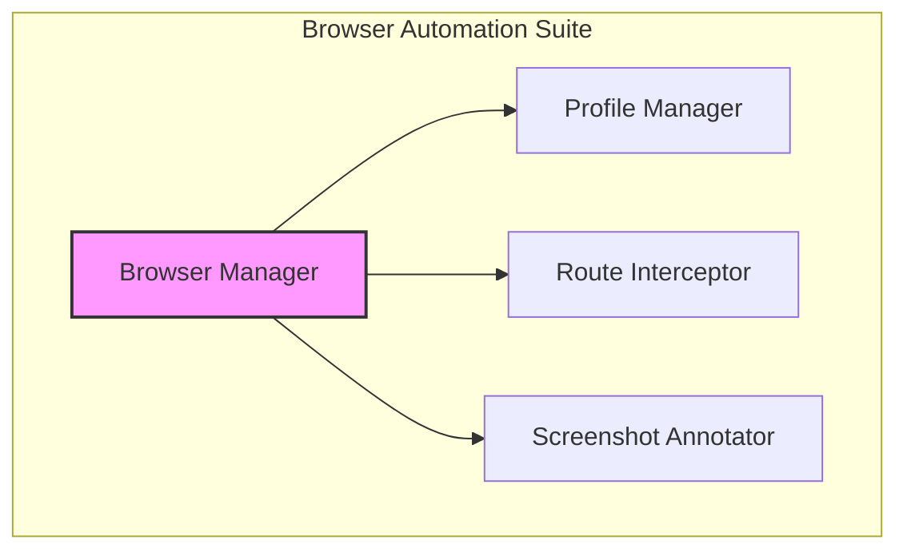

## src (2 modules)

This section provides an in-depth overview of two pivotal modules within the `src` directory: `embedding-cache` and `codebase-rag/embeddings`. These components are foundational for implementing efficient semantic search and Retrieval-Augmented Generation (RAG) capabilities, directly influencing the performance and relevance of context retrieval for large language models. Understanding these modules is essential for developers focused on optimizing RAG systems, enhancing memory management, or improving overall application performance.

- **src/cache/embedding-cache** (rank: 0.004, 23 functions)

The `src/cache/embedding-cache` module serves as a critical component for optimizing performance by storing and managing pre-computed embeddings. Its primary role is to prevent redundant computations, thereby significantly accelerating retrieval operations in systems that frequently generate or query embeddings. Core functionalities include efficient retrieval of existing embeddings through `EmbeddingCache.get()`, the generation of unique cache keys via `EmbeddingCache.createKey()`, and robust management of cache validity using `EmbeddingCache.isExpired()`. For a streamlined workflow, the `EmbeddingCache.getOrCompute()` method offers a unified interface that either fetches a cached embedding or computes it on demand if not already present, ensuring optimal resource utilization.

This caching layer is frequently utilized by `RepoProfiler.getProfile()` to ensure that code graph analysis remains performant across multiple sessions, preventing the need to re-process static code structures. By abstracting the persistence logic, it allows the application to maintain a consistent state across different execution environments, which is critical for long-running agentic tasks.

> **Key concept:** Caching embeddings significantly reduces latency and computational cost in RAG systems by minimizing calls to embedding models, which can be resource-intensive.

Beyond simply caching individual embeddings, the system requires a mechanism to leverage these cached representations for effective semantic search within a specific domain, such as a codebase.

- **src/context/codebase-rag/embeddings** (rank: 0.002, 31 functions)

Building upon the robust caching infrastructure provided by `embedding-cache`, the `src/context/codebase-rag/embeddings` module specializes in the generation and retrieval of embeddings specifically optimized for codebase Retrieval-Augmented Generation (RAG). This module is designed to integrate seamlessly with the embedding cache, enabling highly efficient semantic searches across an entire codebase. It leverages key methods such as `HybridMemorySearch.semanticSearch()` to identify and retrieve relevant code snippets based on a given query. Furthermore, `HybridMemorySearch.getCachedQueryEmbedding()` ensures that query embeddings themselves are cached, further enhancing performance by preventing redundant computations for frequently asked queries. This comprehensive integration guarantees that the RAG system can rapidly supply precise and relevant code context to the language model, improving the quality and speed of responses.

By utilizing the cached vectors, the system avoids the overhead of re-embedding static code blocks during iterative query cycles. This architecture ensures that the RAG pipeline remains responsive even when dealing with large, complex codebases where context window management is paramount.

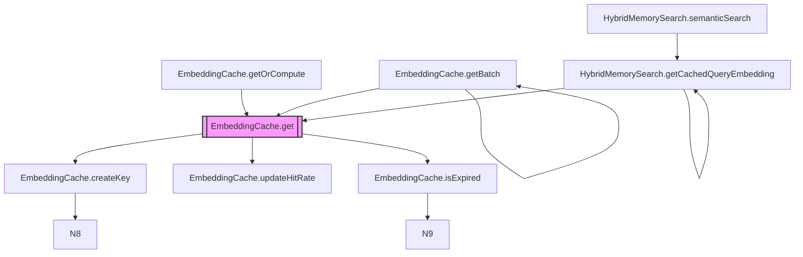

## src/canvas

This section documents the `src/canvas` modules, which provide the foundational architecture for the application's interactive visual interface. It details how dynamic user interfaces are rendered, managed, and integrated into the workspace, serving as a critical reference for developers building UI components or extending visual tooling.

### src/canvas/a2ui-tool

-   **src/canvas/a2ui-tool** (rank: 0.003, 22 functions)

The `src/canvas/a2ui-tool` module provides the core functionality for managing abstract UI surfaces and components. It allows for the programmatic creation and manipulation of visual elements, enabling dynamic user interfaces. Key operations include `A2UITool.createSurface()` to establish new rendering contexts, `A2UITool.addComponent()` for adding interactive elements, and `A2UITool.renderHTML()` or `A2UITool.renderTerminal()` for displaying content. The module also manages the underlying server infrastructure with `A2UITool.startServer()` and `A2UITool.stopServer()`, allowing for remote interaction and rendering.

The `src/canvas/a2ui-tool` module serves as the primary interface for programmatic UI management, abstracting the complexities of rendering into manageable surfaces and components. It facilitates the creation and manipulation of visual elements, enabling highly dynamic and responsive user interfaces. Beyond visual presentation, this module also manages the server-side infrastructure required for remote interaction and rendering, ensuring a robust and flexible UI delivery mechanism.

> **Key concept:** The `A2UITool` abstracts complex UI rendering into manageable surfaces and components, allowing for dynamic, server-driven UI updates without direct DOM manipulation, enhancing performance and flexibility.

```mermaid
graph TD
    N0[["A2UITool.execute"]]
    N1["A2UITool.createSurface"]
    N2["A2UITool.deleteSurface"]
    N3["A2UITool.addComponent"]
    N4["A2UITool.addComponents"]
    N5["A2UITool.updateData"]
    N6["A2UITool.beginRendering"]
    N7["A2UITool.renderTerminal"]
    N8["A2UITool.renderHTML"]
    N9["A2UITool.getSurface"]
    N10["A2UITool.listSurfaces"]
    N11["A2UITool.startServer"]
    N12["A2UITool.stopServer"]
    N13["A2UITool.serverStatus"]
    N14["A2UITool.getData"]
    N0 --> N1
    N0 --> N2
    N0 --> N3
    N0 --> N4
    N0 --> N5
    N0 --> N6
    N0 --> N7
    N0 --> N8
    N0 --> N9
    N0 --> N10
    N0 --> N11
    N0 --> N12
    N0 --> N13
    N0 --> N14
    N2 --> N2
    N3 --> N3
    N4 --> N4
    N6 --> N6
    N7 --> N7
    N8 --> N8
    N10 --> N10
    N11 --> N18
    N11 --> N19
    N12 --> N20
    N13 --> N13
    style N0 fill:#f9f,stroke:#333,stroke-width:2px
```

With the rendering infrastructure established by the tool layer, the system requires a structured environment to display and interact with these components. This is handled by the workspace orchestration layer.

### src/canvas/visual-workspace

-   **src/canvas/visual-workspace** (rank: 0.003, 20 functions)

Building upon the capabilities of the `a2ui-tool`, the `src/canvas/visual-workspace` module defines the interactive environment where these UI surfaces and components are presented to the user. It orchestrates the layout, interaction, and overall visual presentation, acting as the primary canvas for user engagement and direct manipulation of visual elements.

The `src/canvas/visual-workspace` module acts as the central interactive environment, defining how the abstract UI surfaces and components are arranged, displayed, and interacted with. It manages the layout, user input, and overall visual presentation, serving as the primary canvas where users engage directly with the application's visual elements. This module is critical for delivering a cohesive and intuitive user experience.

Once the workspace is established, the system must manage the lifecycle and availability of the tools that operate within that space to ensure extensibility.

### src/tools/registry/canvas-tools

-   **src/tools/registry/canvas-tools** (rank: 0.002, 14 functions)

The `src/tools/registry/canvas-tools` module is responsible for registering and making available a suite of tools specifically designed to interact with and manipulate the visual workspace. This ensures that the system can dynamically discover and utilize canvas-specific functionalities, integrating them seamlessly into the overall application experience.

The `src/tools/registry/canvas-tools` module plays a crucial role in extending the functionality of the visual workspace by providing a mechanism to register and discover specialized tools. This registry ensures that the application can dynamically integrate and utilize a diverse suite of canvas-specific functionalities, allowing for seamless interaction and manipulation of visual elements within the workspace.

Together, these canvas modules form the foundation for a rich, interactive user interface, enabling dynamic visual feedback and direct manipulation within the application's visual environment. Collectively, these `src/canvas` modules establish a powerful and flexible framework for building and managing the application's interactive visual environment, from abstract UI component management to user-facing workspace orchestration and tool integration.

## src/channels (10 modules)

The `src/channels` directory acts as the abstraction layer for multi-platform communication, decoupling core agent logic from specific messaging APIs. This architecture is essential for developers integrating new platforms or maintaining existing channel-specific protocols, as it centralizes message handling and security validation.

This directory encapsulates the specific client implementations for each supported messaging channel, ensuring that the core application logic remains decoupled from platform-specific APIs. Each module provides the necessary interfaces and utilities to send and receive messages, manage conversations, and handle platform-specific events.

-   **src/channels/dm-pairing** (rank: 0.019, 19 functions)
-   **src/channels/google-chat/index** (rank: 0.002, 16 functions)
-   **src/channels/matrix/index** (rank: 0.002, 23 functions)
-   **src/channels/signal/index** (rank: 0.002, 19 functions)
-   **src/channels/teams/index** (rank: 0.002, 18 functions)
-   **src/channels/webchat/index** (rank: 0.002, 21 functions)
-   **src/channels/whatsapp/index** (rank: 0.002, 20 functions)
-   **src/channels/discord/client** (rank: 0.002, 35 functions)
-   **src/channels/slack/client** (rank: 0.002, 31 functions)
-   **src/channels/telegram/client** (rank: 0.002, 37 functions)

While the directory contains numerous platform-specific clients, the security and authorization logic is unified through shared modules. The most critical of these is the pairing subsystem, which governs how the agent establishes trust with external users.

Among these, `src/channels/dm-pairing` stands out with the highest architectural rank, indicating its foundational role in managing secure direct message interactions. This module is responsible for establishing and maintaining trusted relationships between users and the system across various channels, preventing unauthorized access and ensuring privacy.

> **Key concept:** The DM pairing mechanism, managed by `DMPairingManager`, is a critical security layer that ensures only explicitly approved senders can initiate direct message interactions with the system. This prevents spam, unauthorized access, and maintains user privacy by requiring a deliberate opt-in process.

The `DMPairingManager` orchestrates the entire pairing lifecycle, from initial request to approval or revocation. The following diagram illustrates the core functions involved in verifying and managing sender permissions within the DM pairing system.

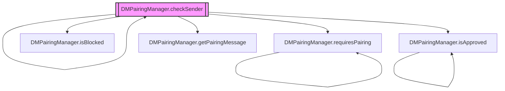

The `DMPairingManager.checkSender()` method is central to validating incoming direct messages. It relies on `DMPairingManager.requiresPairing()` to determine if a sender needs to be paired, and `DMPairingManager.isBlocked()` to check if a sender has been explicitly denied access. 

Beyond standard validation, the system supports administrative overrides via `DMPairingManager.approveDirectly()` and provides user-facing feedback through `DMPairingManager.getPairingMessage()`. These utilities ensure that the pairing flow remains transparent to the end-user while maintaining strict security boundaries. Other critical methods within this module include `DMPairingManager.approve()` and `DMPairingManager.revoke()` for managing pairing status, and `DMPairingManager.isApproved()` to query the current approval state of a sender.

# src (11 modules)

The `src` directory serves as the architectural foundation of the application, containing the primary logic and integration layers. This section specifically focuses on the communication channel modules, which are critical for enabling multi-platform user interaction. Developers should review this documentation when extending platform support, debugging cross-channel integration issues, or implementing new messaging features.

The `src` directory serves as the core codebase, housing the primary logic and integrations for the application. This particular section details the various communication channel modules, which are critical for enabling interaction with users across diverse messaging platforms. Understanding these modules is essential for developers extending platform support, debugging integration issues, or implementing new channel-specific features.

The `channels` subdirectory within `src` encapsulates the logic required to interface with external messaging and communication services. Each module provides the necessary adapters and handlers to send and receive messages, manage user sessions, and facilitate interactions specific to its platform. This abstraction allows the core application logic to remain independent of the underlying communication medium. The following diagram illustrates the high-level data flow from user interaction through various channel adapters to the core application logic, highlighting the role of the `DMPairingManager` in securing these interactions.

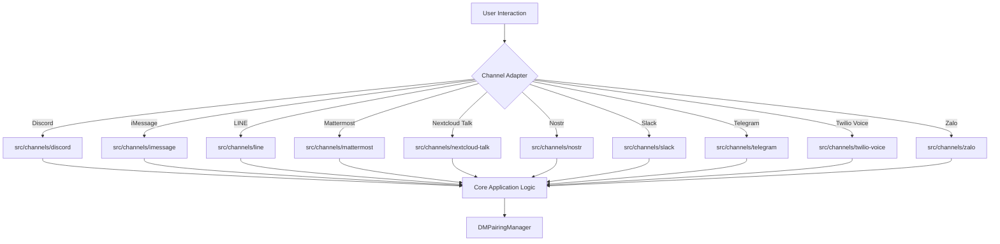

While the channel adapters handle the transport layer, the security and authorization of these interactions are managed by the `DMPairingManager`. This component ensures that only verified senders can initiate or continue conversations, preventing unauthorized access across the various supported platforms.

> **Key concept:** The `channels` modules provide a unified interface for diverse communication platforms, abstracting platform-specific protocols. This allows the core system, including components like `DMPairingManager`, to interact with users consistently regardless of their chosen channel, using methods such as `DMPairingManager.checkSender()` and `DMPairingManager.approve()` for secure interactions.

The following modules represent the current suite of supported communication channels, each designed to handle the unique characteristics and APIs of its respective platform:

-   **src/channels/discord/index** (rank: 0.002, 0 functions)
-   **src/channels/imessage/index** (rank: 0.002, 20 functions)
-   **src/channels/line/index** (rank: 0.002, 11 functions)
-   **src/channels/mattermost/index** (rank: 0.002, 10 functions)
-   **src/channels/nextcloud-talk/index** (rank: 0.002, 11 functions)
-   **src/channels/nostr/index** (rank: 0.002, 20 functions)
-   **src/channels/slack/index** (rank: 0.002, 0 functions)
-   **src/channels/telegram/index** (rank: 0.002, 0 functions)
-   **src/channels/twilio-voice/index** (rank: 0.002, 12 functions)
-   **src/channels/zalo/index** (rank: 0.002, 10 functions)
-   ... and 1 more

These channel integrations are foundational for the system's ability to communicate with users. Beyond simply receiving and sending messages, they often involve complex logic for session management and user authentication, frequently leveraging the `DMPairingManager` to determine if a sender `DMPairingManager.requiresPairing()` or if a user `DMPairingManager.isApproved()`. The next set of modules focuses on how these incoming communications are then processed and understood by the system's core AI components.

# src (2 modules)

The `src` directory serves as the core source code repository, encapsulating fundamental system functionalities. This section details two critical modules within `src`: `src/checkpoints/persistent-checkpoint-manager`, responsible for maintaining system state integrity and enabling rollback capabilities, and `src/commands/handlers/extra-handlers`, which extends the system's command processing capabilities. Understanding these modules is crucial for developers working on system stability, state management, or extending command-line interactions.

### src/checkpoints/persistent-checkpoint-manager

The `persistent-checkpoint-manager` module is central to ensuring the system's resilience and data integrity. It provides mechanisms for capturing and restoring the application's state at various points, allowing for reliable recovery from errors or unexpected shutdowns. This module is particularly important for long-running processes or operations that require atomic state changes, ensuring that the system can always revert to a known good state.

> **Key concept:** Checkpointing involves capturing a consistent snapshot of the system's state. This allows for efficient recovery to a known good state, minimizing data loss and ensuring operational continuity, especially in complex, multi-step processes.

A core function within this module involves computing a unique identifier for the current project state. This hash is instrumental in detecting changes and determining when a new checkpoint is required or if an existing checkpoint is still valid, thereby optimizing the checkpointing process.

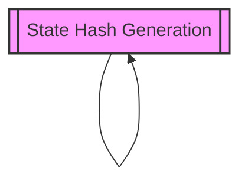
*Figure 1: Conceptual flow of state hash generation, indicating its self-referential role in validating system state.*

Beyond ensuring system state integrity through checkpointing, the system also requires robust mechanisms for interacting with users and processing commands.

### src/commands/handlers/extra-handlers

The `extra-handlers` module addresses the need for extensibility by providing a structured way to register additional command handlers. This allows the application to respond to a broader range of user inputs or internal system events without modifying the core command processing loop.

> **Key concept:** The handler registration pattern decouples command definition from execution logic. By utilizing a modular handler architecture, developers can inject new functionality at runtime, significantly reducing the risk of regression in the primary command processing pipeline.

While `src/checkpoints/persistent-checkpoint-manager` focuses on state preservation, `src/commands/handlers/extra-handlers` focuses on action execution, providing the necessary logic to execute specialized operations. Together, these two modules contribute to a robust and responsive system, ensuring both data integrity and comprehensive command execution.

## src (3 modules)

This section documents the core persistence and interface modules within the `src` directory, which manage user session lifecycle and data integrity. These components are critical for maintaining state across application restarts and providing consistent access points for both CLI and API consumers. Engineers working on state management, session persistence, or interface routing should review these modules to ensure architectural consistency.

The primary module for session management is `src/persistence/session-store`, which handles the durable storage and retrieval of session data. This module provides the foundational capabilities for maintaining conversational context and user-specific states.

-   **src/persistence/session-store** (rank: 0.008, 44 functions)
    This module is responsible for the persistent storage and retrieval of all user session data. It ensures that conversational history, user preferences, and application state are preserved across different interactions and application restarts. Key operations include ensuring the integrity of session directories via `SessionStore.ensureSessionsDirectory()` and `SessionStore.ensureWritableDirectory()`, creating new sessions with `SessionStore.createSession()`, and persisting changes using `SessionStore.saveSession()`. Messages are appended to the current session using `SessionStore.addMessageToCurrentSession()`, and existing sessions can be loaded with `SessionStore.loadSession()`. Additionally, the module handles data normalization through `SessionStore.convertChatEntryToMessage()`.

    > **Key concept:** The `SessionStore` module provides a robust, file-system-based persistence layer, enabling the application to maintain stateful conversations and user context without relying on external databases for core session data. This design choice simplifies deployment and ensures data locality.

    The following diagram illustrates the internal dependencies and flow within the `SessionStore` module, highlighting how various operations contribute to session persistence and management.

    ```mermaid
    graph TD
        A[SessionStore.ensureSessionsDirectory] --> B[SessionStore.ensureWritableDirectory]
        C[SessionStore.createSession] --> D[SessionStore.saveSession]
        E[SessionStore.updateCurrentSession] --> D
        F[SessionStore.addMessageToCurrentSession] --> E
        G[SessionStore.loadSession]
        H[SessionStore.convertChatEntryToMessage]
    ```

With the persistence layer established as the single source of truth for session data, the system exposes these capabilities through specialized interfaces. The following modules bridge the gap between raw data storage and user-facing interaction.

-   **src/cli/session-commands** (rank: 0.002, 3 functions)
    This module defines the command-line interface (CLI) commands that allow users to interact with session management functionalities. These commands typically leverage the `SessionStore` module to create, load, or manage sessions directly from the terminal, providing a direct interface for developers and advanced users. By abstracting the underlying file operations, this module ensures that CLI interactions remain consistent with the broader application state.

Beyond direct command-line interaction, session management capabilities are also exposed via a RESTful API, allowing for programmatic control and integration with external services or front-end applications.

-   **src/server/routes/sessions** (rank: 0.002, 2 functions)
    This module implements the API routes related to session management. It provides HTTP endpoints that allow external clients or the frontend application to programmatically interact with user sessions, performing operations such as retrieving session history or updating session metadata, all built upon the capabilities provided by `src/persistence/session-store`. This layer acts as the primary gateway for remote session manipulation, ensuring that all API-driven state changes adhere to the same persistence rules as local CLI operations.

## src (7 modules)

The `src` directory serves as the primary repository for the application's core logic, housing fundamental components that enable AI interaction, custom scripting, and external system integrations. This directory acts as the architectural foundation for the system; understanding its module structure is essential for developers tasked with extending AI capabilities, modifying core execution pipelines, or integrating external services.

-   **src/codebuddy/index** (rank: 0.003, 0 functions)

This module acts as the central entry point for CodeBuddy-related functionalities, orchestrating interactions with AI models and tools. While `src/codebuddy/index` itself has no directly exposed functions, it aggregates and coordinates services provided by other CodeBuddy modules, such as those responsible for model validation or tool probing. For instance, it leverages capabilities like `CodeBuddyClient.validateModel()` or `CodeBuddyClient.probeToolSupport()` from `src/codebuddy/client` to ensure robust AI interactions and proper tool integration.

Beyond managing AI interactions, the system provides powerful scripting capabilities, allowing users to extend its functionality with custom logic. This internal extensibility is managed by the `src/scripting` modules, which define the lifecycle of script execution.

-   **src/scripting/index** (rank: 0.003, 16 functions)
-   **src/scripting/lexer** (rank: 0.003, 23 functions)
-   **src/scripting/parser** (rank: 0.003, 12 functions)
-   **src/scripting/runtime** (rank: 0.003, 37 functions)

The `src/scripting` subdirectory contains the core components for the application's embedded scripting language, enabling users to define and execute custom logic. This pipeline begins with `src/scripting/lexer`, which tokenizes raw script input into a stream of meaningful symbols. The output of the lexer is then consumed by `src/scripting/parser`, responsible for constructing an Abstract Syntax Tree (AST) that represents the script's hierarchical structure. Finally, `src/scripting/runtime` executes the parsed AST, managing the script's execution environment and state.

> **Key concept:** The scripting pipeline (lexer, parser, runtime) provides a secure and extensible mechanism for users to automate tasks and extend application behavior without modifying the core codebase.

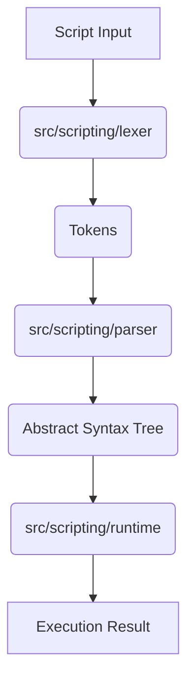

In addition to internal scripting, the application also supports robust communication with external systems. The `src/integrations` modules provide the necessary infrastructure for interacting with other services and platforms, ensuring seamless data exchange and broader interoperability.

-   **src/integrations/json-rpc/server** (rank: 0.002, 26 functions)
-   **src/integrations/mcp/mcp-server** (rank: 0.002, 26 functions)

These modules facilitate communication with external systems and services, forming the backbone of the application's extensibility. `src/integrations/json-rpc/server` implements a JSON-RPC 2.0 compliant server, allowing other applications to interact with the system's functionalities remotely using a standardized protocol. Similarly, `src/integrations/mcp/mcp-server` provides the server-side implementation for the Message Control Protocol (MCP), enabling specialized, high-performance communication with specific external components or plugins.

# src (5 modules)

This section details the core `src` modules responsible for managing and providing tools within the system. These modules are fundamental for enabling the agent's capabilities, allowing it to interact with external services, retrieve information, and execute actions. Developers extending the system's toolset or integrating new external functionalities should familiarize themselves with these components.

- **src/codebuddy/tools** (rank: 0.006, 12 functions)

This module serves as the central registry and management system for all tools available to the CodeBuddy agent. It orchestrates the initialization and integration of various tool types, including those from the Multi-Agent Communication Protocol (MCP) and external plugins. Key functions include `initializeToolRegistry()` for setting up the tool environment, and `addMCPToolsToCodeBuddyTools()` and `addPluginToolsToCodeBuddyTools()` for incorporating tools from different sources into the agent's accessible toolkit. The module also handles conversions between different tool formats, such as `convertMCPToolToCodeBuddyTool()` and `convertPluginToolToCodeBuddyTool()`, ensuring compatibility across the system. Additionally, the module supports `initializeMCPServers()` and `getMCPManager()` to handle protocol-specific requirements, while `convertMarketplaceToolToPluginTool()` facilitates the ingestion of third-party marketplace assets.

> **Key concept:** The `src/codebuddy/tools` module centralizes tool management, abstracting away the complexities of integrating diverse tool types (MCP, plugins) into a unified interface for the agent. This ensures consistent tool discovery and execution.

Building upon the foundational tool management provided by `src/codebuddy/tools`, specific modules implement the functionality for individual tools, such as the capability to perform web searches.

- **src/tools/web-search** (rank: 0.003, 28 functions)

This module encapsulates the logic required for performing web searches, enabling the agent to retrieve real-time information from the internet. It handles the query formulation, execution against search providers, and parsing of results, making external web data accessible for agent reasoning and task completion.

Beyond active data retrieval like web searches, the system also manages metadata associated with various entities to provide context and structure.

- **src/tools/metadata** (rank: 0.003, 0 functions)

The `src/tools/metadata` module is responsible for defining and managing metadata structures used throughout the system. While it does not contain executable functions, its presence signifies the importance of structured data for describing tools, agents, and other system components, facilitating better organization and discoverability.

To ensure that the available tools are well-documented and understandable, a dedicated module generates descriptive markdown.

- **src/tools/tools-md-generator** (rank: 0.002, 6 functions)

This module is dedicated to generating markdown documentation for the tools available within the system. It programmatically creates human-readable descriptions and usage instructions for each tool, which is crucial for both developer understanding and for informing the agent about tool capabilities.

Finally, specific tools are designed to interact with the Multi-Agent Communication Protocol (MCP) sessions, enabling inter-agent communication and collaboration.

- **src/mcp/mcp-session-tools** (rank: 0.002, 1 functions)

This module provides tools specifically designed to interact with and manage Multi-Agent Communication Protocol (MCP) sessions. These tools facilitate communication, coordination, and data exchange between different agents or services operating within the MCP framework, enabling complex multi-agent workflows.

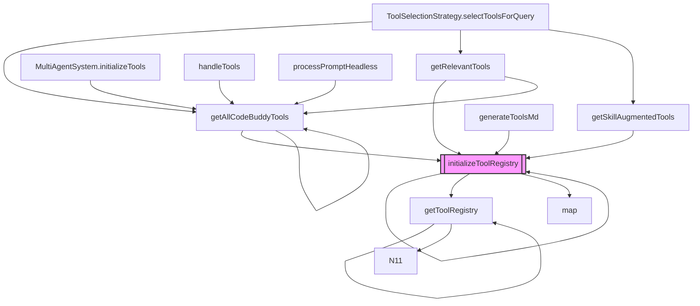

# src (29 modules)

The `src` directory encapsulates the core implementation details of the system, housing a diverse set of modules responsible for fundamental operations, command-line interfaces, and system observability. This section provides an overview of these critical components, offering insights for developers extending system functionality, integrating new devices, or enhancing monitoring capabilities. Understanding this directory is essential for contributors, as it contains the primary logic for agent orchestration, memory management, and device communication protocols.

The modules within the `src` directory are foundational, ranging from device and node management to user interaction and system monitoring. For instance, `src/nodes/index` serves as a central point for managing device nodes, often interacting with the `DeviceNodeManager` through methods like `DeviceNodeManager.getInstance()` to handle device pairing and communication. Command-line interface (CLI) modules, such as `src/commands/cli/device-commands` and `src/commands/cli/node-commands`, define how users interact with these underlying systems, enabling direct control over devices and nodes. Furthermore, `src/observability/run-viewer` provides tools for monitoring system execution and understanding operational flows.

Beyond high-level orchestration, the directory structure is organized to separate concerns between agent logic, persistence, and external communication channels. Developers working on agent behavior should focus on `src/agent/codebuddy-agent`, which utilizes `CodeBuddyAgent.initializeSkills()` to bootstrap agent capabilities, while those working on data integrity should reference `src/persistence/session-store` and its implementation of `SessionStore.saveSession()`.

> **Key concept:** The modular design of the `src` directory, particularly within the `commands/cli` sub-modules, allows for extensible command-line interaction, enabling developers to easily add new functionalities and manage system components like devices and nodes through a unified interface.

To provide a detailed understanding of the `src` directory's composition, the following list enumerates its modules, detailing their architectural significance and the functional surface area they expose.

- **src/nodes/index** (rank: 0.004, 19 functions)
- **src/observability/run-viewer** (rank: 0.004, 11 functions)
- **src/talk-mode/providers/audioreader-tts** (rank: 0.004, 7 functions)
- **src/utils/session-enhancements** (rank: 0.004, 22 functions)
- **src/commands/cli/approvals-command** (rank: 0.002, 9 functions)
- **src/commands/cli/device-commands** (rank: 0.002, 1 functions)
- **src/commands/cli/node-commands** (rank: 0.002, 1 functions)
- **src/commands/cli/secrets-command** (rank: 0.002, 7 functions)
- **src/commands/cli/speak-command** (rank: 0.002, 1 functions)
- **src/commands/execpolicy** (rank: 0.002, 1 functions)
- ... and 19 more

The following diagram illustrates the foundational relationships within the node management system, depicting how node commands are registered and managed through the `DeviceNodeManager` instance.

```mermaid
graph TD
    N0[["DeviceNodeManager.getInstance"]]
    N1["registerNodeCommands"]
    N2["addLazyCommandGroup"]
    N1 --> N0
    N1 --> N1
    N2 --> N1
    style N0 fill:#f9f,stroke:#333,stroke-width:2px
```

# src (2 modules)

This section details the core configuration management and command-line interface (CLI) components of the system. It covers how environment variables are defined and validated, and how CLI commands are structured to interact with these configurations. Developers and system administrators should understand these modules to effectively configure and manage the application's runtime environment, as these components serve as the primary gatekeepers for system state and operational parameters.

- **src/config/env-schema** (rank: 0.004, 4 functions)

The `src/config/env-schema` module is crucial for defining and validating the application's environment variables. It ensures that all necessary configuration parameters are present and correctly formatted, providing a robust foundation for system operation. This module contains functions that contribute to the overall environment definition, enforcing type safety and required fields for critical system settings.

Beyond defining the environment, the system provides a command-line interface for direct interaction with these configurations. This interface acts as the primary user-facing layer for modifying system settings and ensuring that runtime parameters remain consistent across different deployment environments.

- **src/commands/cli/config-command** (rank: 0.002, 1 functions)

The `src/commands/cli/config-command` module implements the command-line interface for managing application configurations. It allows users to interact with and modify system settings directly from the terminal, integrating with the environment schema to ensure all changes adhere to predefined validation rules. This command facilitates both viewing current configurations and applying updates, ensuring consistency across different deployment environments.

> **Key concept:** The tight coupling between the environment schema and the CLI configuration command ensures that all system settings, whether defined via environment variables or modified through the command line, are consistently validated against a single source of truth, preventing misconfigurations and enhancing system stability.

```mermaid
graph LR
    Schema["src/config/env-schema"]
    CLI["src/commands/cli/config-command"]
    Env["Environment Variables"]
    User["System Administrator"]

    Schema -->|Validates| Env
    CLI -->|Reads/Updates| Env
    User -->|Executes| CLI
```

## src (4 modules)

The `src` directory serves as the foundational layer of the application, housing critical modules responsible for system initialization, security auditing, and user onboarding. These components provide the necessary infrastructure to ensure that the environment is correctly configured, secure, and ready for user interaction before higher-level logic is executed.

### src/doctor/index

The `src/doctor/index` module is responsible for performing comprehensive system health checks. It ensures that all necessary dependencies and configurations are in place for optimal operation. This module orchestrates a series of diagnostic routines, verifying external tool availability, TTS provider setup, and Git installation, among other critical components, to ensure the system is ready for use.

> **Key concept:** The `doctor` module acts as the system's self-diagnostic tool, proactively identifying and reporting environmental issues that could impact functionality or performance.

Beyond ensuring system readiness, robust security measures are paramount for protecting user data and maintaining system integrity.

### src/security/security-audit

The `src/security/security-audit` module provides a framework for evaluating and enforcing security policies across the application. It contains 18 functions dedicated to identifying potential vulnerabilities and ensuring compliance with established security protocols. This module plays a crucial role in maintaining the overall security posture of the system by systematically auditing configurations and operational practices.

> **Key concept:** The security audit module functions as a gatekeeper, preventing the execution of unverified configurations that could expose the system to unauthorized access or data leakage.

Once the system's health and security are established, guiding new users through initial setup is crucial for a smooth and productive experience.

### src/wizard/onboarding

The `src/wizard/onboarding` module facilitates the initial user setup experience. It guides users through the necessary steps to configure the application, ensuring a personalized and functional environment from the start. This module streamlines the process of getting the system ready for interaction, covering essential configurations and preferences.

For advanced users and system administrators, a set of command-line utilities provides direct control and diagnostic capabilities, extending the system's manageability.

### src/commands/cli/utility-commands

The `src/commands/cli/utility-commands` module encapsulates various command-line interface (CLI) tools designed to assist with system management and debugging. These utilities provide direct access to core functionalities, enabling efficient interaction and troubleshooting for a single function, offering granular control over system operations.

The following diagram illustrates the interdependencies and flow of some key checks and commands, particularly those related to system diagnostics and external tool interactions, as managed by these foundational `src` modules.

```mermaid
graph TD
    N0[["commandExists"]]
    N1["SubagentManager.spawn"]
    N2["checkDependencies"]
    N3["checkTtsProviders"]
    N4["checkGit"]
    N5["VoiceInput.commandExists"]
    N6["ConfirmationService.openInVSCode"]
    N7["ExtensionLoader.checkDependencies"]
    N8["runDoctorChecks"]
    N9["VoiceInput.isAvailable"]
    N0 --> N0
    N0 --> N1
    N1 --> N1
    N1 --> N10
    N2 --> N0
    N3 --> N0
    N4 --> N0
    N5 --> N0
    N6 --> N0
    N2 --> N2
    N7 --> N2
    N3 --> N3
    N4 --> N4
    N8 --> N4
    N9 --> N5
    style N0 fill:#f9f,stroke:#333,stroke-width:2px
```

# src/commands/dev (3 modules)

The `src/commands/dev` module provides a critical set of development-focused commands designed to enhance internal workflows and facilitate advanced system interactions. This section details the architecture and purpose of these commands, which are essential for developers extending the system's capabilities, automating complex multi-agent operations, or integrating new development tools. Understanding these components is crucial for anyone looking to customize automated processes or contribute to the system's development tooling.

## src/commands/dev/workflows (rank: 0.005, 3 functions)

This module defines the core logic for executing predefined development workflows. These workflows often involve orchestrating multiple agents or tools to achieve a specific development task. The initiation of these sequences is managed by a core workflow execution mechanism, which often incorporates a user confirmation step to prevent unintended operations before proceeding with potentially impactful tasks.

Beyond general workflows, the system also provides specialized pipelines for managing development issues.

## src/commands/dev/issue-pipeline (rank: 0.003, 4 functions)

The `src/commands/dev/issue-pipeline` module focuses on automating the lifecycle of development issues, from identification to resolution. It leverages structured processes to guide agents through diagnostic and remediation steps. The orchestration of these issue resolution steps is handled by a dedicated pipeline mechanism, which integrates with various system components to gather contextual information and execute necessary remediation actions.

These specialized commands are made available through a central registration mechanism.

## src/commands/dev/index (rank: 0.002, 2 functions)

The `src/commands/dev/index` module serves as the entry point for registering and exposing the development commands to the wider system. It ensures that all defined dev commands, including those for workflows and issue pipelines, are properly initialized and accessible. This initialization process is managed by a dedicated command registration mechanism, ensuring that all development commands are properly exposed and accessible for execution throughout the system.

> **Key concept:** The modular design of `src/commands/dev` allows for the rapid development and deployment of new automated workflows, significantly reducing manual overhead for complex development tasks by providing structured execution paths for agents.

The following diagram illustrates the interdependencies within the `src/commands/dev` module, highlighting how various functions contribute to the execution of development workflows and issue pipelines. It shows the flow from command registration to the execution of specific tasks, often involving confirmation steps.

```mermaid
graph TD
    N0[["waitForConfirmation"]]
    N1["runWorkflow"]
    N2["MultiAgentSystem.runWorkflow"]
    N3["registerDevCommands"]
    N4["runIssuePipeline"]
    N0 --> N0
    N1 --> N0
    N2 --> N1
    N3 --> N1
    N4 --> N1
    style N0 fill:#f9f,stroke:#333,stroke-width:2px
```

## src (5 modules)

The `src` directory serves as the primary entry point for the application's core logic, housing foundational utilities and command-processing modules. These components manage the lifecycle of user interactions, configuration validation, and tool orchestration, ensuring that the system remains extensible and stable. Developers working within this directory are responsible for maintaining the interface between user-defined commands and the underlying agentic architecture.

### src/utils/interactive-setup (rank: 0.002, 10 functions)
This module provides utilities specifically designed for guiding users through initial setup processes and interactive configurations. It ensures a smooth onboarding experience by managing prompts, collecting necessary user inputs, and validating them for system initialization. The functions within this module are critical for establishing the foundational environment for new users.

During the setup phase, the system may invoke `DMPairingManager.requiresPairing` to ensure secure communication channels are established before proceeding with further configuration.

Beyond initial setup, the system requires dynamic management of its operational capabilities, particularly concerning the tools it can leverage.

### src/utils/tool-filter (rank: 0.002, 11 functions)
Responsible for dynamically managing and filtering the available tools based on contextual relevance or user permissions. This module optimizes performance and operational efficiency by ensuring that only appropriate tools are presented or invoked during agent operations, thereby reducing unnecessary processing and improving response accuracy.

This filtering process often precedes `CodeBuddyClient.probeToolSupport`, ensuring that only validated tools are queried for compatibility before they are exposed to the agent.

The ability to filter tools is complemented by a robust command system that allows users to directly interact with the application's capabilities.

### src/commands/slash-commands (rank: 0.002, 12 functions)
This module defines and registers the application's slash commands, enabling users to interact with the system through concise, predefined inputs. It acts as the central registry for command definitions and their associated handlers, facilitating user-driven actions and providing a consistent interface for system control.

These commands often trigger `CodeBuddyAgent.initializeSkills` to prepare the agent for specific task execution based on the user's intent.

Effective command execution relies on a stable and correctly configured environment, which is maintained by dedicated validation processes.

### src/utils/config-validator (rank: 0.002, 0 functions)
Dedicated to ensuring the integrity and correctness of system configurations. This module performs rigorous validation checks against defined schemas, preventing malformed or insecure settings from being applied. Its role is paramount in maintaining system stability, security, and predictable behavior by enforcing configuration standards.

Validation routines ensure that settings passed to `EnhancedMemory.initialize` meet the required schema, preventing runtime errors during memory allocation.

Once configurations are validated, the system can effectively process user inputs, including those that influence its conversational style and persona.

### src/commands/handlers/vibe-handlers (rank: 0.002, 6 functions)
Contains specific handlers for commands related to user "vibe" or conversational context management. These handlers interpret and respond to user inputs that influence the overall interaction style or persona of the system, enhancing user experience by allowing for dynamic adjustments to the system's communication approach.

These handlers frequently update the agent's persona by calling `CodeBuddyAgent.initializeAgentSystemPrompt` to adjust the tone and behavior of the response dynamically.

> **Key concept:** The modular design of `src` utilities and command handlers ensures a clear separation of concerns, allowing for independent development and maintenance of user interaction flows, configuration management, and tool orchestration.

```mermaid
graph TD
    N0[["createInterface"]]
    N1["createKnowledgeCommand"]
    N2["SidecarBridge.start"]
    N3["runSetup"]
    N4["addLazyCommandGroup"]
    N5["SidecarBridge.call"]
    N6["processPromptHeadless"]
    N0 --> N0
    N1 --> N0
    N2 --> N0
    N3 --> N0
    N1 --> N1
    N4 --> N1
    N5 --> N2
    N6 --> N3
    N3 --> N3
    style N0 fill:#f9f,stroke:#333,stroke-width:2px
```

# src

The `src` directory acts as the foundational repository for the application's core logic, encapsulating the execution engines and interface layers required for automated workflows. This section provides an architectural overview of the modules responsible for orchestrating multi-step operations and the command-line interfaces that expose these capabilities to the user. Developers should review this section to understand how to extend system automation and maintain the separation between workflow definition and invocation.

### src/workflows

The `src/workflows` subdirectory is dedicated to defining and managing the system's automated processes. These workflows encapsulate sequences of operations, enabling complex tasks to be executed reliably and repeatably. They are foundational for automating complex business logic and ensuring consistent task execution across various system components.

- **src/workflows/index** (rank: 0.003, 0 functions)
  This module typically acts as an aggregation point or entry file for the workflow system, potentially registering available workflows or providing a central interface for their discovery. While it does not expose specific functions directly, its presence indicates a structured approach to workflow management, facilitating discoverability and modularity within the system.

- **src/workflows/pipeline** (rank: 0.003, 24 functions)
  This module is the core engine for executing defined pipelines. It provides the necessary infrastructure to manage the state, dependencies, and execution flow of multi-step operations. The numerous functions within this module indicate its comprehensive role in orchestrating complex sequences, from initial setup to final completion, ensuring robust and error-tolerant execution.

> **Key concept:** A *pipeline* in this context represents a structured, ordered sequence of operations designed to achieve a specific goal. Pipelines abstract away the complexity of individual steps, allowing for robust automation and consistent execution of multi-stage processes. They are essential for tasks requiring multiple interdependent actions.

With the workflow logic established, the system requires a mechanism to trigger these operations. The `src/commands` directory fulfills this role by providing the necessary entry points for both programmatic and manual interaction.

### src/commands

Complementing the workflow definitions, the `src/commands` directory provides the interface through which these workflows can be invoked and managed, typically via a command-line interface or programmatic calls. This separation of concerns ensures that workflow logic remains distinct from its invocation mechanism, promoting cleaner architecture and easier maintenance.

- **src/commands/pipeline** (rank: 0.002, 3 functions)
  This module exposes the pipeline execution capabilities to external callers, such as command-line users or other system components. It translates user requests into calls to the underlying workflow engine, initiating and managing the execution of defined pipelines. Its functions likely handle argument parsing, validation, and the dispatching of pipeline execution requests, acting as the primary entry point for pipeline control.

To visualize how these components interact during a standard operation, the following diagram maps the lifecycle of a request from the command line to the workflow execution engine.

### Workflow Execution Flow

The interaction between the command layer and the workflow engine is designed to be unidirectional, ensuring that user inputs are sanitized and validated before they reach the execution logic. This flow ensures that the system remains stable even when processing complex or malformed requests.

```mermaid
graph TD
    A[User/System Invocation] --> B(src/commands/pipeline);
    B --> C{Initiate Pipeline};
    C --> D(src/workflows/pipeline);
    D --> E[Execute Workflow Steps];
    E --> F[Completion/Result];
```

By decoupling the invocation logic from the execution logic, the system allows for independent scaling and testing of both the command-line interface and the underlying pipeline engine. This architecture is critical for maintaining long-term system health as new workflows are added.

# src (2 modules)

The `src` directory serves as the foundational layer for the application, housing critical modules that manage external service integrations, agent logic, and command-line interfaces. This section details the architecture of provider management, agent state, and command execution, providing essential context for developers tasked with extending system capabilities or modifying service interaction patterns.

### Provider Management

The `src/providers/provider-manager` module is central to how the system interacts with external services and APIs. It orchestrates the registration and instantiation of various providers, ensuring a unified interface for diverse integrations. This manager is responsible for maintaining a registry of all available providers and their configurations.

-   **src/providers/provider-manager** (rank: 0.004, 14 functions)

Key functions within this module include `ProviderManager.registerProvider()`, which adds new provider definitions to the system, and `ProviderManager.createProvider()`, which handles the dynamic creation of provider instances based on these registered configurations. This architecture promotes a pluggable design, allowing new services to be integrated without modifying core system logic.

> **Key concept:** The Provider Manager acts as a crucial abstraction layer, decoupling the core system from specific external service implementations, thereby enhancing modularity and maintainability.

Beyond the provider management layer, the system requires robust mechanisms to expose these capabilities to the end-user through standardized interfaces.

### Provider Commands

Building upon the foundational provider management, the `src/commands/provider` module extends this functionality by exposing provider-related operations through the command-line interface. This allows users and developers to interact with and configure providers directly, facilitating tasks such as listing available providers or managing their lifecycle.

-   **src/commands/provider** (rank: 0.002, 6 functions)

This module translates user commands into calls to the `ProviderManager`, ensuring that all provider interactions adhere to the established management protocols. The integration between these two modules ensures that provider registration and instantiation are consistently managed, whether initiated programmatically or via user commands.

### Agent and Memory Integration

The system architecture relies heavily on the `CodeBuddyAgent` to orchestrate tasks, utilizing `EnhancedMemory` to maintain context across execution cycles. By invoking `CodeBuddyAgent.initializeMemory()`, the agent prepares the necessary storage structures to track project state and user preferences.

-   **src/agent/codebuddy-agent** (rank: 0.013, 10 modules)
-   **src/memory/enhanced-memory** (rank: 0.009, 2 modules)

When the agent processes complex requests, it relies on `EnhancedMemory.store()` to persist critical information. This ensures that subsequent operations, such as those handled by `CodeBuddyClient.performToolProbe()`, have access to a consistent and updated state, reducing the need for redundant data fetching.

> **Key concept:** The `CodeBuddyAgent` utilizes `EnhancedMemory.store()` to persist state across sessions, ensuring that context is maintained even after the agent process restarts, which significantly improves the accuracy of long-running tasks.

The following diagram illustrates the relationship between the core agent, memory persistence, and the client-side tool execution flow.

```mermaid
graph TD
    Agent[CodeBuddyAgent] --> Memory[EnhancedMemory]
    Agent --> Client[CodeBuddyClient]
    Client --> Tools[src/codebuddy/tools]
    Memory --> Session[SessionStore]
    style Agent fill:#f9f,stroke:#333,stroke-width:2px
```

# src (14 modules)

The `src` directory serves as the architectural foundation for the system's semantic understanding and automated documentation capabilities. This section covers the core modules responsible for constructing, analyzing, and leveraging the codebase's knowledge graph, which is essential for developers maintaining code analysis pipelines or implementing automated documentation workflows.

The system's ability to understand and reason about a codebase is powered by a sophisticated knowledge pipeline. This pipeline begins with raw source code, processes it into a structured code graph, and then enriches it into a semantic knowledge graph, which in turn drives documentation generation and advanced analytics. The following diagram illustrates this high-level data flow, from initial source code ingestion to final documentation output and agent reasoning.

```mermaid
graph TD
    A[Source Code] --> B(Repo Profiling);
    B --> C(Code Graph);
    C --> D(Knowledge Graph);
    D --> E(Graph Analytics);
    D --> F(Docs Generation);
    E --> G(Agent Reasoning);
    F --> H(Documentation Output);
```

The `knowledge` modules are central to how the system understands and interacts with the codebase. They build upon initial code analysis, often initiated by components like `runCartography` (from `src/agent/repo-profiling/cartography`) or `RepoProfiler.computeProfile()`, to create a rich, interconnected knowledge graph. This graph is then used for various analytical tasks and as a foundation for generating documentation.

> **Key concept:** The Knowledge Graph transforms raw code structure into a semantic network, enabling advanced queries and reasoning beyond simple syntax. Modules like `src/knowledge/knowledge-graph` provide functions to manage this graph, while `src/knowledge/graph-analytics` and `src/knowledge/community-detection` extract deeper insights.

Following the construction and enrichment of the knowledge graph, the `docs` modules leverage this structured understanding to produce comprehensive documentation. This process involves extracting relevant information, formatting it, and potentially enhancing it with AI-driven insights. The following modules contribute to the system's knowledge representation and documentation capabilities:

-   **src/knowledge/path** (rank: 0.005, 0 functions)
    This module likely handles path normalization and resolution within the knowledge graph context, ensuring consistent referencing of file system entities.
-   **src/knowledge/community-detection** (rank: 0.004, 5 functions)
    This module focuses on identifying clusters and relationships within the code graph, leveraging graph theory algorithms to group related components and uncover hidden architectural structures or functional boundaries.
-   **src/knowledge/graph-analytics** (rank: 0.004, 4 functions)
    Provides utilities for performing various analytical operations on the knowledge graph, such as centrality measures, dependency analysis, and identifying critical paths or highly interconnected components. These analytics are crucial for understanding codebase complexity and impact.
-   **src/knowledge/knowledge-graph** (rank: 0.004, 25 functions)
    This is the core module for managing the knowledge graph, including operations for adding, querying, and updating nodes and edges. It serves as the central repository for the system's understanding of the codebase, providing a programmatic interface for interacting with the semantic representation.
-   **src/knowledge/mermaid-generator** (rank: 0.003, 7 functions)
    Responsible for converting graph structures into Mermaid syntax, enabling visual representation of code relationships, architectural diagrams, and data flows directly within documentation. This facilitates clear communication of complex system designs.
-   **src/knowledge/code-graph-deep-populator** (rank: 0.003, 8 functions)
    Enriches the initial code graph with deeper semantic information, often by traversing dependencies and inferring relationships not immediately apparent from static analysis. This deep population enhances the graph's utility for advanced reasoning.
-   **src/docs/docs-generator** (rank: 0.003, 18 functions)
    Leveraging the insights from the knowledge graph, this module automates the generation of documentation. It orchestrates the extraction of relevant information and formats it into human-readable content, supporting various output formats.
-   **src/docs/llm-enricher** (rank: 0.003, 1 functions)
    This module integrates Large Language Models (LLMs) to further enrich generated documentation, adding contextual explanations, summaries, or examples that go beyond what can be derived purely from static analysis, thereby improving clarity and completeness.
-   **src/tools/registry/code-graph-tools** (rank: 0.002, 7 functions)
    Provides a set of tools that interact directly with the code graph, enabling agents or other system components to query and manipulate code-related knowledge programmatically. These tools expose the graph's capabilities to higher-level operations.
-   **src/knowledge/graph-drift** (rank: 0.002, 5 functions)
    Monitors changes in the knowledge graph over time, identifying significant structural or semantic drifts that might indicate architectural changes or potential issues requiring attention. This module helps maintain the accuracy and relevance of the knowledge representation.
-   ... and 4 more

## src (5 modules)

This section documents the core modules within the `src` directory responsible for the system's memory architecture, contextual awareness, and Multi-Component Protocol (MCP) integration. These components form the backbone of the agent's state management, enabling persistent recall and dynamic tool interoperability across diverse operational environments. Developers working on memory persistence, agent intelligence, or tool registry systems should prioritize understanding these modules.

The following modules are central to these operations:

-   **src/memory/persistent-memory** (rank: 0.004, 19 functions)
    This module is responsible for the long-term storage and retrieval of agent memories. It ensures that critical information, learned behaviors, and user interactions persist across sessions, forming the foundation of the agent's cumulative knowledge. The system relies on this module to manage the lifecycle of stored data, from initial creation to loading and updating, similar to how `EnhancedMemory.initialize()` sets up the memory system and `EnhancedMemory.loadMemories()` retrieves stored data.

    > **Key concept:** Persistent memory allows the agent to retain learned information and context across multiple sessions, enabling continuous learning and personalized interactions without requiring re-initialization of core knowledge.

While persistent memory handles the storage of raw data, the system requires a mechanism to interpret and retrieve this information based on conceptual relevance rather than simple indexing.

-   **src/memory/semantic-memory-search** (rank: 0.003, 22 functions)
    Complementing persistent memory, this module provides advanced capabilities for retrieving relevant information based on semantic similarity rather than exact keyword matches. It processes and indexes memories to enable efficient and contextually aware searches, significantly enhancing the agent's ability to recall and apply past experiences to new situations. This semantic approach allows the agent to understand the *meaning* of queries, leading to more accurate and contextually appropriate recall.

    > **Key concept:** Semantic memory search moves beyond keyword matching, enabling the agent to understand the conceptual relevance of stored information, thereby improving recall accuracy and contextual application of past experiences.

Beyond internal memory retrieval, the agent must also synthesize external environmental data to maintain situational awareness during task execution.

-   **src/context/context-files** (rank: 0.003, 6 functions)
    This module manages the dynamic loading and manipulation of contextual files, which provide essential background information for agent operations. These files can include project-specific configurations, user preferences, or external data sources, ensuring the agent operates with the most current and relevant environmental context. This dynamic context provisioning is critical for adapting the agent's behavior to specific tasks or user requirements.

To extend these internal capabilities, the system utilizes the Multi-Component Protocol (MCP) to bridge the gap between the agent's core memory and external tool ecosystems.

-   **src/mcp/mcp-memory-tools** (rank: 0.002, 1 functions)
-   **src/mcp/mcp-resources** (rank: 0.002, 1 functions)
    These modules facilitate the integration of memory-related functionalities and resource management within the Multi-Component Protocol (MCP) framework. They enable external tools and components to interact with the agent's memory system and access necessary resources, promoting a modular and extensible architecture. For instance, `initializeToolRegistry()` might be used to register MCP-compatible tools that can then interact with the agent's memory.

The initialization and management of persistent memory are critical operations, as illustrated by the following data flow diagram. This diagram outlines the core steps involved in setting up and accessing the agent's long-term memory store using the `EnhancedMemory` interface.

```mermaid
graph TD
    N0["EnhancedMemory.initialize"]
    N1["EnhancedMemory.loadMemories"]
    N2["EnhancedMemory.loadProjects"]
    N3["EnhancedMemory.loadSummaries"]
    N4["EnhancedMemory.store"]
    
    N0 --> N1
    N1 --> N2
    N1 --> N3
    N2 --> N4
    N3 --> N4
    
    style N0 fill:#f9f,stroke:#333,stroke-width:2px
```

# src (2 modules)

This section details two key modules within the `src` directory that are fundamental to the application's operational context and memory management. It covers how the system dynamically manages its operational parameters and exposes memory-related functionalities via server routes. Developers working on core system configuration, token budgeting, or API integrations for user memory will find this information essential.

- **src/context/context-manager-v3** (rank: 0.004, 6 functions)

The `src/context/context-manager-v3` module is responsible for managing the application's dynamic context, particularly concerning configuration updates and resource allocation. It plays a critical role in adapting the system's behavior based on various operational parameters. The `ContextManagerV3.updateConfig()` method is central to this, allowing for real-time adjustments to the system's configuration. This module also integrates with token counting mechanisms, such as `createTokenCounter`, to ensure efficient resource utilization and adherence to API limits.

> **Key concept:** Dynamic context management, facilitated by `ContextManagerV3.updateConfig()`, allows the system to adapt its operational parameters and resource allocation, such as token budgets, in real-time without requiring a full system restart.

Building upon the core context management capabilities, the system provides dedicated interfaces for interacting with its persistent memory. These interfaces bridge the gap between incoming API requests and the underlying storage logic, ensuring that state is preserved across sessions.

- **src/server/routes/memory** (rank: 0.002, 1 functions)

The `src/server/routes/memory` module provides the API endpoints necessary for interacting with the system's memory components. This module exposes functionalities that allow external services or user interfaces to access, store, and manipulate various forms of persistent memory. It acts as the gateway for memory operations, ensuring data integrity and secure access for all memory-related requests by defining the server routes that handle these interactions.

When a request hits these routes, the system orchestrates data persistence by invoking specific memory management methods. The following diagram illustrates how the memory routing layer interacts with the core memory persistence components:

```mermaid
graph TD
    A[Client Request] --> B[src/server/routes/memory]
    B --> C{Memory Operations}
    C --> D[EnhancedMemory.store]
    C --> E[SessionStore.saveSession]
    D --> F[(Persistent Storage)]
    E --> F
    style B fill:#f9f,stroke:#333,stroke-width:2px
    style D fill:#bbf,stroke:#333
    style E fill:#bbf,stroke:#333
```

By utilizing `EnhancedMemory.store` and `SessionStore.saveSession`, the routing layer ensures that all user interactions and context updates are durably recorded. This architecture allows the system to maintain high availability of user data while abstracting the complexities of the storage backend from the API consumers.

## src (3 modules)

The `src` directory serves as the foundational layer for the application, housing critical infrastructure modules that manage system state, error recovery, and lifecycle events. These modules provide the essential services required for data persistence, robust exception handling, and controlled system termination, ensuring the application remains stable and reliable under varying operational conditions. Developers working on core system architecture or stability improvements should prioritize understanding these foundational components.

- **src/database/database-manager** (rank: 0.003, 18 functions)

The `src/database/database-manager` module is responsible for all interactions with the application's persistent data store. It provides a centralized interface for database initialization, schema migrations, and routine maintenance operations. Key functions include `DatabaseManager.initialize()` for setting up the database connection, `DatabaseManager.runMigrations()` to apply schema updates, and `DatabaseManager.backup()` for data preservation. The module also handles database closure via `DatabaseManager.close()` and data clearing with `DatabaseManager.clearAll()`.

This module ensures data consistency and availability by managing the entire lifecycle of the database. It abstracts away the underlying database technology, providing a consistent API for other parts of the application to interact with stored data.

> **Key concept:** The `DatabaseManager.emitWithLegacy()` function acts as a central dispatch point for database operations, ensuring consistent event emission and compatibility with legacy systems during critical database lifecycle events.

The following diagram illustrates the core lifecycle operations of the `DatabaseManager`, showing how various functions feed into the central `emitWithLegacy` mechanism.

```mermaid
graph TD
    N0[["DatabaseManager.emitWithLegacy"]]
    N1["DatabaseManager.initialize"]
    N2["DatabaseManager.runMigrations"]
    N3["DatabaseManager.vacuum"]
    N4["DatabaseManager.backup"]
    N5["DatabaseManager.close"]
    N6["DatabaseManager.clearAll"]
    N1 --> N0
    N2 --> N0
    N3 --> N0
    N4 --> N0
    N5 --> N0
    N6 --> N0
    N1 --> N2
    N3 --> N3
    style N0 fill:#f9f,stroke:#333,stroke-width:2px
```

While the database manager ensures data integrity during normal operation, the system must also be prepared to handle unexpected runtime failures. The following module provides the necessary infrastructure to intercept and mitigate such issues.

- **src/errors/crash-handler** (rank: 0.003, 14 functions)

The `src/errors/crash-handler` module provides a centralized facility for intercepting and processing application-level errors and unhandled exceptions. Its primary role is to log critical failures, provide diagnostic information, and, when possible, attempt graceful recovery or inform the user of the issue. This module is vital for debugging and ensuring system resilience. It ensures that even in the event of unforeseen errors, the application can provide meaningful feedback and potentially prevent data loss or system instability.

Beyond handling unexpected crashes, the system requires a structured approach to planned termination. This ensures that resources are released cleanly and the application state remains consistent upon exit.

- **src/utils/graceful-shutdown** (rank: 0.002, 24 functions)

The `src/utils/graceful-shutdown` module orchestrates the orderly termination of the application. It registers handlers for various system signals (e.g., SIGINT, SIGTERM) to ensure that all active processes, open connections, and pending operations are properly concluded before the application exits. This prevents data corruption, resource leaks, and ensures a clean state for subsequent restarts. By managing the shutdown sequence, this module enhances the application's reliability and maintainability.

## src/desktop-automation (4 modules)

The `src/desktop-automation` module group provides the core capabilities for interacting with and controlling the host operating system's graphical user interface. This functionality is crucial for tasks requiring direct manipulation of desktop elements, such as simulating user input, managing windows, or preparing the screen for a capture operation. Understanding these modules is essential for developers extending the system's ability to perform actions outside the application's sandbox, as they encapsulate the platform-specific implementations required for robust desktop interaction.

-   **src/desktop-automation/linux-native-provider** (rank: 0.003, 35 functions)

The `src/desktop-automation/linux-native-provider` module encapsulates the logic for performing desktop automation tasks specifically on Linux systems. It leverages native Linux APIs and tools to interact with the desktop environment, enabling actions like simulating mouse clicks, keyboard inputs, and window management. This provider is fundamental for any automation workflow targeting Linux distributions, ensuring precise control over the user interface.

Building upon the foundational capabilities for Linux, the system also provides dedicated support for Apple's macOS, ensuring comprehensive cross-platform desktop automation.

-   **src/desktop-automation/macos-native-provider** (rank: 0.003, 40 functions)

Similarly, `src/desktop-automation/macos-native-provider` offers a robust set of functions tailored for macOS. This module utilizes macOS-specific frameworks and accessibility APIs to achieve precise control over the desktop, facilitating automation workflows unique to the Apple ecosystem, such as managing application windows or interacting with system dialogs.

To complete the cross-platform coverage, a corresponding provider exists for Windows environments, addressing the unique requirements of that operating system.

-   **src/desktop-automation/windows-native-provider** (rank: 0.003, 0 functions)

The `src/desktop-automation/windows-native-provider` module is designed to handle desktop interactions on Microsoft Windows. While the current implementation might have fewer exposed functions, its purpose is to integrate with Windows APIs for tasks such as window manipulation and input simulation, laying the groundwork for comprehensive Windows automation capabilities.

These platform-specific providers are not directly invoked by higher-level modules; instead, their functionality is orchestrated by a central manager that abstracts away the underlying operating system differences.

-   **src/desktop-automation/automation-manager** (rank: 0.002, 90 functions)

The `src/desktop-automation/automation-manager` acts as the primary interface for desktop automation, providing a unified API regardless of the underlying operating system. It dynamically selects and delegates tasks to the appropriate native provider (Linux, macOS, or Windows) based on the execution environment. This manager ensures that high-level automation requests, such as those that might precede a `ScreenshotTool.captureMacOS()` call, are translated into platform-specific actions, simplifying the development of cross-platform automation features and maintaining a consistent interaction model.

> **Key concept:** The `automation-manager` module provides a unified interface for desktop interactions, abstracting away platform-specific implementations and enabling cross-platform automation logic through dynamic delegation to native providers.

The following diagram illustrates how the automation manager orchestrates platform-specific capture operations by delegating to the appropriate tool implementation.

```mermaid
graph TD
    AM["AutomationManager"] --> ST["ScreenshotTool.capture"]
    ST --> SCM["ScreenshotTool.captureMacOS"]
    ST --> SCL["ScreenshotTool.captureLinux"]
    ST --> SCW["ScreenshotTool.captureWindows"]
    
    style AM fill:#e1f5fe,stroke:#01579b
    style ST fill:#fff3e0,stroke:#e65100
```

# src (4 modules)

This section details the core modules responsible for managing embeddings, vector search, and knowledge graph representations within the `src` directory. These components are fundamental for enabling advanced semantic search, contextual memory retrieval, and efficient knowledge representation, which are critical for the system's ability to understand and respond intelligently. Developers working on knowledge retrieval, memory systems, or any feature requiring semantic understanding should familiarize themselves with these modules.

The following modules provide the foundational capabilities for embedding generation and vector-based search operations:

-   **src/embeddings/embedding-provider** (rank: 0.005, 20 functions)
    This module serves as the primary interface for generating vector embeddings from various data types. It abstracts the underlying embedding models, ensuring consistent vector representation across the system, which is crucial for interoperability with downstream search and retrieval components. Key operations include initializing the provider via `EmbeddingProvider.initialize()` and `EmbeddingProvider.doInitialize()`, and generating embeddings for single items or batches using `EmbeddingProvider.embed()` and `EmbeddingProvider.embedBatch()`, respectively. This standardization is vital for maintaining data integrity and performance across different embedding models.

With the embedding infrastructure established, the system requires a mechanism to store and query these vectors efficiently. The following module handles the storage and lookup of these vectors.

-   **src/search/usearch-index** (rank: 0.003, 33 functions)
    This module integrates a high-performance vector search index, optimized for efficient similarity search over large datasets of embeddings. Leveraging advanced indexing algorithms, it enables rapid retrieval of semantically similar items, forming a crucial component for RAG (Retrieval Augmented Generation) and contextual memory lookups. Its efficiency is paramount for real-time query responses and scaling with increasing data volumes.

Beyond raw vector similarity, the system must also account for structured relationships between entities. The knowledge graph module bridges this gap by embedding relational data.

-   **src/knowledge/graph-embeddings** (rank: 0.002, 4 functions)
    Focusing on structured knowledge, this module is responsible for generating and managing embeddings specifically tailored for knowledge graph entities and relationships. These specialized embeddings capture the semantic meaning and relational context within the graph, facilitating advanced reasoning and graph-based retrieval. This approach significantly enhances the system's ability to understand and navigate complex, interconnected data structures.

To maximize retrieval accuracy, the system integrates these specialized search methods into a unified retrieval pipeline.

-   **src/memory/hybrid-search** (rank: 0.002, 20 functions)
    This module orchestrates a hybrid search strategy, combining traditional keyword-based search with vector similarity search. This dual-faceted approach allows for robust retrieval across diverse query types, from precise keyword matches to conceptual semantic queries. By leveraging both methods, `hybrid-search` aims to provide more comprehensive and relevant retrieval results, effectively addressing scenarios where pure semantic or pure vector search might fall short in capturing user intent.

The `EmbeddingProvider` is central to these operations, managing the lifecycle and execution of embedding generation. The following diagram illustrates its core initialization and embedding workflow.

```mermaid
graph TD
    N0[["EmbeddingProvider.initialize"]]
    N1["EmbeddingProvider.doInitialize"]
    N2["EmbeddingProvider.embed"]
    N3["EmbeddingProvider.embedBatch"]
    N0 --> N1
    N1 --> N1
    N1 --> N4
    N2 --> N0
    N3 --> N0
    style N0 fill:#f9f,stroke:#333,stroke-width:2px
```

The provided Mermaid diagram illustrates the core functions of the `EmbeddingProvider`. The `EmbeddingProvider.initialize()` method serves as the entry point for setting up the embedding infrastructure, which in turn calls `EmbeddingProvider.doInitialize()` for the actual setup logic. Once initialized, `EmbeddingProvider.embed()` and `EmbeddingProvider.embedBatch()` are used to generate vector representations of input data.

> **Key concept:** Vector embeddings transform complex data (text, code, images) into numerical representations, allowing for efficient semantic similarity comparisons and enabling advanced search and retrieval capabilities crucial for RAG systems.

## src (3 modules)

This section details the core modules responsible for the system's voice processing capabilities, encompassing voice activity detection, wake word recognition, and the overall voice input pipeline. Understanding these components is crucial for developers working on audio interfaces, real-time interaction, or integrating new speech recognition capabilities, as they form the foundation for natural language interaction.

The following modules constitute the primary audio processing pipeline, handling the lifecycle of voice interaction from initial detection to command dispatch.

-   **src/voice/voice-activity** (rank: 0.003, 13 functions)
-   **src/voice/wake-word** (rank: 0.003, 18 functions)
-   **src/input/voice-input** (rank: 0.002, 17 functions)

The `src/voice/voice-activity` module is central to identifying speech segments within an audio stream. It implements a Voice Activity Detector (VAD) that continuously analyzes incoming audio frames to distinguish human speech from background noise. This process is critical for optimizing downstream speech recognition by focusing computational resources only when speech is present, thereby reducing latency and improving accuracy.

The module relies on specific internal methods to perform this analysis. The `VoiceActivityDetector.processFrame` method serves as the entry point for raw audio data, which then delegates to `VoiceActivityDetector.calculateEnergy` to determine signal strength. To maintain temporal consistency, `VoiceActivityDetector.updateEnergyHistory` tracks signal trends, while `VoiceActivityDetector.calculateSpeechProbability` computes the likelihood of speech presence based on the accumulated data.

Once the system establishes that speech is present, it must evaluate the audio stream for specific activation triggers. Building upon the foundational voice activity detection, the `src/voice/wake-word` module specializes in recognizing specific keywords or phrases that trigger system actions. This module employs sophisticated acoustic models to detect predefined wake words, enabling hands-free activation and command initiation. Its efficient operation ensures that the system remains responsive without constant, resource-intensive full speech transcription.

With the activation confirmed, the system orchestrates the captured audio into a structured input format for downstream processing. The `src/input/voice-input` module acts as the orchestrator, integrating the capabilities of both voice activity detection and wake word recognition into a cohesive user input system. It manages the audio capture, passes frames to the VAD and wake word components, and dispatches recognized speech or commands to the appropriate system handlers. This module provides the primary interface for users to interact with the system using natural speech.

> **Key concept:** The modular design of the voice processing pipeline, separating voice activity detection from wake word recognition, allows for independent optimization and ensures efficient resource utilization, activating full speech processing only when necessary.

The following diagram illustrates the core data flow within a Voice Activity Detector, showing how audio frames are processed to determine the presence of speech.

```mermaid
graph TD
    N0[["VoiceActivityDetector.processFrame"]]
    N1["VoiceActivityDetector.calculateEnergy"]
    N2["VoiceActivityDetector.updateEnergyHistory"]
    N3["VoiceActivityDetector.calculateSpeechProbability"]
    N0 --> N1
    N0 --> N2
    N0 --> N3
    N1 --> N1
    N2 --> N2
    N3 --> N3
    style N0 fill:#f9f,stroke:#333,stroke-width:2px
```

# src/knowledge/scanners (3 modules)

The `src/knowledge/scanners` module group provides the core infrastructure for static code analysis and abstract syntax tree (AST) generation. These modules are critical for the system's ability to index, understand, and navigate complex codebases, serving as the foundation for features like code intelligence and repository profiling. Contributors working on knowledge retrieval, indexing pipelines, or language-specific analysis should familiarize themselves with these components to understand how raw source code is transformed into structured data.

The `src/knowledge/scanners` module group is responsible for parsing and extracting structured information from various source code files. These modules leverage advanced parsing technologies like Tree-sitter to build abstract syntax trees (ASTs), which are fundamental for deeper code analysis, understanding project structure, and populating knowledge bases. Developers working on code intelligence features or static analysis tools will find this section particularly relevant for understanding how source code is transformed into actionable data.

> **Key concept:** Tree-sitter is a parser generator tool and an incremental parsing library. It generates parsers that can build concrete syntax trees (CSTs) for various programming languages, enabling efficient and robust code analysis, syntax highlighting, and code navigation, which are crucial for knowledge extraction.

The following diagram illustrates the general flow of how source code is processed by these scanners to contribute to a knowledge base.

```mermaid
graph TD
    A[Source Code Files] --> B{Tree-sitter Parsers};
    B --> C[py-tree-sitter];
    B --> D[ts-tree-sitter];
    C --> E[Structured Code Data];
    D --> E;
    E --> F[Knowledge Base];
```

The `src/knowledge/scanners` directory contains specialized modules for parsing different programming languages.

With the architectural role of the scanners established, the following sections detail the specific implementations for individual language support and the orchestration layer.

Building upon the general principles of AST generation, the system employs specialized modules for different programming languages. The `py-tree-sitter` module is the first of these, focusing specifically on Python source code.

-   **src/knowledge/scanners/py-tree-sitter** (rank: 0.003, 0 functions)
    This module is dedicated to parsing Python source code files. It integrates with the Tree-sitter library to generate a detailed abstract syntax tree (AST) for Python, enabling precise structural analysis of Python projects. By isolating Python-specific parsing logic, the system ensures that language-specific syntax nuances are handled correctly without polluting the core scanning logic.

Beyond Python, the system requires equivalent structural analysis for the web ecosystem, which is handled by the TypeScript/JavaScript scanner.

Complementing the Python parsing capabilities, the system also provides robust support for modern web technologies. The `ts-tree-sitter` module extends this parsing functionality to TypeScript and JavaScript, critical for front-end and Node.js projects.

-   **src/knowledge/scanners/ts-tree-sitter** (rank: 0.003, 1 functions)
    Similar to its Python counterpart, this module focuses on parsing TypeScript and JavaScript source code. It utilizes Tree-sitter to construct ASTs for these languages, which is essential for understanding front-end and Node.js project structures. This module is vital for maintaining context in projects that rely heavily on modern JavaScript frameworks.

To abstract the complexity of individual language parsers, the system utilizes a central entry point that standardizes the scanning interface for the rest of the application.

While `py-tree-sitter` and `ts-tree-sitter` handle language-specific parsing, a central module is required to coordinate these efforts and expose a unified interface. The `index` module within `src/knowledge/scanners` fulfills this role, acting as the primary entry point for all scanning operations.

-   **src/knowledge/scanners/index** (rank: 0.002, 4 functions)
    The `index` module serves as the primary entry point and aggregator for the scanning functionalities. It likely orchestrates the invocation of language-specific parsers and provides a unified interface for other parts of the system to access the code scanning capabilities. By centralizing these calls, the system ensures that higher-level services do not need to be aware of the underlying implementation details of specific language parsers.

# src/mcp

The `src/mcp` module is central to managing the Multi-Channel Protocol (MCP), which facilitates standardized communication and interaction across various system channels and external integrations. This section details the architecture of MCP configuration and client components, crucial for developers extending the system's communication capabilities or integrating new services.

### src/mcp/config

The `src/mcp/config` module is responsible for handling all configuration aspects related to the Multi-Channel Protocol. It ensures that MCP components are initialized with the correct environmental settings and operational parameters. This includes resolving environment variables and loading specific MCP configuration files, which are critical for the protocol's adaptability across different deployment environments.

> **Key concept:** Dynamic configuration loading within `src/mcp/config` allows the Multi-Channel Protocol to adapt seamlessly to diverse operational environments without requiring code changes, enhancing deployment flexibility.

- **src/mcp/config** (rank: 0.004, 11 functions)

With the MCP configuration established, the system can then leverage these settings to manage active communication channels through its client interface.

### src/mcp/client

The `src/mcp/client` module provides the programmatic interface for interacting with the Multi-Channel Protocol. It utilizes the configuration provided by `src/mcp/config` to establish connections, send messages, and manage the lifecycle of various communication channels. This client is instrumental in enabling other parts of the system, such as the tool registry, to interact with MCP. 

For instance, the system uses `getMCPManager()` and `initializeMCPServers()` from `src/codebuddy/tools` to manage and integrate MCP-enabled functionalities. When extending the system, developers should utilize `convertMCPToolToCodeBuddyTool()` to normalize external tools, and `addMCPToolsToCodeBuddyTools()` to register them within the active environment.

- **src/mcp/client** (rank: 0.002, 13 functions)

The following diagram illustrates the relationship between the configuration layer, the client interface, and the integration points within the tool registry.

```mermaid
graph LR
    A[src/mcp/config] -->|Provides Params| B[src/mcp/client]
    B -->|Initializes| C[src/codebuddy/tools]
    C -->|Registers| D{Tool Registry}
    style A fill:#f9f,stroke:#333
    style D fill:#bbf,stroke:#333
```

## src (5 modules)

This section details the core `src` modules responsible for device management and interaction within the system. It covers the abstraction layer for various device types, the communication transports, and the tools that enable agents to interact with connected hardware. Understanding these components is essential for contributors extending device support or integrating new communication protocols, as they form the foundation for all device-agent interactions.

The `src/nodes/device-node` module serves as the central orchestrator for managing connected devices. The `DeviceNodeManager` class, accessible via `DeviceNodeManager.getInstance()`, provides methods for loading and saving device configurations using `DeviceNodeManager.loadDevices()` and `DeviceNodeManager.saveDevices()`. It also handles the lifecycle of device pairings through `DeviceNodeManager.pairDevice()` and `DeviceNodeManager.unpairDevice()`, abstracting the underlying communication mechanisms. If the state requires a clean initialization, `DeviceNodeManager.resetInstance()` can be invoked to reset the manager's internal state.

> **Key concept:** The `DeviceNodeManager` provides a unified abstraction layer for diverse hardware, allowing the system to interact with local, remote, and mobile devices through a consistent API, regardless of the underlying transport mechanism.

Building upon the device management capabilities, the system relies on specialized transport modules to establish actual communication channels with diverse hardware. Complementing the `DeviceNodeManager`, the `src/nodes/transports` modules implement the specific communication protocols required to interact with different device types. `adb-transport` facilitates communication with Android devices via ADB, `ssh-transport` enables secure shell connections to remote machines, and `local-transport` handles interactions with the host system. The `DeviceNodeManager.createTransport()` and `DeviceNodeManager.getTransport()` methods are used to instantiate and retrieve these transport instances based on the device configuration.

With the underlying communication channels established by the transport layers, the `device-tool` module provides a unified interface for agents to interact with these devices. The `src/tools/device-tool` module provides the high-level interface for agents and other system components to execute commands on managed devices. It acts as the primary entry point, translating abstract device commands into operations performed by the appropriate transport layer. This separation ensures that agents can request device actions without needing to understand the intricacies of each device's communication protocol.

The following modules are part of the `src` directory, focusing on device management and interaction:

-   **src/nodes/device-node** (rank: 0.006, 21 functions)
-   **src/nodes/transports/adb-transport** (rank: 0.004, 10 functions)
-   **src/nodes/transports/local-transport** (rank: 0.004, 8 functions)
-   **src/nodes/transports/ssh-transport** (rank: 0.004, 13 functions)
-   **src/tools/device-tool** (rank: 0.002, 1 functions)

```mermaid
graph TD
    A[DeviceNodeManager] -->|createTransport| B(Transport Layer)
    B --> C{Device Interaction}
    C --> D[ADB Transport]
    C --> E[SSH Transport]
    C --> F[Local Transport]
    A -->|pairDevice| C
    A -->|getTransport| B
```

## src/plugins (2 modules)

The `src/plugins` directory encapsulates the core logic for managing and integrating external functionalities within the system. This section details the components responsible for discovering, loading, and maintaining the lifecycle of plugins, which are crucial for extending the system's capabilities without modifying its core codebase. Developers looking to integrate new tools or extend existing features should understand this architecture to ensure compatibility and security.

### src/plugins/git-pinned-marketplace (rank: 0.004, 15 functions)

The `git-pinned-marketplace` module provides the mechanism for integrating and managing plugins sourced from a Git-pinned marketplace. This ensures that plugins are fetched from a trusted, version-controlled source, enhancing security and reproducibility. The module is responsible for resolving plugin dependencies and ensuring their availability.

> **Key concept:** The Git-pinned marketplace ensures that all external plugins are sourced from specific, version-controlled Git repositories, providing a robust supply chain for extensions and mitigating risks associated with untrusted or volatile plugin sources.

Interaction with this marketplace typically involves obtaining a singleton instance for managing marketplace operations. Access to the marketplace manager is facilitated through dedicated functions, ensuring consistent control over plugin sourcing and versioning within the system. By leveraging version-controlled sources, the system ensures that plugin updates are predictable, auditable, and easily rolled back if compatibility issues arise.

Beyond the secure acquisition of plugins, the system requires a centralized mechanism to orchestrate their execution and lifecycle management.

### src/plugins/plugin-system (rank: 0.002, 17 functions)

The `plugin-system` module handles the overarching management of all loaded plugins, regardless of their origin. It provides the foundational framework for plugin lifecycle management, including loading, initialization, and runtime interaction. This system ensures that plugins are properly sandboxed and integrated into the application's operational flow, maintaining system stability and security.

The core functionality for bringing plugins online involves orchestrating the discovery and loading process for all registered plugins. This ensures that all available extensions are properly initialized and ready for use by the system, integrating seamlessly into the application's operational flow. This module acts as the primary interface for the application to interact with external code, ensuring that runtime errors in plugins do not propagate to the core system.

```mermaid
graph TD
    N0[["GitPinnedMarketplace.getInstance"]]
    N1["getGitPinnedMarketplace"]
    N2["PluginManager.loadAllPlugins"]
    N1 --> N0
    N1 --> N1
    N2 --> N1
    style N0 fill:#f9f,stroke:#333,stroke-width:2px
```

## src (3 modules)

This section details the core modules responsible for establishing secure execution environments and facilitating direct system interaction. It covers the sandboxing mechanisms and the Bash tool integration, which are critical for isolating potentially unsafe operations and enabling controlled command execution. Understanding these components is essential for developers extending system capabilities or integrating with external tools, as they directly impact security and operational integrity.

The `src` directory contains key modules that manage the execution of code and commands within the system. These modules are fundamental for maintaining security and stability, especially when dealing with external inputs or requiring direct interaction with the operating system.

-   **src/sandbox/auto-sandbox** (rank: 0.003, 7 functions)
-   **src/sandbox/docker-sandbox** (rank: 0.003, 11 functions)
-   **src/tools/bash/bash-tool** (rank: 0.002, 18 functions)

The `src/sandbox` modules, specifically `auto-sandbox` and `docker-sandbox`, provide robust environments for executing untrusted or potentially hazardous code. The `auto-sandbox` module is designed to dynamically determine when and how to isolate execution, making intelligent decisions about the appropriate level of sandboxing required for a given operation. Complementing this, `docker-sandbox` leverages Docker containers to create highly isolated execution environments, ensuring that operations are strictly contained and do not affect the host system. This layered approach to sandboxing is crucial for maintaining system stability and security when interacting with user-provided code or external scripts.

> **Key concept:** Sandboxing, particularly through Docker, creates an isolated execution environment, preventing malicious or erroneous code from impacting the host system. This defense-in-depth strategy is vital for secure tool execution and processing of user-provided scripts.

While sandboxing provides a secure perimeter for code execution, direct system interaction is often necessary for advanced operations. The following section details how the system safely interfaces with the underlying operating system.

Beyond isolated execution, the `src/tools/bash/bash-tool` module facilitates direct interaction with the underlying operating system via Bash commands. This tool is instrumental for tasks requiring shell access, such as file system operations, process management, or executing external utilities. Its integration allows the system to perform a wide range of low-level operations, but also necessitates careful sandboxing to prevent privilege escalation or system compromise. The interaction between the sandboxing mechanisms and the Bash tool ensures that powerful system access is granted only within controlled and secure boundaries.

The following Mermaid diagram illustrates the high-level data flow from the initial request through the sandboxing decision logic to the final execution of system commands:

```mermaid
graph TD
    A[Incoming Request] --> B{Sandbox Router}
    B -->|High Risk| C[Docker Sandbox]
    B -->|Low Risk| D[Direct Execution]
    C --> E[Bash Tool]
    D --> E
    E --> F[Host OS]
    style B fill:#f9f,stroke:#333,stroke-width:2px
```

# src (3 modules)

The `src` directory serves as the architectural backbone of the system, housing the core modules responsible for workflow orchestration, optimization, and API management. This section details the interaction between the optimization layer, the execution engine, and the workflow builder, providing essential context for developers maintaining or extending the system's automation capabilities.

The `src` directory encompasses core modules that drive the system's workflow capabilities:

-   **src/workflows/aflow-optimizer** (rank: 0.003, 15 functions)
    This module is responsible for optimizing the execution of automated flows. It dynamically adjusts task scheduling and resource allocation to enhance performance and reduce operational overhead. The primary instance of the optimizer is typically retrieved using `getAFlowOptimizer()`, which ensures a singleton pattern for consistent optimization strategies across the application.

    > **Key concept:** The `AFlowOptimizer` dynamically adapts workflow execution paths based on real-time system load and task dependencies, significantly reducing latency and improving throughput for complex automation sequences.

While the `aflow-optimizer` focuses on the efficiency of workflow execution, the underlying `lobster-engine` is responsible for the actual orchestration and runtime management of these optimized processes. By decoupling the optimization logic from the execution runtime, the system maintains a clear separation of concerns, allowing for independent scaling of performance tuning and task processing.

-   **src/workflows/lobster-engine** (rank: 0.003, 17 functions)
    The `lobster-engine` module provides the core execution environment for workflows. It orchestrates the sequence of operations defined within a workflow, managing state transitions, error handling, and the invocation of individual tasks. This engine acts as the runtime for all automated processes, ensuring reliable and consistent execution.

To enable the creation and management of these workflows, the system provides a dedicated API layer through the `workflow-builder` module. This layer abstracts the complexity of the underlying engine, providing a stable interface for external consumers to define and deploy automation logic.

-   **src/server/routes/workflow-builder** (rank: 0.002, 42 functions)
    This module exposes API endpoints for creating, modifying, and managing workflows through a user interface or programmatic access. It handles the persistence of workflow definitions and integrates with the `lobster-engine` to deploy and activate new or updated workflows.

The relationship between the `AFlowOptimizer` and its access pattern is illustrated below, showing how the optimizer instance is retrieved and utilized within the broader workflow lifecycle:

```mermaid
graph TD
    A[Workflow Definition] --> B[workflow-builder]
    B --> C[lobster-engine]
    C --> D{getAFlowOptimizer()}
    D --> E[AFlowOptimizer Instance]
    E --> F[Optimized Execution]
```

## src/tools (10 modules)

The `src/tools` directory serves as the centralized registry for the system's extensible capability layer, enabling interaction with external data formats, multimedia, and hardware interfaces. This architecture allows developers to modularize specific domain logic—such as document processing or device communication—ensuring that the core agent remains decoupled from specialized execution environments. Understanding this directory is essential for contributors tasked with adding new integrations or modifying existing data processing pipelines.

This collection of modules provides core functionalities, ranging from data archiving and multimedia processing to document handling and device interaction. Each module is tailored to a specific domain, ensuring modularity and maintainability, and collectively they enable the system to process diverse inputs and generate specific outputs.

-   **src/tools/archive-tool** (rank: 0.002, 21 functions)
-   **src/tools/audio-tool** (rank: 0.002, 12 functions)
-   **src/tools/clipboard-tool** (rank: 0.002, 6 functions)
-   **src/tools/diagram-tool** (rank: 0.002, 11 functions)
-   **src/tools/document-tool** (rank: 0.002, 19 functions)
-   **src/tools/export-tool** (rank: 0.002, 14 functions)
-   **src/tools/pdf-tool** (rank: 0.002, 11 functions)
-   **src/tools/qr-tool** (rank: 0.002, 14 functions)
-   **src/tools/video-tool** (rank: 0.002, 15 functions)
-   **src/tools/registry/multimodal-tools** (rank: 0.002, 59 functions)

While the directory contains a broad spectrum of utilities, specific modules like the `archive-tool` demonstrate the pattern for handling complex, multi-format data streams. Its design addresses the complexities of different compression algorithms and file structures, ensuring reliable data extraction and manipulation across various system environments.

> **Key concept:** The `archive-tool` module is critical for managing compressed data, supporting a wide array of archive formats. Its design addresses the complexities of different compression algorithms and file structures, ensuring robust data extraction and manipulation across various system environments.

Beyond data archiving, the system includes specialized hardware interaction modules. For example, the `src/tools/screenshot-tool` provides a unified interface for visual data acquisition across different operating systems. Developers should utilize `ScreenshotTool.capture` to initiate the process, which internally delegates to `ScreenshotTool.captureMacOS`, `ScreenshotTool.captureLinux`, or `ScreenshotTool.captureWindows` based on the host environment. The module also includes `ScreenshotTool.isWSL` to detect specific virtualization constraints, ensuring robust execution in Windows Subsystem for Linux environments.

To illustrate the internal structure and dependencies within a typical tool module, the following diagram depicts the operational flow for handling archive extraction, highlighting the interdependencies between different extraction methods.

```mermaid
graph TD
    N0[["getArchivePassword"]]
    N1["ArchiveTool.extract7z"]
    N2["ArchiveTool.extractRar"]
    N3["ArchiveTool.extract"]
    N0 --> N0
    N1 --> N0
    N2 --> N0
    N3 --> N1
    N1 --> N1
    N3 --> N2
    N2 --> N2
    style N0 fill:#f9f,stroke:#333,stroke-width:2px
```

# src/tools

The `src/tools` directory encapsulates the core functionalities for interacting with external systems and processes, providing a standardized interface for the agent to perform actions beyond its internal environment. This section details the modules responsible for process execution, tool registry management, and system introspection, which are critical for enabling automation and integration with host operating system capabilities. Developers extending the agent's action space or integrating new system-level functionalities should familiarize themselves with these components to ensure consistent behavior across different host environments.

The following diagram illustrates the high-level interaction flow, showing how the Agent Core leverages the process tool registry to discover and utilize specific process execution capabilities provided by the `process-tool` module, ultimately interacting with the host operating system.

```mermaid
graph TD
    A[Agent Core] --> B(src/tools/registry/process-tools);
    B -- Registers and Manages --> C(src/tools/process-tool);
    C -- Executes Commands --> D[Host OS Process];
```

### src/tools/process-tool (rank: 0.004, 11 functions)

The `src/tools/process-tool` module provides the foundational capabilities for executing arbitrary commands and managing external processes on the host system. It acts as a secure wrapper around operating system process invocation, enabling the agent to interact with the environment, run scripts, or launch applications. This module is essential for any task requiring direct system interaction, from file operations to complex software compilation.

> **Key concept:** Abstracting direct operating system interactions into distinct, callable tools via `src/tools/process-tool` enhances security, auditability, and agent reasoning by providing a structured interface for external actions.

This abstraction ensures that all system-level operations are channeled through a controlled interface, allowing for consistent error handling, resource management, and security policy enforcement. It prevents direct, unmediated access to the underlying operating system, thereby reducing potential vulnerabilities and improving the predictability of agent actions.

Following the execution layer, the system requires a mechanism to organize these capabilities for discovery and invocation.

### src/tools/registry/process-tools (rank: 0.002, 8 functions)

While `src/tools/process-tool` handles the direct execution of commands, the organization and discoverability of these capabilities are managed by a dedicated registry.

The `src/tools/registry/process-tools` module is responsible for cataloging and providing access to the various process-related tools available to the agent. It ensures that process execution capabilities are properly defined, discoverable, and can be invoked by the agent's reasoning engine. This registry centralizes the management of system interaction tools, promoting modularity and maintainability across the agent's operational scope by providing a single source of truth for available process-based functionalities.

Beyond process management, the system supports a broader ecosystem of tools, including Model Context Protocol (MCP) servers and plugins, which are managed by the `src/codebuddy/tools` module.

### src/codebuddy/tools (rank: 0.006, 8 functions)

The `src/codebuddy/tools` module serves as the central hub for tool registration and integration, bridging the gap between the agent's core logic and external tool providers. It facilitates the ingestion of diverse tool types, including MCP servers and marketplace plugins, converting them into a unified format that the agent can interpret and execute.

Key operations within this module include `initializeToolRegistry()` for setting up the environment and `getMCPManager()` for retrieving the active MCP controller. The module also handles complex transformations, such as `convertMCPToolToCodeBuddyTool()` and `convertPluginToolToCodeBuddyTool()`, ensuring that disparate tool definitions are normalized. Developers adding new integrations should utilize `addMCPToolsToCodeBuddyTools()` or `addPluginToolsToCodeBuddyTools()` to register their capabilities within the agent's runtime.

In addition to general-purpose tools, the system includes specialized hardware and OS-level interaction capabilities, such as those found in the screenshot utility.

### src/tools/screenshot-tool (rank: 0.006, 8 functions)

The `src/tools/screenshot-tool` module provides specialized functionality for capturing visual state from the host machine, which is critical for debugging UI-related issues or providing visual context to the agent. This module abstracts the platform-specific complexities of screen capture, providing a unified interface for the agent to request visual data.

The module exposes several platform-specific capture methods, including `ScreenshotTool.captureMacOS()`, `ScreenshotTool.captureLinux()`, and `ScreenshotTool.captureWindows()`. The primary entry point is `ScreenshotTool.capture()`, which orchestrates the capture process. To ensure compatibility, the module includes `ScreenshotTool.isWSL()` to detect if the agent is running within a Windows Subsystem for Linux environment, adjusting execution strategies accordingly. Internal process management is handled via `ScreenshotTool.execSync()`, with promise-based resolution managed by `ScreenshotTool.resolve()` and `ScreenshotTool.reject()`.

# Community Interactions

This section maps the dependency graph and architectural coupling between core system modules. It is intended for maintainers and contributors who need to understand the impact of refactoring or extending core services, as high-coupling areas often dictate the stability of the entire codebase.

This section details the intricate web of interactions and dependencies between core modules within the system. Understanding these relationships is crucial for developers to grasp the architectural flow, identify potential coupling issues, and contribute effectively to feature development or refactoring efforts without introducing unintended side effects. It highlights how different components collaborate to deliver functionality, from agent orchestration to user-facing command-line interfaces.

To visualize these relationships, we utilize a dependency graph that highlights the central role of the `src` directory in orchestrating system-wide operations.

```mermaid
graph LR
  subgraph C15["src (51 modules)"]
    N0["agent/codebuddy-agent"]
    N1["middleware/auto-repair-middleware"]
    N2["middleware/context-warning"]
    N3["middleware/cost-limit"]
    N4["middleware/index"]
    N5["middleware/quality-gate-middleware"]
    more_15["+45 more"]
  end
  subgraph C186["src (29 modules)"]
    N6["cli/approvals-command"]
    more_186["+28 more"]
  end
  C186 -->|"7 imports"| C15
  C147 -->|"6 imports"| C146
  C19 -->|"3 imports"| C59
  C102 -->|"3 imports"| C230
  C147 -->|"2 imports"| C15
  C186 -->|"2 imports"| C223
  C186 -->|"2 imports"| C17
  C186 -->|"2 imports"| C182
  C59 -->|"2 imports"| C15
  C15 -->|"1 imports"| C42
```

The provided dependency graph illustrates the high-level interactions between significant module clusters within the `src` directory. `C15`, representing a collection of 51 modules including `agent/codebuddy-agent` and various middleware components, serves as a central hub for core system logic. This cluster is frequently imported by other parts of the system, indicating its foundational role in orchestrating agent behavior and enforcing operational policies.

> **Key concept:** The dependency graph reveals critical paths for data flow and control, where changes in highly imported modules like those within `C15` can have broad system-wide implications, necessitating careful consideration during development.

One notable interaction shown is `C186` (containing `cli/approvals-command` and 28 other modules) importing `C15` with 7 distinct connections. This signifies that command-line interface functionalities, such as those managed by `cli/approvals-command`, heavily rely on the core agent and middleware services provided by `C15`. For instance, a CLI command might trigger an agent initialization via `CodeBuddyAgent.initializeAgentRegistry()` or manage user approvals by interacting with methods like `DMPairingManager.approve()` or `DMPairingManager.checkSender()`, which are part of modules that might be implicitly included in these clusters. These inter-module communications are fundamental to how the system processes user input and orchestrates complex operations.

Beyond high-level cluster dependencies, specific functional interactions define how the system handles state, security, and tool execution. Developers working on agent initialization should note that `CodeBuddyAgent.initializeAgentRegistry()` and `CodeBuddyAgent.initializeSkills()` are critical entry points that must be invoked before any tool execution or memory retrieval occurs.

Furthermore, the security and persistence layers rely on strict method execution order. When managing session state, the system utilizes `SessionStore.createSession()` and `SessionStore.saveSession()` to ensure data integrity. Similarly, when handling sensitive pairing operations, the system enforces validation through `DMPairingManager.checkSender()` before allowing `DMPairingManager.approve()` to proceed. Modifying these methods requires a thorough review of the downstream effects on the `src/channels/dm-pairing` and `src/persistence/session-store` modules to prevent security regressions.

---

**See also:** [Overview](./1-overview.md) · [Architecture](./2-architecture.md) · [Tool System](./5-tools.md) · [Security](./6-security.md)