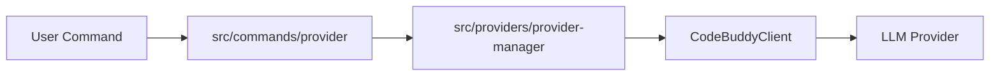

# Subsystems (continued)

This section documents the provider management and command handling subsystems. These modules facilitate the abstraction of LLM inference providers and the routing of user commands, ensuring consistent behavior across different model backends and maintaining a clean separation of concerns between the CLI interface and the core agent logic.

## src (2 modules)

The following modules define the infrastructure for provider orchestration and command execution.

- **src/providers/provider-manager** (rank: 0.004, 14 functions)
- **src/commands/provider** (rank: 0.002, 6 functions)

### src/providers/provider-manager

The `src/providers/provider-manager` module serves as the central registry for all configured LLM providers. It manages the lifecycle of provider connections and ensures that the `CodeBuddyClient` can interface with various models seamlessly, regardless of the underlying API implementation.

> **Key concept:** The provider manager acts as the primary abstraction layer for `CodeBuddyClient`, allowing the system to switch between different inference providers without modifying core agent logic. This decoupling is essential for maintaining compatibility across diverse model backends.

The provider manager ensures that when `CodeBuddyClient.validateModel()` is invoked, the system has the necessary context to route the request to the correct provider.

### src/commands/provider

The `src/commands/provider` module implements the command-line interface logic for interacting with the provider subsystem. It maps user inputs to specific provider actions, facilitating configuration, status checks, and runtime adjustments.

This module bridges the gap between user-facing CLI commands and the internal provider management logic. By centralizing these commands, the system ensures that operations such as provider switching or configuration updates are handled consistently before being passed to the `CodeBuddyAgent` for execution.

---

**See also:** [Subsystems](./3-subsystems.md) · [API Reference](./9-api-reference.md)

--- END ---