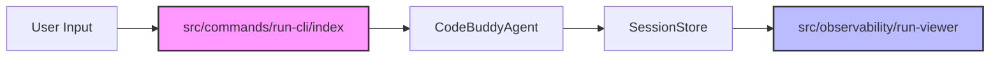

# Subsystems (continued)

This section details the observability and command-line interface subsystems within the `src` directory. These modules are critical for developers monitoring agent execution flows and managing CLI interactions, providing the necessary hooks for debugging and operational control.

## src (2 modules)

The following modules handle the lifecycle of user-initiated commands and the subsequent visualization of execution data.

- **src/observability/run-viewer** (rank: 0.004, 11 functions)
- **src/commands/run-cli/index** (rank: 0.002, 1 functions)

### Observability and CLI Integration

The `src/observability/run-viewer` module provides the interface for inspecting execution traces and session history. It relies on data persisted by `SessionStore.saveSession` and `SessionStore.addMessageToCurrentSession` to reconstruct the agent's state for the end-user. By decoupling the viewer from the core agent logic, the system ensures that observability overhead does not impact the primary execution loop.

The `src/commands/run-cli/index` module serves as the primary entry point for CLI operations. It initializes the environment and calls `CodeBuddyAgent.setRunId` to establish the context for the current execution, ensuring that all subsequent operations are correctly associated with the active session.

> **Key concept:** The observability subsystem decouples execution logging from the core agent logic, allowing `src/observability/run-viewer` to inspect session state without impacting the performance of the primary execution loop.

With the CLI and observability layers defined, we can now look at how these components integrate with the broader system architecture to maintain session integrity and user context.

---

**See also:** [Subsystems](./3-subsystems.md) · [API Reference](./9-api-reference.md)

--- END ---