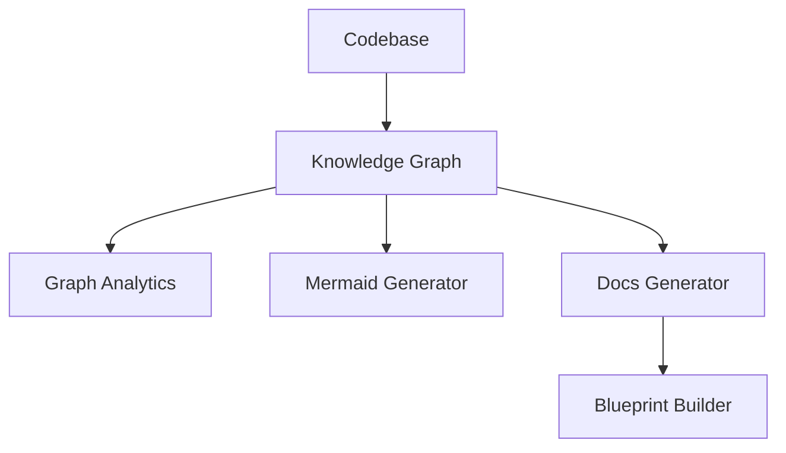

# Subsystems (continued)

This section details the knowledge management and documentation generation subsystems within the `src` directory. These modules are critical for maintaining the repository's internal representation of code structures and automating the creation of technical documentation, which is essential for developers relying on automated context retrieval.

## Knowledge Management

The `src/knowledge` directory contains the core logic for graph-based code analysis. These modules are responsible for mapping the repository structure, identifying community clusters within the codebase, and generating visual representations of the system architecture.

Beyond the static analysis of the codebase, the system utilizes advanced graph analytics to determine the relationships between disparate modules. This allows the agent to understand the impact of changes across the dependency tree.

> **Key concept:** The `src/knowledge/knowledge-graph` module serves as the primary data source for the documentation pipeline, enabling the `src/docs/docs-generator` to create context-aware blueprints without manual intervention.

## Documentation Generation

The `src/docs` directory handles the transformation of raw graph data into structured documentation. These tools leverage the knowledge graph to build blueprints and enrich content, ensuring that technical documentation remains synchronized with the codebase.

## src (15 modules)

- **src/knowledge/path** (rank: 0.005, 0 functions)
- **src/knowledge/community-detection** (rank: 0.004, 5 functions)
- **src/knowledge/graph-analytics** (rank: 0.004, 4 functions)
- **src/knowledge/knowledge-graph** (rank: 0.004, 25 functions)
- **src/knowledge/mermaid-generator** (rank: 0.003, 7 functions)
- **src/knowledge/code-graph-deep-populator** (rank: 0.003, 8 functions)
- **src/docs/blueprint-builder** (rank: 0.002, 4 functions)
- **src/docs/docs-generator** (rank: 0.002, 19 functions)
- **src/docs/llm-enricher** (rank: 0.002, 4 functions)
- **src/tools/registry/code-graph-tools** (rank: 0.002, 7 functions)
- ... and 5 more

---

**See also:** [Subsystems](./3-subsystems.md) · [Tool System](./5-tools.md)