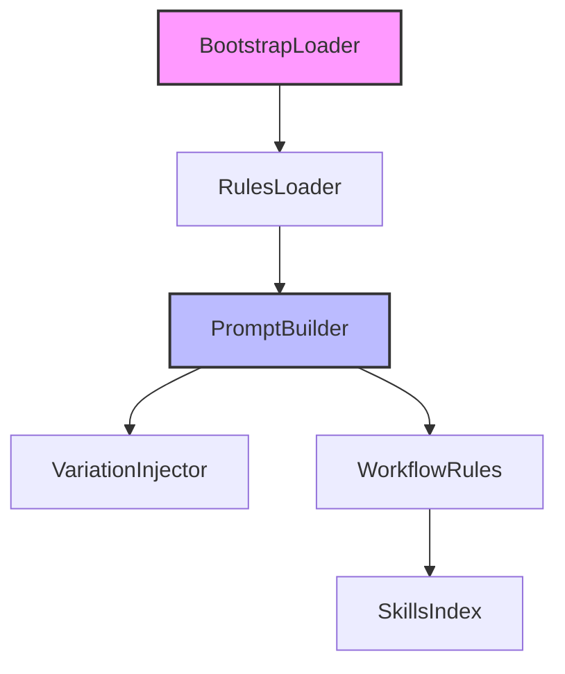

# Subsystems (continued)

The modules listed below constitute the core infrastructure for system initialization and prompt orchestration. These services are invoked during the startup phase to configure the agent's operational parameters and ensure that all subsequent LLM interactions align with established workflow rules.

## src (6 modules)

- **src/context/bootstrap-loader** (rank: 0.002, 7 functions)
- **src/prompts/variation-injector** (rank: 0.002, 4 functions)
- **src/prompts/workflow-rules** (rank: 0.002, 1 functions)
- **src/rules/rules-loader** (rank: 0.002, 10 functions)
- **src/skills/index** (rank: 0.002, 8 functions)
- **src/services/prompt-builder** (rank: 0.002, 2 functions)

These modules interface directly with the agent's core lifecycle. For instance, the `src/context/bootstrap-loader` prepares the environment before `CodeBuddyAgent.initializeAgentSystemPrompt` is called to define the agent's persona and constraints.

> **Key concept:** The `src/rules/rules-loader` and `src/services/prompt-builder` modules act as the primary gatekeepers for LLM interactions, ensuring that injected variations and workflow rules are applied consistently before any tool execution occurs.

Following the initialization phase, the system relies on the prompt services to dynamically adjust behavior based on user input and context. The `src/prompts/variation-injector` and `src/services/prompt-builder` work together to synthesize the final prompt payload, ensuring that `src/rules/rules-loader` constraints are respected throughout the session. This modular approach allows for the separation of concerns between static rule enforcement and dynamic prompt generation.

---

**See also:** [Architecture](./2-architecture.md) · [Subsystems](./3-subsystems.md) · [Context & Memory](./7-context-memory.md)

--- END ---