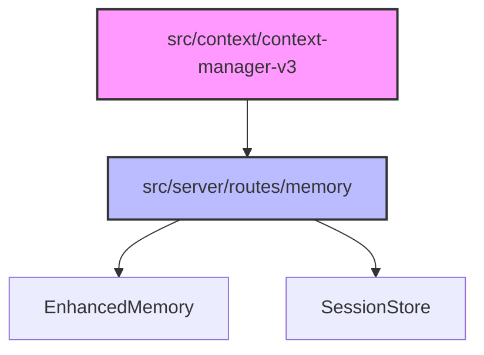

# Subsystems (continued)

This section details the auxiliary subsystems responsible for context management and memory routing within the application architecture. Developers working on state persistence or context window optimization should review these modules to understand how data flows between the client-side context manager and the server-side memory endpoints.

## src (2 modules)

- **src/context/context-manager-v3** (rank: 0.004, 6 functions)
- **src/server/routes/memory** (rank: 0.002, 1 functions)

### Context Management

The `src/context/context-manager-v3` module acts as the primary orchestrator for the LLM's active context window. It is responsible for aggregating relevant state, managing token limits, and ensuring that the model receives a coherent representation of the current workspace.

> **Key concept:** The context manager acts as a bridge between raw session data and the LLM's active prompt window, ensuring that only high-relevance tokens are injected into the model's input to optimize performance and reduce latency.

By maintaining a structured view of the conversation and project state, this module ensures that the agent maintains continuity across interactions.

### Memory Routing

Once the context is prepared and managed by the client-side logic, the system routes specific memory requests to the server for persistent storage and retrieval. The `src/server/routes/memory` module defines the API endpoints required to interact with the persistent memory layer, facilitating communication between the frontend memory interface and the backend storage mechanisms.

When these routes are invoked, they typically interface with core persistence utilities to handle data operations. For instance, requests to retrieve historical data will trigger `EnhancedMemory.loadMemories()` to fetch stored context, or `SessionStore.loadSession()` to restore the state of a specific interaction thread. This separation of concerns ensures that memory retrieval remains decoupled from the routing logic, allowing for easier maintenance of the persistence layer.

---

**See also:** [Subsystems](./3-subsystems.md) · [Context & Memory](./7-context-memory.md)

--- END ---