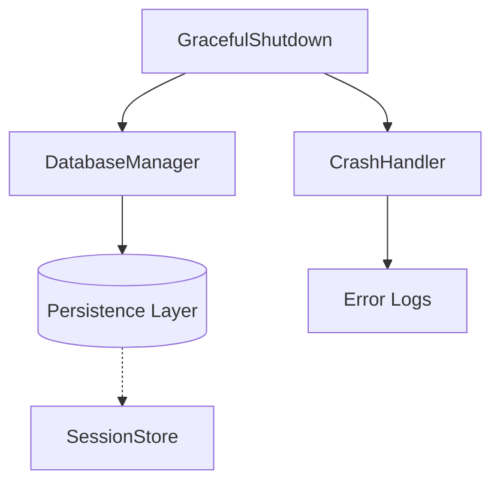

# Subsystems (continued)

This section documents the core infrastructure modules responsible for data persistence, error management, and process lifecycle control. These components are essential for maintaining system integrity and ensuring that the application can recover from unexpected states or terminate without data loss.

## src (3 modules)

The following modules form the foundational layer of the application. They are responsible for low-level system operations that support higher-level features, such as the persistence logic utilized by `SessionStore.saveSession`.

- **src/database/database-manager** (rank: 0.003, 18 functions)
- **src/errors/crash-handler** (rank: 0.003, 14 functions)
- **src/utils/graceful-shutdown** (rank: 0.002, 24 functions)

> **Key concept:** The lifecycle management provided by these modules ensures that the system maintains a "fail-safe" state, preventing partial writes to the database during unexpected shutdowns or runtime exceptions.

Beyond the database management layer, the system implements robust error handling to capture and report runtime failures.

### Error Handling and Lifecycle
The `src/errors/crash-handler` module is designed to intercept unhandled exceptions, ensuring that the application does not exit in an undefined state. This is complemented by `src/utils/graceful-shutdown`, which coordinates the orderly termination of active processes. By ensuring that all pending operations are finalized, these modules prevent resource leaks and corruption of the persistent state.

---

**See also:** [Subsystems](./3-subsystems.md)

--- END ---