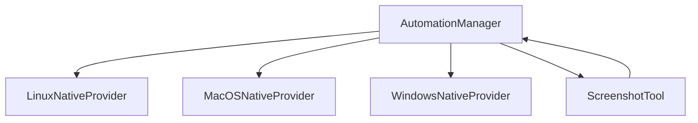

# Subsystems (continued)

The `src/desktop-automation` subsystem provides the abstraction layer necessary for cross-platform UI interaction and system-level control. This module is critical for developers implementing automated workflows that require native OS capabilities, such as window management, input simulation, and screen capture.

The `AutomationManager` acts as the central orchestrator, delegating tasks to specific platform providers based on the host operating system. This architecture ensures that platform-specific implementations remain decoupled from the core application logic, facilitating easier maintenance and testing.

## src/desktop-automation (4 modules)

- **src/desktop-automation/linux-native-provider** (rank: 0.003, 35 functions)
- **src/desktop-automation/macos-native-provider** (rank: 0.003, 40 functions)
- **src/desktop-automation/windows-native-provider** (rank: 0.003, 0 functions)
- **src/desktop-automation/automation-manager** (rank: 0.002, 90 functions)

> **Key concept:** The desktop automation layer utilizes a provider pattern to abstract OS-specific APIs, allowing the system to maintain a unified interface for automation tasks regardless of the underlying host environment.

While the automation providers handle low-level system interaction, they often interface with other utilities to complete complex tasks. For example, the `ScreenshotTool.capture()` method relies on these underlying providers to resolve display coordinates and capture frame buffers across different operating systems.

---

**See also:** [Subsystems](./3-subsystems.md)

--- END ---