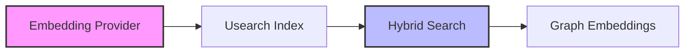

# Subsystems (continued)

This section details the core infrastructure responsible for semantic search, vector embeddings, and knowledge graph management within the system. These modules are critical for enabling high-performance retrieval-augmented generation (RAG) and maintaining context across large codebases, ensuring that the agent can effectively query and retrieve relevant information.

The following modules constitute the retrieval layer, responsible for transforming raw data into searchable vector representations and managing the underlying indices.

- **src/embeddings/embedding-provider** (rank: 0.005, 20 functions)
- **src/search/usearch-index** (rank: 0.003, 33 functions)
- **src/knowledge/graph-embeddings** (rank: 0.002, 4 functions)
- **src/memory/hybrid-search** (rank: 0.002, 20 functions)

These components integrate directly with the broader memory subsystem to facilitate efficient data retrieval and context injection. By decoupling the embedding generation from the search indexing, the system maintains flexibility in how it processes and stores knowledge.

> **Key concept:** Hybrid search implementations leverage both vector embeddings and graph-based relationships to reduce retrieval noise, ensuring that context provided to the LLM is both relevant and structurally accurate.

Beyond the raw indexing capabilities, these modules provide the necessary abstraction to support multiple search strategies, allowing the system to switch between vector-only lookups and more complex graph-traversal queries depending on the specific requirements of the agent's current task.

---

**See also:** [Subsystems](./3-subsystems.md) · [Context & Memory](./7-context-memory.md)

--- END ---