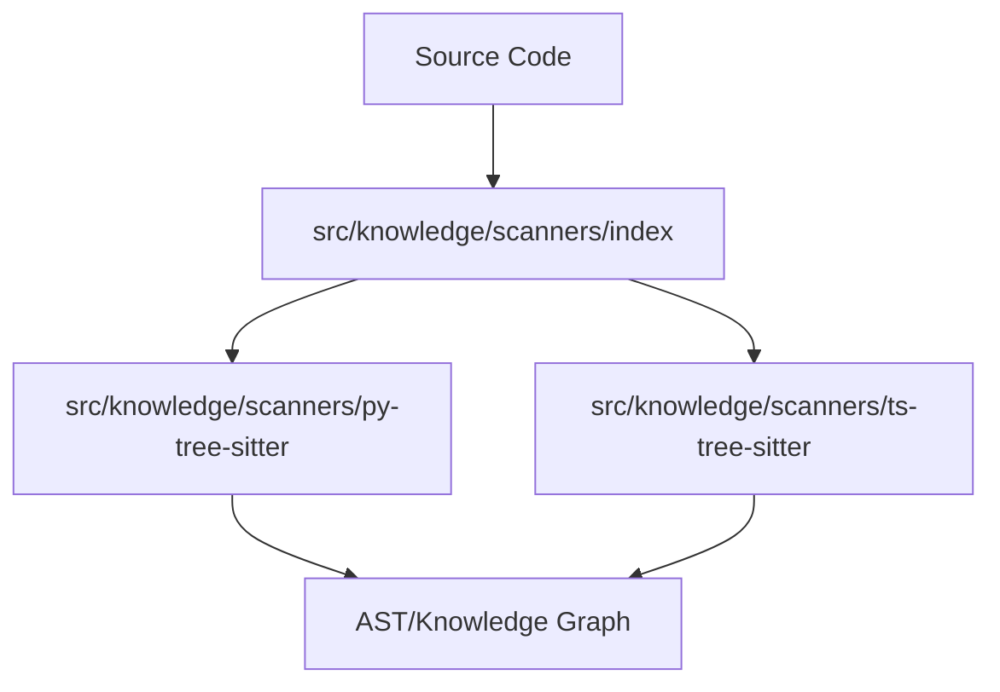

# Subsystems (continued)

The `src/knowledge/scanners` subsystem provides the infrastructure for parsing source code into Abstract Syntax Trees (ASTs) using Tree-sitter. This layer is critical for the agent's ability to understand code structure, perform semantic analysis, and generate accurate context for repository profiling.

The following modules implement language-specific parsing logic, enabling the system to traverse and analyze codebases across different programming languages.

> **Key concept:** By utilizing Tree-sitter, the scanner subsystem achieves incremental parsing, allowing the agent to update its understanding of the codebase efficiently without re-parsing the entire project on every change.

## src/knowledge/scanners (3 modules)

- **src/knowledge/scanners/py-tree-sitter** (rank: 0.003, 0 functions)
- **src/knowledge/scanners/ts-tree-sitter** (rank: 0.003, 1 functions)
- **src/knowledge/scanners/index** (rank: 0.002, 4 functions)

---

**See also:** [Subsystems](./3-subsystems.md)