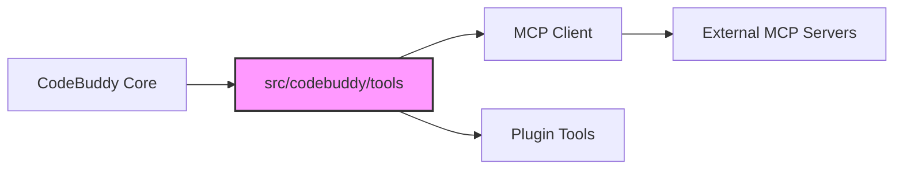

# Subsystems (continued)

The Model Context Protocol (MCP) subsystem provides the infrastructure necessary for the agent to interface with external tool providers. By standardizing how tools are discovered and executed, this subsystem allows for a modular extension of the agent's capabilities without modifying core logic.

While the configuration and client modules handle the low-level transport and handshake protocols, the higher-level orchestration is managed by the tool registry. The integration process is primarily driven by `initializeToolRegistry()` and `getMCPManager()`. When new tools are discovered, `initializeMCPServers()` prepares the environment, while `convertMCPToolToCodeBuddyTool()` and `addMCPToolsToCodeBuddyTools()` ensure compatibility with the agent's internal execution loop.

> **Key concept:** The MCP integration layer acts as an adapter, using `convertMCPToolToCodeBuddyTool()` to normalize external tool schemas into the internal format, allowing the agent to treat third-party MCP tools as native capabilities.

## src/mcp (2 modules)

- **src/mcp/config** (rank: 0.004, 11 functions)
- **src/mcp/client** (rank: 0.002, 13 functions)

---

**See also:** [Subsystems](./3-subsystems.md) · [Configuration](./8-configuration.md)