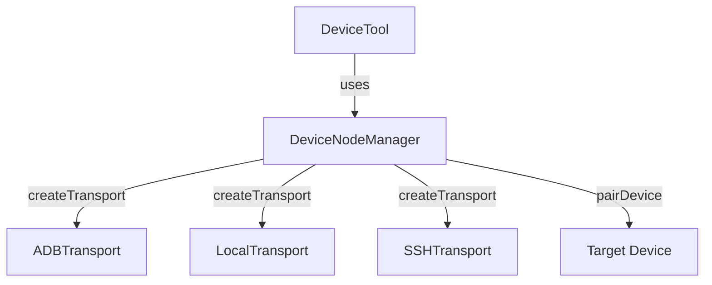

# Subsystems (continued)

This section details the node management and transport layer architecture, which facilitates communication between the agent and external hardware or remote environments. Developers working on device integration or transport protocols should review these modules to understand how connectivity is established, managed, and secured across different environments.

The `src/nodes` subsystem provides the infrastructure for managing device connectivity, abstracting the complexities of different transport protocols into a unified interface. This architecture allows the system to interact with local, ADB-enabled, and SSH-accessible devices seamlessly.

The `DeviceNodeManager` acts as the central orchestrator for these connections. Developers should utilize `DeviceNodeManager.getInstance()` to access the singleton manager, and `DeviceNodeManager.createTransport()` to initialize specific communication channels. Once a transport is established, the manager handles the lifecycle of the connection, including pairing and unpairing operations via `DeviceNodeManager.pairDevice()` and `DeviceNodeManager.unpairDevice()`.

> **Key concept:** The `DeviceNodeManager` implements a singleton pattern to ensure consistent state across the application lifecycle. Use `DeviceNodeManager.resetInstance()` only during testing or critical re-initialization phases to prevent memory leaks or stale connection states.

Beyond the core management logic, the system relies on persistent storage to maintain device configurations across sessions. The manager provides methods such as `DeviceNodeManager.loadDevices()` and `DeviceNodeManager.saveDevices()` to ensure that device states are serialized correctly, allowing for rapid reconnection upon system restart.

## src (5 modules)

- **src/nodes/device-node** (rank: 0.006, 21 functions)
- **src/nodes/transports/adb-transport** (rank: 0.004, 10 functions)
- **src/nodes/transports/local-transport** (rank: 0.004, 8 functions)
- **src/nodes/transports/ssh-transport** (rank: 0.004, 13 functions)
- **src/tools/device-tool** (rank: 0.002, 1 functions)

---

**See also:** [Subsystems](./3-subsystems.md) · [Tool System](./5-tools.md)

--- END ---