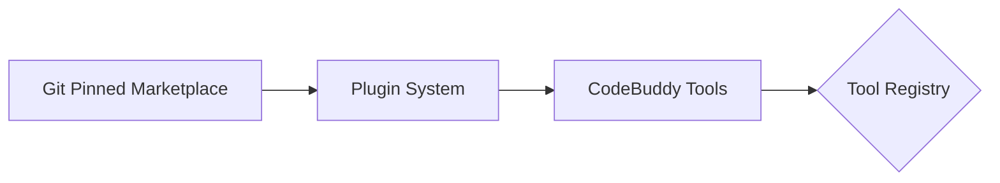

# Subsystems (continued)

The `src/plugins` directory manages the extensibility layer of the application, enabling the integration of external tools and marketplace-sourced functionality. This subsystem is critical for developers looking to extend core capabilities without modifying the primary codebase, ensuring a modular and maintainable architecture.

The plugin architecture relies on the tool registry to normalize external inputs into executable commands. By utilizing `convertPluginToolToCodeBuddyTool()` and `addPluginToolsToCodeBuddyTools()`, the system ensures that third-party extensions adhere to the same interface standards as native tools.

## src/plugins (2 modules)

- **src/plugins/git-pinned-marketplace** (rank: 0.004, 15 functions)
- **src/plugins/plugin-system** (rank: 0.002, 17 functions)

> **Key concept:** The plugin system acts as an abstraction layer, transforming marketplace-defined tools into standard `CodeBuddy` tool definitions. This allows for seamless runtime integration without requiring core system recompilation or manual dependency management.

---

**See also:** [Subsystems](./3-subsystems.md)

--- END ---