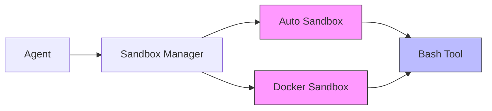

# Subsystems (continued)

This section details the execution environment and command-line interface subsystems, specifically focusing on sandboxing and shell-based tool interaction. These components are critical for maintaining system integrity while allowing the agent to execute untrusted or complex code safely within isolated environments.

## Sandbox Architecture

The sandbox subsystem provides a tiered isolation strategy, ensuring that code execution does not compromise the host system. The `auto-sandbox` module handles dynamic environment detection and lightweight isolation, while the `docker-sandbox` module provides robust, containerized environments for more complex or persistent tasks.

> **Key concept:** The sandbox subsystem implements a tiered isolation strategy, defaulting to `auto-sandbox` for lightweight tasks and escalating to `docker-sandbox` for operations requiring persistent containerized environments.

Beyond the isolation layers, the system requires a unified interface for executing shell commands. This is handled by the bash tool, which bridges the gap between the agent's logic and the underlying operating system.

## Tooling and Execution

The `bash-tool` acts as the primary interface for executing shell commands within the secured environments defined by the sandbox modules. It abstracts the complexities of command execution, providing a consistent API for the agent to interact with the filesystem and system utilities.

### Module Definitions

- **src/sandbox/auto-sandbox** (rank: 0.003, 7 functions)
- **src/sandbox/docker-sandbox** (rank: 0.003, 11 functions)
- **src/tools/bash/bash-tool** (rank: 0.002, 18 functions)

---

**See also:** [Subsystems](./3-subsystems.md) · [Tool System](./5-tools.md) · [Security](./6-security.md)