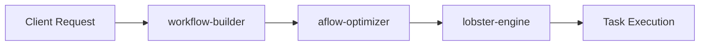

# Subsystems (continued)

This section details the workflow orchestration and server-side routing subsystems, which are responsible for managing complex task execution and API endpoint definitions. Developers working on automation pipelines or extending the system's API surface should review these modules to understand how workflow logic is decoupled from request handling.

The `src` directory contains specialized modules that manage the lifecycle of automated workflows. These components facilitate the transition from API requests to optimized execution paths, ensuring that workflow logic remains modular and testable.

## src (3 modules)

- **src/workflows/aflow-optimizer** (rank: 0.003, 15 functions)
- **src/workflows/lobster-engine** (rank: 0.003, 17 functions)
- **src/server/routes/workflow-builder** (rank: 0.002, 42 functions)

> **Key concept:** The separation of concerns between `workflow-builder` and the workflow engines (`aflow-optimizer`, `lobster-engine`) allows for independent scaling of API routing logic versus execution optimization strategies.

These modules rely on the core infrastructure defined in the architectural overview. For further details on how these subsystems integrate with the broader codebase, refer to the following documentation.

---

**See also:** [Architecture](./2-architecture.md) · [Subsystems](./3-subsystems.md)

--- END ---