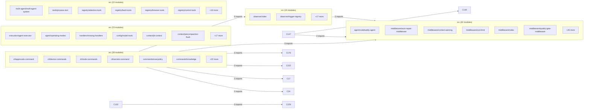

# Subsystems (continued)

This section details the specialized tool modules and the complex dependency graph governing system interactions. Developers should review these components when extending agent capabilities, modifying cross-module communication patterns, or integrating new external services.

## src/tools (10 modules)

The `src/tools` directory houses modular extensions that provide specific capabilities to the agent. These modules are registered via the central registry to ensure compatibility with the core execution loop. The system relies on `initializeToolRegistry()` to bootstrap the environment, while `getMCPManager()` handles the lifecycle of Model Context Protocol (MCP) servers.

> **Key concept:** The tool registry acts as a unified interface, abstracting the underlying implementation details of MCP servers, plugins, and marketplace tools into a standardized format consumable by the agent.

To integrate new capabilities, developers must utilize `initializeMCPServers()` to establish connections and `convertMCPToolToCodeBuddyTool()` or `convertPluginToolToCodeBuddyTool()` to normalize external tool definitions into the internal schema.

- **src/tools/archive-tool** (rank: 0.002, 21 functions)
- **src/tools/audio-tool** (rank: 0.002, 12 functions)
- **src/tools/clipboard-tool** (rank: 0.002, 6 functions)
- **src/tools/diagram-tool** (rank: 0.002, 11 functions)
- **src/tools/document-tool** (rank: 0.002, 19 functions)
- **src/tools/export-tool** (rank: 0.002, 14 functions)
- **src/tools/pdf-tool** (rank: 0.002, 11 functions)
- **src/tools/qr-tool** (rank: 0.002, 14 functions)
- **src/tools/video-tool** (rank: 0.002, 15 functions)
- **src/tools/registry/multimodal-tools** (rank: 0.002, 59 functions)

While the tool modules provide specific functionality, the broader system relies on a complex web of dependencies to manage state, execution, and CLI interactions.

## Community Interactions

The following diagram illustrates the architectural coupling between core subsystems. Understanding these relationships is critical for avoiding circular dependencies and ensuring stable deployments when modifying cross-cutting concerns like middleware or execution handlers.

---

**See also:** [Architecture](./2-architecture.md) · [Subsystems](./3-subsystems.md) · [Tool System](./5-tools.md) · [Context & Memory](./7-context-memory.md)