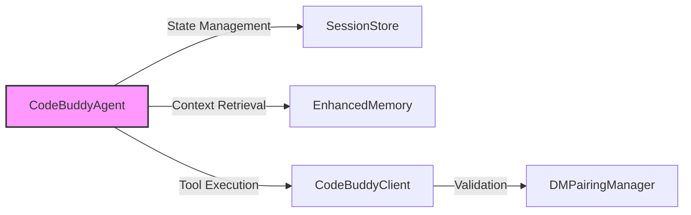

# Subsystems

This section provides an architectural overview of the project's modular structure, detailing the 42 identified subsystems that comprise the core codebase. Developers should consult this documentation to understand module boundaries, dependency hierarchies, and the functional distribution across the `src` directory.

## src (16 modules)

The `src` directory serves as the primary container for the application's business logic, orchestration, and infrastructure layers. The following list categorizes the most critical modules by their architectural rank and functional density, reflecting the current state of the codebase.

- **src/utils/memory-monitor** (rank: 0.004, 23 functions)
- **src/optimization/model-routing** (rank: 0.003, 13 functions)
- **src/optimization/latency-optimizer** (rank: 0.003, 23 functions)
- **src/mcp/mcp-client** (rank: 0.003, 29 functions)
- **src/security/sandbox** (rank: 0.002, 12 functions)
- **src/agent/agent-mode** (rank: 0.002, 9 functions)
- **src/agent/execution/repair-coordinator** (rank: 0.002, 24 functions)
- **src/context/context-manager-v2** (rank: 0.002, 39 functions)
- **src/hooks/lifecycle-hooks** (rank: 0.002, 17 functions)
- **src/hooks/moltbot-hooks** (rank: 0.002, 0 functions)
- ... and 6 more

> **Key concept:** The system maintains a modularity score of 0.758, indicating a high degree of decoupling between subsystems. This architecture allows for isolated testing and independent deployment of core services like `src/optimization/model-routing` and `src/security/sandbox`.

The interaction between these modules is orchestrated primarily through the agent lifecycle. When the system initializes, `CodeBuddyAgent.initializeAgentSystemPrompt()` coordinates with `SessionStore.createSession()` to establish the operational context, while `EnhancedMemory.loadMemories()` populates the working state.

The diagram above illustrates the primary data flow during agent initialization and execution. The `CodeBuddyAgent` acts as the central orchestrator, delegating state persistence to `SessionStore` and memory retrieval to `EnhancedMemory`.

Beyond the core agent loop, the system relies on specialized modules for tool support and environment validation. For instance, `CodeBuddyClient.performToolProbe()` is invoked to verify capabilities before execution, ensuring that the environment is correctly configured for the requested model.

---

**See also:** [Architecture](./2-architecture.md) · [Subsystems](./3-subsystems.md) · [Security](./6-security.md) · [Context & Memory](./7-context-memory.md)

--- END ---