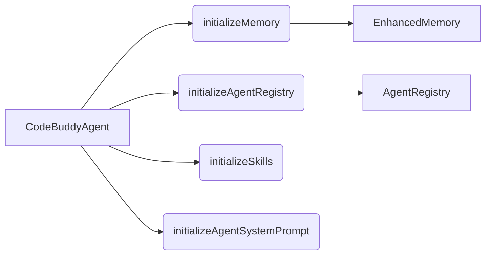

# Subsystems (continued)

The `src` directory contains the core implementation modules for the CodeBuddy agent, encompassing orchestration, tool integration, and state management. This section provides an architectural overview of these modules, which is critical for developers extending agent capabilities or debugging system-level initialization flows.

## src (32 modules)

- **src/agent/codebuddy-agent** (rank: 0.013, 65 functions)
- **src/channels/index** (rank: 0.007, 0 functions)
- **src/utils/confirmation-service** (rank: 0.005, 21 functions)
- **src/commands/dev/workflows** (rank: 0.005, 3 functions)
- **src/agent/specialized/agent-registry** (rank: 0.005, 29 functions)
- **src/agent/thinking/extended-thinking** (rank: 0.005, 30 functions)
- **src/tools/registry** (rank: 0.004, 10 functions)
- **src/analytics/tool-analytics** (rank: 0.003, 23 functions)
- **src/agent/repair/fault-localization** (rank: 0.003, 17 functions)
- **src/agent/repair/repair-engine** (rank: 0.003, 25 functions)
- ... and 22 more

The agent's lifecycle is managed through a series of initialization routines that prepare the environment for inference. The following diagram outlines the primary bootstrap sequence for the `CodeBuddyAgent`, ensuring that memory and registry components are ready before the system prompt is applied.

> **Key concept:** The `CodeBuddyAgent` initialization sequence is strictly ordered to ensure that memory providers and skill registries are available before the system prompt is injected, preventing race conditions during the first inference cycle.

Beyond the core agent, the system relies on specialized subsystems for persistence and tool execution. These modules represent the foundational infrastructure required for stable operation and must be initialized in the correct order to maintain state consistency.

---

**See also:** [Architecture](./2-architecture.md) · [Subsystems](./3-subsystems.md) · [Tool System](./5-tools.md) · [Context & Memory](./7-context-memory.md)

--- END ---