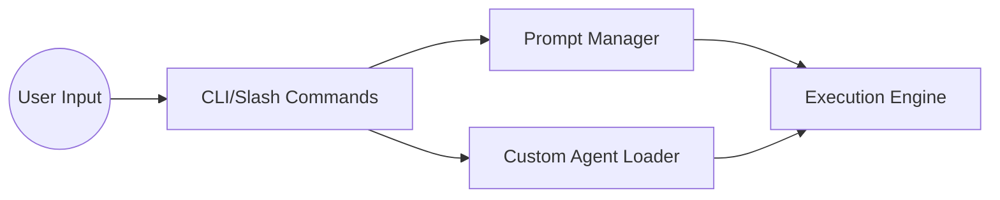

# Subsystems (continued)

This section details the core infrastructure modules responsible for prompt orchestration, custom agent initialization, and command-line interface interactions. These components serve as the bridge between user-defined configurations and the underlying execution engine, ensuring that commands and prompts are correctly routed and loaded.

## src (4 modules)

- **src/prompts/prompt-manager** (rank: 0.005, 17 functions)
- **src/agent/custom/custom-agent-loader** (rank: 0.003, 15 functions)
- **src/cli/list-commands** (rank: 0.002, 3 functions)
- **src/commands/slash/prompt-commands** (rank: 0.002, 2 functions)

> **Key concept:** The `src/prompts/prompt-manager` acts as the single source of truth for system instructions, decoupling prompt engineering from core agent logic to allow for rapid iteration without modifying the execution runtime.

The modules listed above facilitate the extensibility of the agent framework. The `src/prompts/prompt-manager` handles the retrieval and injection of system prompts, while `src/agent/custom/custom-agent-loader` provides the necessary hooks to register and instantiate specialized agent behaviors. Together, these modules ensure that the system remains modular and adaptable to different use cases.

Furthermore, the CLI and slash command modules provide the primary interface for user interaction. By separating command definitions from the execution logic, the system allows for the dynamic registration of new commands, enabling developers to extend functionality without altering the core codebase.

These subsystems provide the necessary abstraction layer to manage complex agent configurations and user inputs. With the command and prompt infrastructure established, the following sections detail the integration points for external tools and session persistence.

---

**See also:** [Architecture](./2-architecture.md) · [Subsystems](./3-subsystems.md) · [API Reference](./9-api-reference.md)

--- END ---