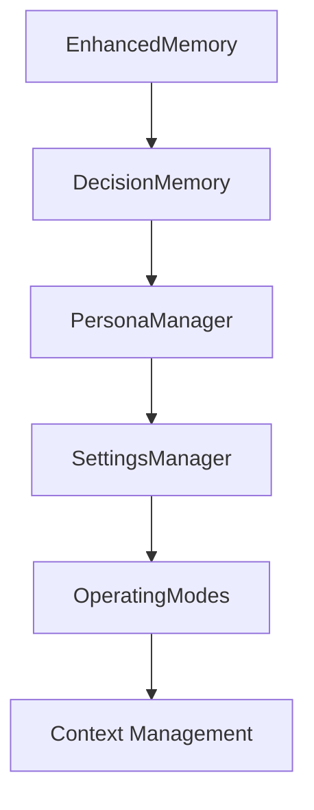

# Subsystems (continued)

This section details the remaining core subsystems located within the `src` directory, focusing on memory management, persona handling, and configuration utilities. These modules are critical for maintaining state, user preferences, and operational modes across the application lifecycle, ensuring that the agent remains consistent and context-aware.

The memory subsystem, specifically `src/memory/enhanced-memory`, serves as the backbone for stateful interactions. Developers interacting with this module should utilize `EnhancedMemory.initialize()` to bootstrap the memory layer and `EnhancedMemory.loadMemories()` to hydrate the current session context.

> **Key concept:** The `EnhancedMemory` module acts as the central repository for state, utilizing `EnhancedMemory.calculateImportance()` to prioritize relevant data points before persistence, significantly reducing noise in long-running sessions.

Once memory is established, the system relies on persona and configuration managers to define the agent's behavior and operational constraints. These modules ensure that the agent adheres to user-defined settings and adapts its operating mode based on the current task requirements.

## src (23 modules)

- **src/memory/enhanced-memory** (rank: 0.009, 28 functions)
- **src/memory/coding-style-analyzer** (rank: 0.004, 11 functions)
- **src/memory/decision-memory** (rank: 0.004, 10 functions)
- **src/personas/persona-manager** (rank: 0.003, 22 functions)
- **src/utils/settings-manager** (rank: 0.003, 32 functions)
- **src/agent/operating-modes** (rank: 0.002, 27 functions)
- **src/config/model-tools** (rank: 0.002, 3 functions)
- **src/context/jit-context** (rank: 0.002, 2 functions)
- **src/context/precompaction-flush** (rank: 0.002, 6 functions)
- **src/context/tool-output-masking** (rank: 0.002, 3 functions)
- ... and 13 more

The modules listed above provide the infrastructure for context injection and tool output management. By leveraging these subsystems, the agent can maintain a coherent state even when handling complex, multi-step tool executions.

---

**See also:** [Architecture](./2-architecture.md) · [Subsystems](./3-subsystems.md) · [Tool System](./5-tools.md) · [Context & Memory](./7-context-memory.md)

--- END ---