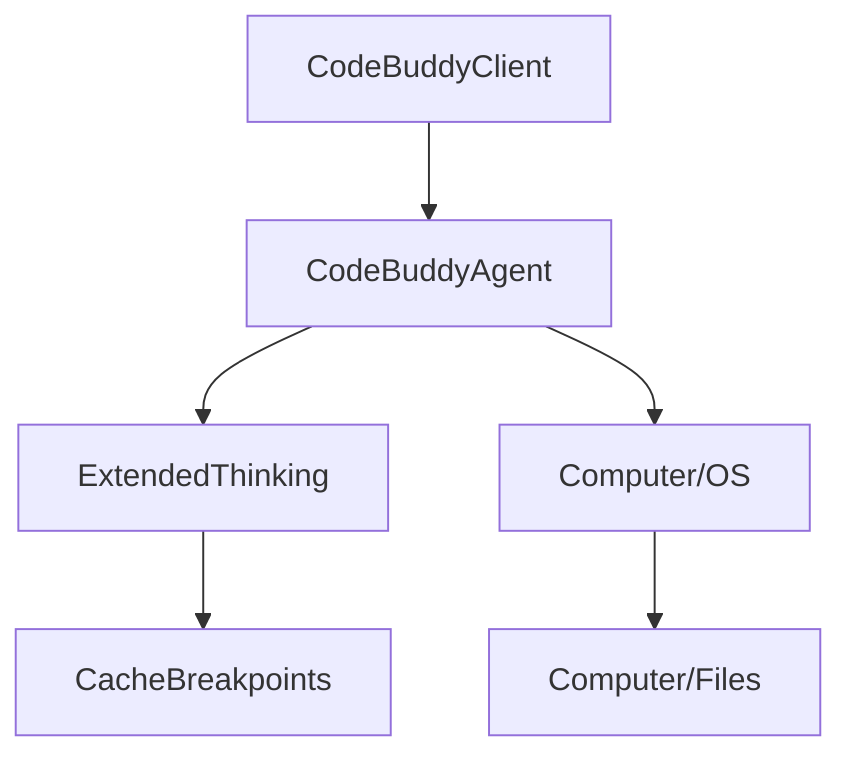

# Subsystems (continued)

This section details the core source modules within the `src` directory, which form the primary operational logic of the application. Developers should review these modules to understand the foundational architecture, including client communication, optimization strategies, and agent-based reasoning flows.

The modules listed below represent the critical path for agent execution. Understanding the interaction between these components is vital for debugging model behavior and optimizing tool performance.

> **Key concept:** The `src/optimization/cache-breakpoints` module is critical for performance. By using `injectAnthropicCacheBreakpoints`, the system significantly reduces latency in long-context scenarios by strategically placing cache markers in the prompt stream.

## src (16 modules)

- **src/codebuddy/client** (rank: 0.017, 22 functions)
- **src/optimization/cache-breakpoints** (rank: 0.010, 3 functions)
- **src/agent/extended-thinking** (rank: 0.010, 8 functions)
- **src/agent/flow/planning-flow** (rank: 0.003, 12 functions)
- **src/interpreter/computer/browser** (rank: 0.003, 15 functions)
- **src/interpreter/computer/files** (rank: 0.003, 33 functions)
- **src/interpreter/computer/os** (rank: 0.003, 9 functions)
- **src/commands/flow** (rank: 0.002, 2 functions)
- **src/commands/research/index** (rank: 0.002, 3 functions)
- **src/agent/prompt-suggestions** (rank: 0.002, 10 functions)
- ... and 6 more

### Module Implementation Details

The `src/codebuddy/client` module acts as the primary gateway for LLM interactions. It relies on `CodeBuddyClient.validateModel` to verify provider compatibility and `CodeBuddyClient.performToolProbe` to determine if the selected model supports the required function-calling capabilities.

For advanced reasoning, the `src/agent/extended-thinking` module manages the cognitive budget of the agent. Developers can manipulate this behavior using `ExtendedThinkingManager.toggle` to enable or disable deep-thinking modes based on the complexity of the user's request.

These modules interact through a centralized event bus and shared state management, ensuring that agentic decisions remain consistent across different execution environments. By maintaining strict separation between the client interface and the interpreter logic, the system allows for modular upgrades to specific providers or OS-level tools without requiring a full system refactor.

---

**See also:** [Architecture](./2-architecture.md) · [Subsystems](./3-subsystems.md) · [API Reference](./9-api-reference.md)

--- END ---