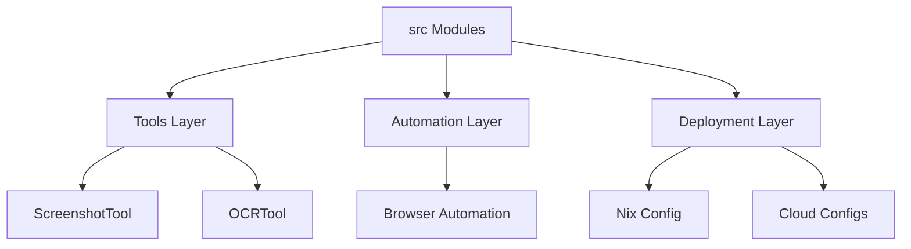

# Subsystems (continued)

This section details the core modules within the `src` directory, focusing on specialized automation tools and deployment configurations. These modules provide the foundational capabilities for system interaction, including visual processing and environment management, and are critical for developers extending the agent's operational scope.

## Tooling and Automation Modules

The `src/tools` directory encapsulates the primary execution logic for agent-driven tasks. These modules are responsible for bridging the gap between high-level agent intent and low-level system operations.

> **Key concept:** The `ScreenshotTool` abstracts cross-platform visual capture, utilizing `ScreenshotTool.captureMacOS`, `ScreenshotTool.captureLinux`, and `ScreenshotTool.captureWindows` to ensure consistent environment observation regardless of the host OS.

The following list outlines the primary modules currently implemented in the `src` hierarchy:

- **src/tools/screenshot-tool** (rank: 0.006, 20 functions)
- **src/deploy/cloud-configs** (rank: 0.005, 10 functions)
- **src/browser-automation/index** (rank: 0.004, 0 functions)
- **src/desktop-automation/index** (rank: 0.003, 0 functions)
- **src/tools/ocr-tool** (rank: 0.003, 12 functions)
- **src/agent/middleware/auto-observation** (rank: 0.003, 6 functions)
- **src/deploy/nix-config** (rank: 0.003, 3 functions)
- **src/tools/computer-control-tool** (rank: 0.003, 78 functions)
- **src/tools/deploy-tool** (rank: 0.003, 8 functions)
- **src/tools/registry/misc-tools** (rank: 0.002, 51 functions)
- ... and 2 more

Beyond direct tool execution, the system manages environment state and deployment via the following modules. These components ensure that the agent operates within a predictable, reproducible environment, whether running locally or in a cloud-hosted container.

## Deployment and Environment Configuration

The deployment modules, such as `src/deploy/nix-config` and `src/deploy/cloud-configs`, handle the infrastructure-as-code requirements for the agent. By decoupling configuration from execution logic, the system allows for rapid environment provisioning and consistent behavior across different deployment targets.

---

**See also:** [Architecture](./2-architecture.md) · [Subsystems](./3-subsystems.md) · [Tool System](./5-tools.md) · [Configuration](./8-configuration.md)

--- END ---