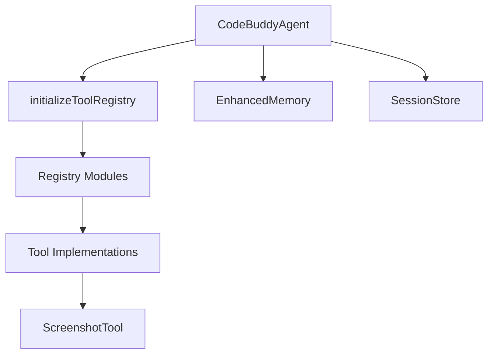

# Subsystems (continued)

The `src` directory constitutes the core architectural foundation of the application, encompassing agent orchestration, memory management, and the extensive tool registry. This section provides a high-level overview of the module organization, which is critical for developers tasked with extending system capabilities or debugging cross-module interactions.

The system utilizes a modular registry pattern to manage capabilities, ensuring that the agent can dynamically resolve and execute tasks. The `initializeToolRegistry()` function acts as the primary entry point for loading these disparate modules, allowing the `CodeBuddyAgent` to maintain a clean separation between core logic and external toolsets.

> **Key concept:** The tool registry uses a centralized lookup pattern, enabling the `CodeBuddyAgent` to dynamically resolve and execute capabilities without hard-coding dependencies for every individual tool. This architecture allows for the seamless integration of new plugins via `addPluginToolsToCodeBuddyTools()`.

Beyond the registry, the system relies on specialized managers for state and communication, such as the `ScreenshotTool.capture()` utility or the `SessionStore` for persistence. The following list details the specific registry modules currently implemented within the `src` tree.

## src (22 modules)

- **src/tools/process-tool** (rank: 0.004, 11 functions)
- **src/tools/registry/index** (rank: 0.004, 1 functions)
- **src/tools/registry/attention-tools** (rank: 0.002, 11 functions)
- **src/tools/registry/bash-tools** (rank: 0.002, 10 functions)
- **src/tools/registry/browser-tools** (rank: 0.002, 18 functions)
- **src/tools/registry/control-tools** (rank: 0.002, 6 functions)
- **src/tools/registry/docker-tools** (rank: 0.002, 10 functions)
- **src/tools/registry/git-tools** (rank: 0.002, 10 functions)
- **src/tools/registry/knowledge-tools** (rank: 0.002, 21 functions)
- **src/tools/registry/kubernetes-tools** (rank: 0.002, 10 functions)
- ... and 12 more

---

**See also:** [Subsystems](./3-subsystems.md) · [Tool System](./5-tools.md)