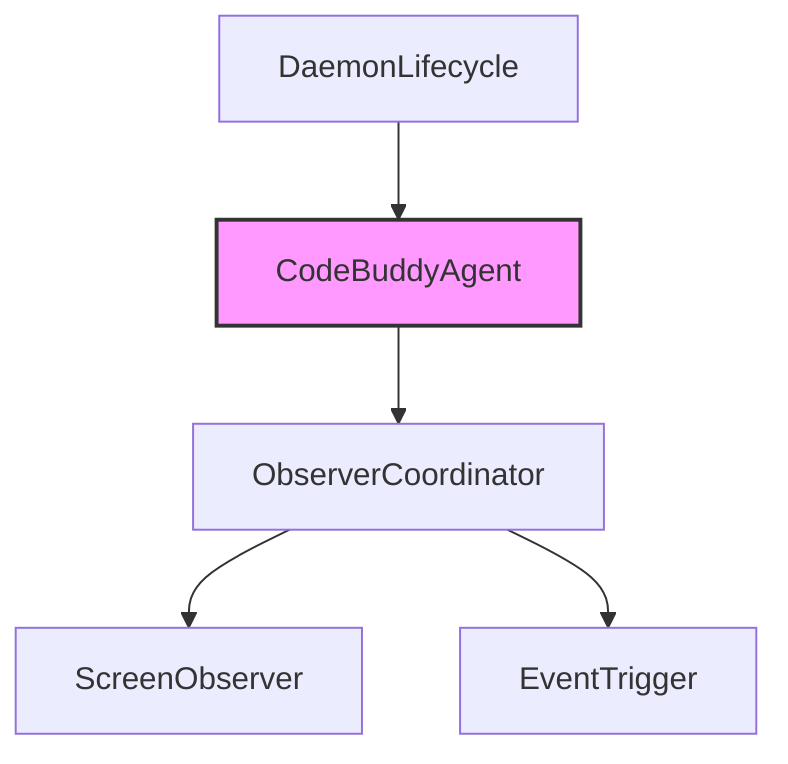

# Subsystems (continued)

This section details the remaining subsystems within the `src` directory, specifically focusing on agent observation mechanisms and daemon lifecycle management. These components are critical for maintaining system state awareness and ensuring background processes remain synchronized with the primary application flow.

The observer modules provide the infrastructure necessary for the system to react to external stimuli. By decoupling event detection from core agent logic, the architecture ensures that the `CodeBuddyAgent` can maintain context without being tightly coupled to specific platform APIs or UI states.

## src (4 modules)

- **src/agent/observer/event-trigger** (rank: 0.003, 11 functions)
- **src/agent/observer/observer-coordinator** (rank: 0.003, 8 functions)
- **src/agent/observer/screen-observer** (rank: 0.003, 9 functions)
- **src/daemon/daemon-lifecycle** (rank: 0.002, 10 functions)

> **Key concept:** The observer architecture decouples event detection from agent logic, allowing the system to react to UI changes or system events without tightly coupling the `CodeBuddyAgent` to specific platform APIs.

These modules work in concert with the primary agent initialization routines. For instance, when the `CodeBuddyAgent` executes `CodeBuddyAgent.initializeAgentSystemPrompt`, it relies on the state provided by these observers to construct an accurate representation of the user's current environment.

The daemon lifecycle management ensures that the background processes are initialized and terminated gracefully, preventing resource leaks. This lifecycle management is essential for maintaining the stability of the `CodeBuddyAgent` during long-running sessions.

---

**See also:** [Architecture](./2-architecture.md) · [Subsystems](./3-subsystems.md)

--- END ---