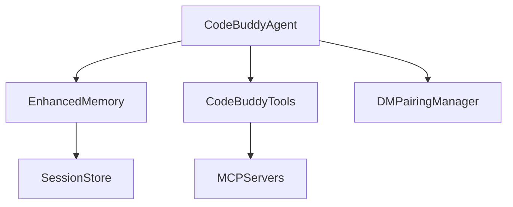

# Subsystems (continued)

This section provides an overview of the core architectural modules residing within the `src` directory, which form the backbone of the system's operational logic. Developers should consult this documentation when extending agent capabilities, modifying communication protocols, or integrating new persistence layers.

The `src` directory contains the primary logic for the agent, memory, and communication subsystems. The `CodeBuddyAgent` serves as the central orchestrator, utilizing `CodeBuddyAgent.initializeAgentSystemPrompt()` to define behavior and `CodeBuddyAgent.initializeSkills()` to register capabilities. When configuring the agent, `CodeBuddyClient.validateModel()` ensures that the selected LLM provider is compatible with the required function-calling features.

> **Key concept:** The `CodeBuddyAgent` initialization sequence is critical for system stability; failure to properly execute `CodeBuddyAgent.initializeAgentRegistry()` or `CodeBuddyAgent.initializeSkills()` will result in a non-functional agent state.

Beyond the core agent logic, the system relies on persistent storage and secure communication channels to maintain state across sessions. The `SessionStore` and `EnhancedMemory` modules handle data persistence. Developers should utilize `SessionStore.saveSession()` to ensure state is captured, while `EnhancedMemory.loadMemories()` retrieves context for the agent. For inter-process communication, the `DMPairingManager` handles authorization via `DMPairingManager.approve()`, while `DeviceNodeManager.pairDevice()` manages hardware-level transport connections.

## src (19 modules)

- **src/skills/hub** (rank: 0.004, 27 functions)
- **src/skills/registry** (rank: 0.004, 27 functions)
- **src/identity/identity-manager** (rank: 0.003, 12 functions)
- **src/agent/observer/trigger-registry** (rank: 0.003, 5 functions)
- **src/webhooks/webhook-manager** (rank: 0.003, 10 functions)
- **src/auth/profile-manager** (rank: 0.003, 22 functions)
- **src/channels/group-security** (rank: 0.003, 17 functions)
- **src/daemon/heartbeat** (rank: 0.003, 12 functions)
- **src/daemon/index** (rank: 0.003, 0 functions)
- **src/scheduler/cron-scheduler** (rank: 0.003, 27 functions)
- ... and 9 more

---

**See also:** [Architecture](./2-architecture.md) · [Subsystems](./3-subsystems.md) · [Tool System](./5-tools.md) · [Security](./6-security.md)