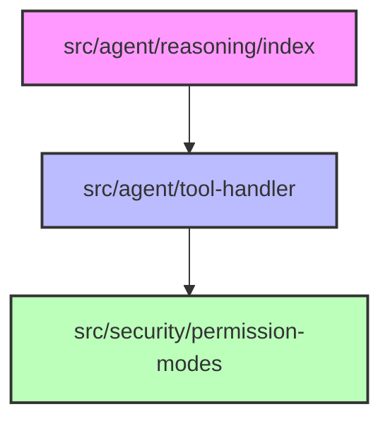

# Subsystems (continued)

This section details critical subsystems within the `src` directory that manage agent reasoning, security permissioning, and tool execution orchestration. These modules form the operational backbone for the agent's decision-making process and are required reading for developers working on core agent behavior or security policy enforcement.

## Module Overview

The following modules represent the core logic layer of the application, handling the translation of intent into secure, executable actions.

- **src/agent/reasoning/index** (rank: 0.003, 0 functions)
- **src/security/permission-modes** (rank: 0.003, 19 functions)
- **src/agent/tool-handler** (rank: 0.002, 23 functions)

---

## Reasoning and Orchestration

The `src/agent/reasoning/index` module serves as the primary entry point for the agent's cognitive processes. It orchestrates the flow of information between the model and the execution environment, determining when the agent needs to transition from thought to action.

Once the reasoning logic determines an action is required, the system delegates the task to the tool handling layer.

## Tool Execution Management

The `src/agent/tool-handler` subsystem manages the lifecycle of tool execution, ensuring that requested operations are correctly mapped to available functions. It acts as the bridge between abstract agent intent and concrete system capabilities, maintaining the state of active tool calls.

> **Key concept:** The integration between reasoning, tool handling, and permission modes creates a synchronous validation loop, ensuring no tool is executed without prior authorization from the permission subsystem.

Before any tool execution is finalized, the system must validate the request against established security policies.

## Security and Permissions

The `src/security/permission-modes` module defines the granular access control policies that govern agent capabilities. It ensures that all operations adhere to the principle of least privilege, preventing unauthorized access to sensitive system resources or external APIs.

---

**See also:** [Architecture](./2-architecture.md) · [Subsystems](./3-subsystems.md) · [Tool System](./5-tools.md) · [Security](./6-security.md)

--- END ---