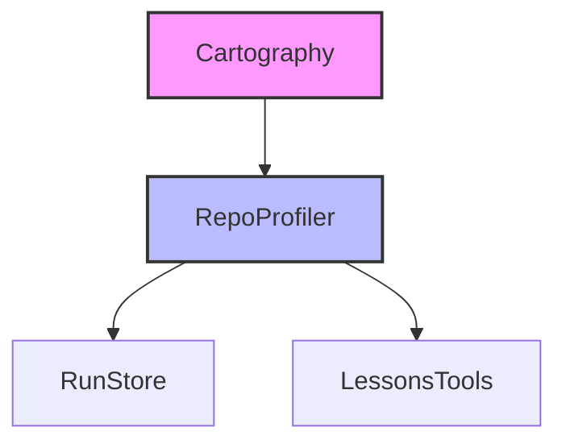

# Subsystems (continued)

This section details the specialized subsystems responsible for repository analysis, observability, and educational tool management. These modules are critical for maintaining context awareness, tracking execution history, and providing structured learning capabilities within the agent environment.

## Repository Analysis

The repository analysis pipeline is responsible for discovering the codebase structure and generating a semantic profile that the agent uses to understand project context.

### Cartography
The `src/agent/repo-profiling/cartography` module provides the foundational file system traversal capabilities. It is responsible for mapping the project structure before analysis begins, ensuring that all relevant source directories are identified and indexed.

Key functions include `runCartography()` to initiate the scan, `walk()` to traverse the directory tree, and `scanFileStats()` to gather metadata about individual files.

### Repo Profiler
The `src/agent/repo-profiler` module consumes the data generated by the cartography process to build a structured code graph. This graph allows the agent to perform complex queries against the codebase.

Key methods include `RepoProfiler.getProfile()` to retrieve the current state, `RepoProfiler.loadCodeGraph()` to initialize the graph, and `RepoProfiler.saveCodeGraph()` to persist the state.

> **Key concept:** The profiler utilizes a caching mechanism to minimize expensive re-indexing operations. It checks `RepoProfiler.isCacheStale()` before deciding whether to perform a full refresh or load from the existing cache.

Beyond static analysis, the system maintains execution state and educational capabilities through the observability and tool registry modules.

## Observability and Tooling

The `src/observability/run-store` and `src/tools/registry/lessons-tools` modules manage the lifecycle of agent executions and the integration of educational resources. These components ensure that run history is preserved and that specialized tools are available for user interaction.

---

## src (4 modules)

- **src/agent/repo-profiling/cartography** (rank: 0.007, 11 functions)
- **src/agent/repo-profiler** (rank: 0.005, 13 functions)
- **src/observability/run-store** (rank: 0.003, 21 functions)
- **src/tools/registry/lessons-tools** (rank: 0.002, 22 functions)

---

**See also:** [Architecture](./2-architecture.md) · [Subsystems](./3-subsystems.md) · [Tool System](./5-tools.md)