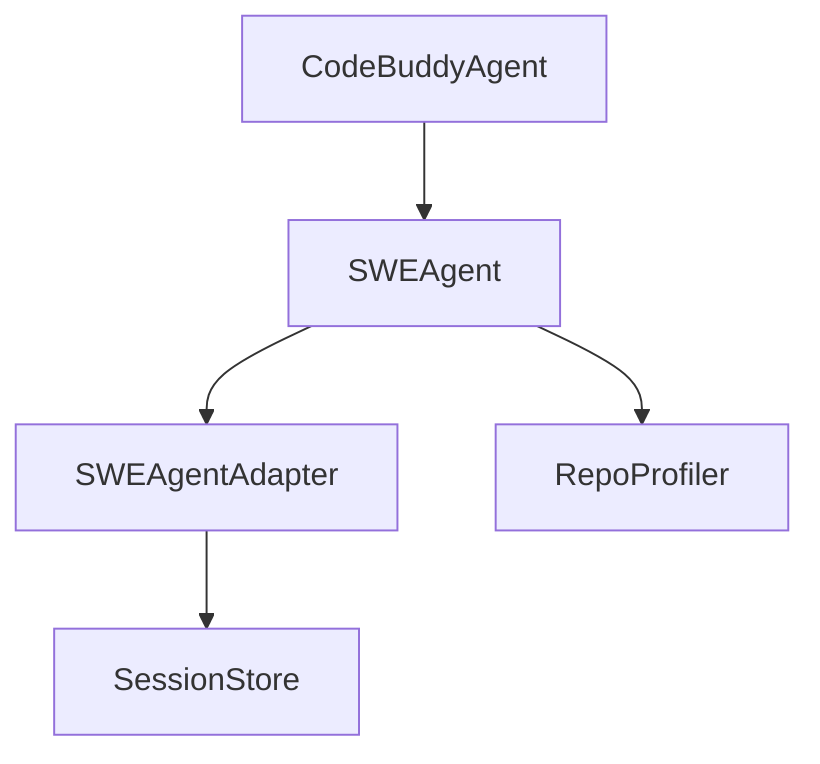

# Subsystems (continued)

This section details the Software Engineering (SWE) agent subsystems, which are responsible for autonomous code modification and repository-level task execution. These modules are critical for developers building automated coding workflows or integrating specialized agentic behaviors into the core system.

## src/agent/specialized/swe-agent (2 modules)

The `swe-agent` module serves as the primary orchestration layer for complex software engineering tasks, delegating specific execution logic to the `swe-agent-adapter`. By decoupling the agent logic from the adapter, the system maintains a clean separation between high-level task planning and low-level environment interaction.

> **Key concept:** The SWE agent architecture utilizes a modular adapter pattern to isolate environment-specific logic, allowing the core agent to remain agnostic of the underlying OS or shell configuration.

Once the agent has established the task parameters, it relies on the adapter to translate these requirements into actionable commands.

- **src/agent/specialized/swe-agent** (rank: 0.004, 8 functions)
- **src/agent/specialized/swe-agent-adapter** (rank: 0.002, 7 functions)

The `swe-agent-adapter` acts as the bridge between the agent's decision-making process and the underlying system utilities. It ensures that commands are formatted correctly for the host environment, utilizing shared resources like `SessionStore.saveSession` to maintain state across long-running operations and `RepoProfiler.getProfile` to understand the codebase context before execution.

---

**See also:** [Architecture](./2-architecture.md) · [Subsystems](./3-subsystems.md)

--- END ---