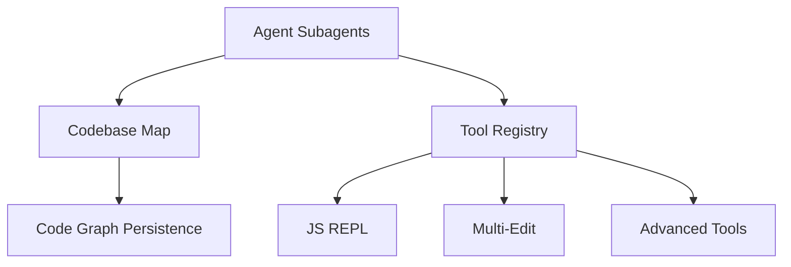

# Subsystems (continued)

This section details the secondary subsystems within the `src` directory, focusing on specialized agent orchestration, codebase mapping, and advanced tool execution. Developers should review these modules when implementing new agent behaviors, modifying the persistence layer for code graphs, or extending the tool registry.

## src (6 modules)

The following modules represent the specialized components of the system, handling everything from sub-agent lifecycle management to advanced tool execution environments.

- **src/agent/subagents** (rank: 0.002, 20 functions)
- **src/context/codebase-map** (rank: 0.002, 12 functions)
- **src/knowledge/code-graph-persistence** (rank: 0.002, 3 functions)
- **src/tools/js-repl** (rank: 0.002, 12 functions)
- **src/tools/multi-edit** (rank: 0.002, 4 functions)
- **src/tools/registry/advanced-tools** (rank: 0.002, 33 functions)

### Agent Orchestration and Context

The `src/agent/subagents` module facilitates the delegation of complex tasks to specialized agents, allowing the primary agent to maintain focus on high-level orchestration. This modular approach ensures that specific capabilities, such as deep analysis or specialized coding tasks, remain isolated from the core agent logic.

> **Key concept:** The tool registry architecture separates core tool logic from advanced implementations, allowing for modular updates to `src/tools/registry/advanced-tools` without requiring a full system rebuild.

After establishing the orchestration layer, the system relies on robust context management to maintain state across sessions. The `src/context/codebase-map` module builds the structural representation of the codebase, while `src/knowledge/code-graph-persistence` ensures that this map survives session restarts, providing a consistent view of the project architecture.

### Tool Execution Environments

The tool ecosystem is extended by the remaining modules, which provide specialized execution environments and batch processing capabilities. `src/tools/js-repl` provides an isolated environment for dynamic code execution, while `src/tools/multi-edit` handles batch file modifications, ensuring atomic updates across multiple files. These tools are registered and managed through the advanced tools registry, which handles the complex tool definitions required for sophisticated agent interactions.

---

**See also:** [Architecture](./2-architecture.md) · [Subsystems](./3-subsystems.md) · [Tool System](./5-tools.md) · [Context & Memory](./7-context-memory.md)

--- END ---