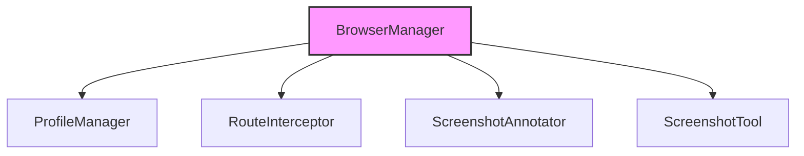

# Subsystems (continued)

The `src/browser-automation` subsystem provides the infrastructure required for headless browser orchestration, enabling the agent to interact with web interfaces, intercept network traffic, and capture visual state. This subsystem is critical for tasks requiring real-time web navigation and visual debugging, and should be reviewed by developers working on agent-environment interaction or UI-based tool execution.

## src/browser-automation (4 modules)

The browser automation suite is designed to encapsulate complex browser lifecycle management, ensuring that stateful interactions—such as authentication cookies or session storage—are handled consistently across different agent runs.

> **Key concept:** Browser automation modules are decoupled from the core agent logic to ensure that browser crashes or resource-intensive rendering tasks do not destabilize the primary execution environment.

- **src/browser-automation/profile-manager** (rank: 0.003, 4 functions)
- **src/browser-automation/route-interceptor** (rank: 0.003, 4 functions)
- **src/browser-automation/screenshot-annotator** (rank: 0.003, 1 functions)
- **src/browser-automation/browser-manager** (rank: 0.002, 70 functions)

The `browser-manager` acts as the primary orchestrator for these components. When visual feedback is required, the system integrates with the `ScreenshotTool` to generate visual artifacts. For instance, the `ScreenshotTool.capture` method is frequently invoked by the automation layer to provide the agent with a visual representation of the current browser state, which is then processed by the annotator.

Beyond the browser automation layer, the system relies on robust session persistence to maintain continuity between automation tasks.

---

**See also:** [Subsystems](./3-subsystems.md)

--- END ---