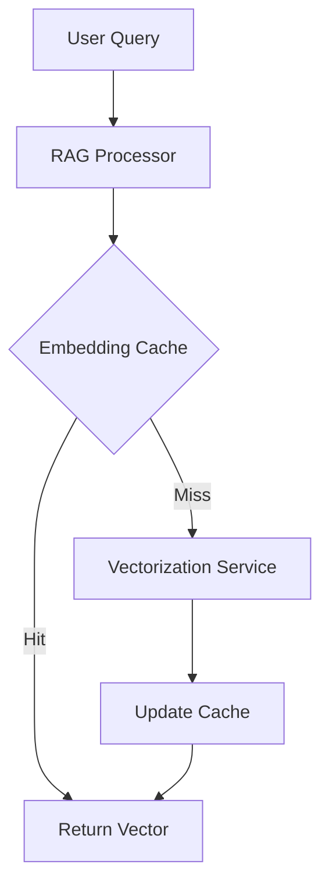

# Subsystems (continued)

This section details the core subsystems responsible for embedding management and codebase retrieval-augmented generation (RAG). These modules are critical for maintaining low-latency context access and ensuring the agent operates on accurate, vectorized representations of the codebase.

## src (2 modules)

The following modules manage the lifecycle of vector data and the retrieval logic necessary for the agent to understand codebase structure.

- **src/cache/embedding-cache** (rank: 0.004, 23 functions)
- **src/context/codebase-rag/embeddings** (rank: 0.002, 31 functions)

> **Key concept:** The embedding cache layer acts as a primary performance gate, reducing redundant vectorization operations by storing previously computed embeddings. This architecture significantly lowers API costs and latency for codebase-wide queries by ensuring that only new or modified code segments require re-vectorization.

While the embedding cache optimizes retrieval speed, the RAG subsystem manages the actual vectorization logic and semantic search parameters required for effective context injection. Developers working on these modules should ensure that cache invalidation logic remains synchronized with the RAG retrieval thresholds to prevent stale context injection.

---

**See also:** [Subsystems](./3-subsystems.md) · [Context & Memory](./7-context-memory.md)