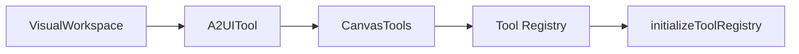

# Subsystems (continued)

The canvas subsystem provides the necessary infrastructure for rendering interactive UI elements within the agent's workspace. By abstracting the visual layer, these modules allow the system to present complex data structures and tool outputs in a human-readable format, bridging the gap between raw tool execution and user interaction.

The integration of these modules relies on the broader tool registry system. When the system needs to register new visual capabilities, it leverages `initializeToolRegistry` to ensure that canvas-specific tools are correctly exposed to the agent's execution environment. This ensures that visual components are discoverable and executable by the core agent logic.

## src (3 modules)

- **src/canvas/a2ui-tool** (rank: 0.003, 22 functions)
- **src/canvas/visual-workspace** (rank: 0.003, 20 functions)
- **src/tools/registry/canvas-tools** (rank: 0.002, 14 functions)

These modules work in tandem to maintain the state of the visual workspace, ensuring that UI components remain synchronized with the underlying agent state. By separating the workspace management from the tool definitions, the architecture allows for modular updates to the UI without requiring changes to the core tool execution logic.

> **Key concept:** The canvas subsystem decouples the visual representation layer from the underlying tool execution logic, allowing the agent to render complex UI components without tightly coupling to specific frontend frameworks.

---

**See also:** [Subsystems](./3-subsystems.md) · [Tool System](./5-tools.md)