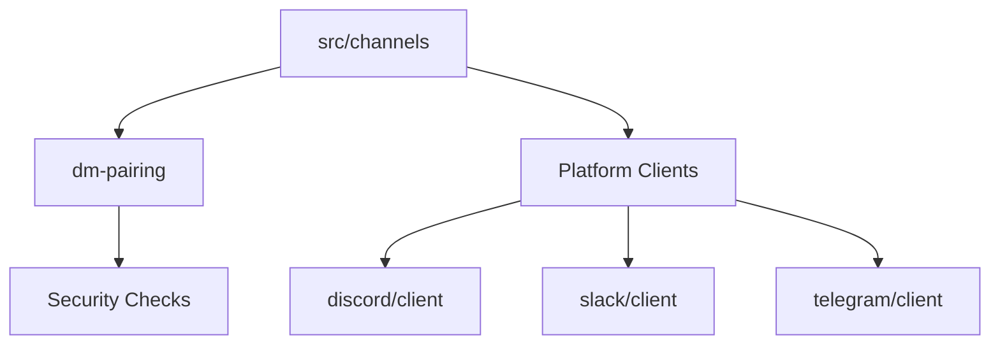

# Subsystems (continued)

The `src/channels` subsystem acts as the unified interface for all external communication platforms, abstracting platform-specific protocols into a consistent internal messaging format. Developers working on multi-channel support or adding new messaging integrations should focus on these modules to ensure consistent event handling, security compliance, and message routing.

## src/channels/dm-pairing

The `src/channels/dm-pairing` module is critical for maintaining secure communication channels. It handles the verification logic required before the agent processes messages from a specific sender, ensuring that only authorized users can trigger agent actions.

> **Key concept:** The `DMPairingManager` acts as an authorization layer, preventing unauthorized command execution by enforcing strict sender verification before any message processing occurs.

The module provides a robust API for managing trust relationships. Developers should utilize `DMPairingManager.checkSender()` to validate identity, and `DMPairingManager.approve()` or `DMPairingManager.revoke()` to manage the lifecycle of a trusted connection. The system uses `DMPairingManager.requiresPairing()` to determine if a specific channel interaction necessitates a handshake, while `DMPairingManager.isBlocked()` and `DMPairingManager.isApproved()` provide quick status checks for the current session.

While the pairing module secures the connection, the remaining modules in the `src/channels` directory provide the concrete implementations for specific messaging platforms, each handling unique API requirements and event streams.

## src/channels (10 modules)

- **src/channels/dm-pairing** (rank: 0.019, 19 functions)
- **src/channels/google-chat/index** (rank: 0.002, 16 functions)
- **src/channels/matrix/index** (rank: 0.002, 23 functions)
- **src/channels/signal/index** (rank: 0.002, 19 functions)
- **src/channels/teams/index** (rank: 0.002, 18 functions)
- **src/channels/webchat/index** (rank: 0.002, 21 functions)
- **src/channels/whatsapp/index** (rank: 0.002, 20 functions)
- **src/channels/discord/client** (rank: 0.002, 35 functions)
- **src/channels/slack/client** (rank: 0.002, 31 functions)
- **src/channels/telegram/client** (rank: 0.002, 37 functions)

---

**See also:** [Subsystems](./3-subsystems.md)

--- END ---