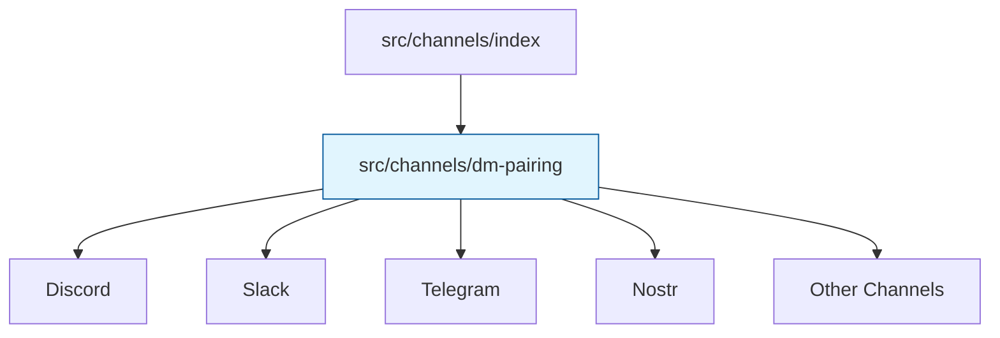

# Subsystems (continued)

This section details the communication channel modules within the `src` directory, which facilitate multi-platform connectivity for the agent. These modules are critical for developers extending the system's reach to new messaging platforms or maintaining existing integrations, as they define how the agent interacts with external APIs.

> **Key concept:** The `src/channels/dm-pairing` module acts as the gatekeeper for direct messaging, utilizing `DMPairingManager.requiresPairing()` to validate communication attempts before routing them to the specific channel implementation. This ensures that only authorized senders can trigger agent actions.

The architecture relies on a centralized pairing mechanism to manage trust and authorization across these channels. Before a message is processed by a specific channel module, the system invokes `DMPairingManager.checkSender()` to verify identity. If authorization is missing, `DMPairingManager.approve()` or `DMPairingManager.approveDirectly()` may be triggered to establish the necessary trust relationship, while `DMPairingManager.isBlocked()` ensures that revoked or malicious senders are immediately rejected.

The following modules implement the specific protocol adapters required to interface with external messaging services. Each module adheres to a standardized interface to ensure consistent behavior across different communication backends.

## src (11 modules)

- **src/channels/discord/index** (rank: 0.002, 0 functions)
- **src/channels/imessage/index** (rank: 0.002, 20 functions)
- **src/channels/line/index** (rank: 0.002, 11 functions)
- **src/channels/mattermost/index** (rank: 0.002, 10 functions)
- **src/channels/nextcloud-talk/index** (rank: 0.002, 11 functions)
- **src/channels/nostr/index** (rank: 0.002, 20 functions)
- **src/channels/slack/index** (rank: 0.002, 0 functions)
- **src/channels/telegram/index** (rank: 0.002, 0 functions)
- **src/channels/twilio-voice/index** (rank: 0.002, 12 functions)
- **src/channels/zalo/index** (rank: 0.002, 10 functions)
- ... and 1 more

These channel implementations are orchestrated by the core index, which manages the lifecycle of each connection. When a session is terminated or a user is removed, the system calls `DMPairingManager.revoke()` to clean up associated permissions and state.

---

**See also:** [Subsystems](./3-subsystems.md)

--- END ---