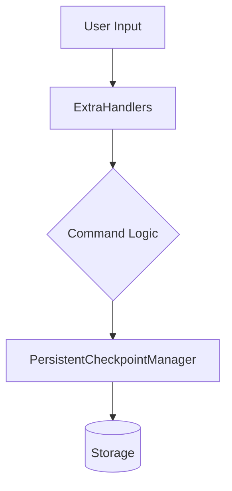

# Subsystems (continued)

This section details the remaining core subsystems within the `src` directory, focusing on state persistence and command execution logic. Developers working on session management or command-line interface extensions should review these modules to understand how state is preserved and how custom handlers are integrated into the system.

## src (2 modules)

### src/checkpoints/persistent-checkpoint-manager

The `persistent-checkpoint-manager` module is responsible for maintaining state integrity across application restarts. It ensures that long-running processes can resume from the last known good state, minimizing data loss during unexpected interruptions.

> **Key concept:** The `persistent-checkpoint-manager` utilizes a rank-based priority system to determine which state snapshots are critical for recovery, ensuring that high-importance data is prioritized during write operations.

Beyond state persistence, the system relies on flexible command handlers to process user-initiated actions and system events.

### src/commands/handlers/extra-handlers

The `extra-handlers` module provides an extensible framework for processing specialized commands that fall outside the scope of standard operations. This modular approach allows for the dynamic registration of new command logic without modifying the core command dispatcher.

- **src/checkpoints/persistent-checkpoint-manager** (rank: 0.004, 30 functions)
- **src/commands/handlers/extra-handlers** (rank: 0.002, 12 functions)

---

**See also:** [Subsystems](./3-subsystems.md) · [API Reference](./9-api-reference.md)