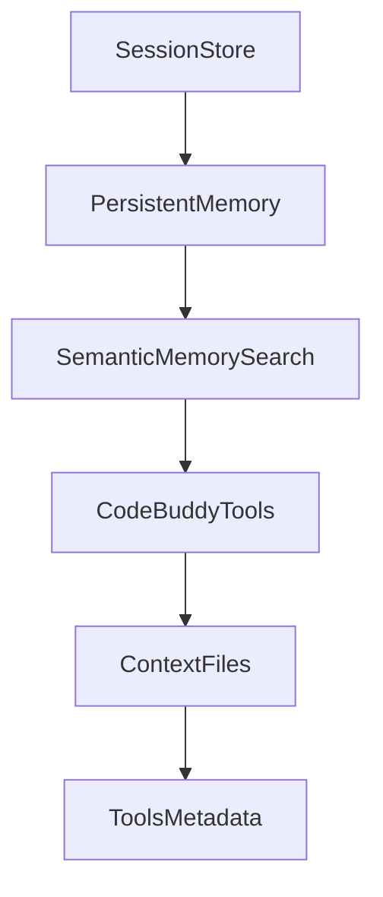

# Subsystems (continued)

This section continues the architectural overview of the `src` directory, detailing critical subsystems responsible for persistence, tool orchestration, and memory management. These modules form the backbone of the application's state and interaction layer, and are essential for developers implementing new features or debugging session-related issues.

The following list outlines the remaining modules, ranked by their architectural importance and functional density within the codebase. Understanding these components is vital for maintaining the integrity of the session lifecycle and ensuring that tool integrations remain compatible with the core agent architecture.

- **src/persistence/session-store** (rank: 0.008, 44 functions)
- **src/codebuddy/tools** (rank: 0.006, 12 functions)
- **src/memory/persistent-memory** (rank: 0.004, 19 functions)
- **src/memory/semantic-memory-search** (rank: 0.003, 22 functions)
- **src/tools/web-search** (rank: 0.003, 28 functions)
- **src/tools/metadata** (rank: 0.003, 0 functions)
- **src/context/context-files** (rank: 0.003, 6 functions)
- **src/tools/tools-md-generator** (rank: 0.002, 6 functions)
- **src/cli/session-commands** (rank: 0.002, 3 functions)
- **src/mcp/mcp-memory-tools** (rank: 0.002, 1 functions)
- ... and 3 more

> **Key concept:** The `SessionStore` module is critical for maintaining state. Developers should utilize `SessionStore.saveSession()` and `SessionStore.loadSession()` to handle data persistence, while `initializeToolRegistry()` and `getMCPManager()` manage the lifecycle of external tool integrations.

These modules collectively ensure that the application can effectively manage long-term memory and dynamic tool execution. Developers modifying these areas should verify that changes do not disrupt the `SessionStore` state machine or the tool registration process.

---

**See also:** [Subsystems](./3-subsystems.md) · [Tool System](./5-tools.md) · [Context & Memory](./7-context-memory.md) · [API Reference](./9-api-reference.md)

--- END ---