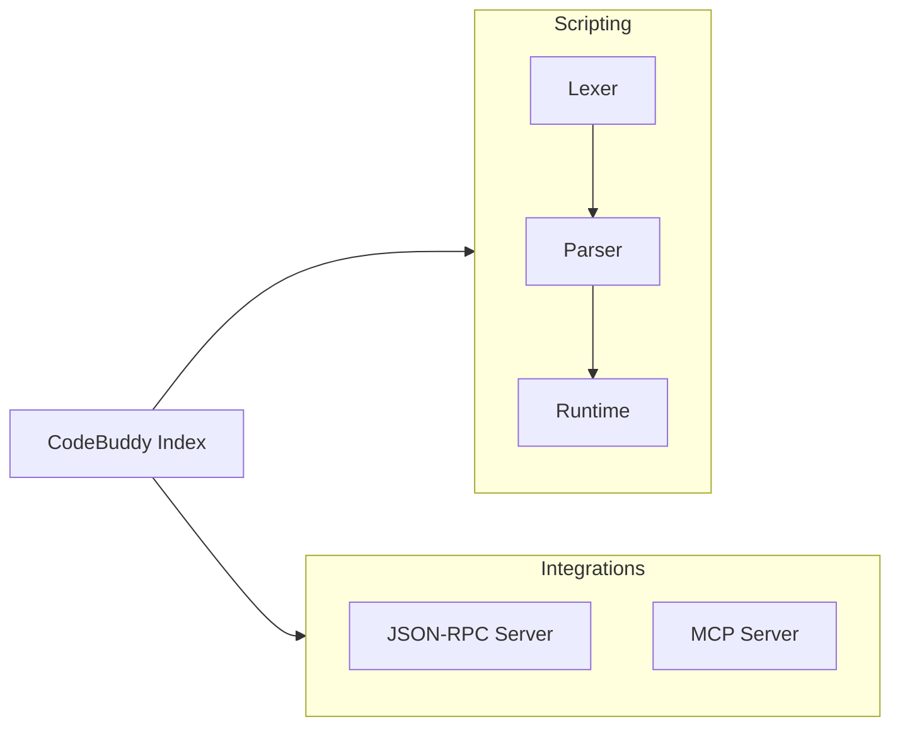

# Subsystems (continued)

This section details the foundational modules within the `src` directory, focusing on the scripting engine and external integration interfaces. Developers working on language extensions, RPC communication, or MCP server implementations should review these modules to understand the underlying execution and connectivity architecture.

The scripting subsystem is responsible for the lifecycle of custom logic, transforming raw input into executable operations. This process is segmented into lexical analysis, syntactic parsing, and runtime execution to ensure robust error handling and performance.

## src (7 modules)

- **src/codebuddy/index** (rank: 0.003, 0 functions)
- **src/scripting/index** (rank: 0.003, 16 functions)
- **src/scripting/lexer** (rank: 0.003, 23 functions)
- **src/scripting/parser** (rank: 0.003, 12 functions)
- **src/scripting/runtime** (rank: 0.003, 37 functions)
- **src/integrations/json-rpc/server** (rank: 0.002, 26 functions)
- **src/integrations/mcp/mcp-server** (rank: 0.002, 26 functions)

Complementing the scripting engine, the integration modules provide the necessary interfaces for external communication. These modules facilitate the bridge between the local environment and external toolsets, ensuring that remote procedure calls and Model Context Protocol (MCP) requests are handled consistently.

> **Key concept:** The scripting pipeline follows a strict unidirectional flow: `Lexer` tokenizes input, `Parser` constructs the Abstract Syntax Tree (AST), and `Runtime` executes the logic. This separation ensures that syntax errors are caught before execution begins.

When configuring the MCP server, the system utilizes `initializeMCPServers` to register external capabilities, which are then mapped to the internal tool registry. This allows the `mcp-server` to expose local functionality to external clients seamlessly.

---

**See also:** [Subsystems](./3-subsystems.md)