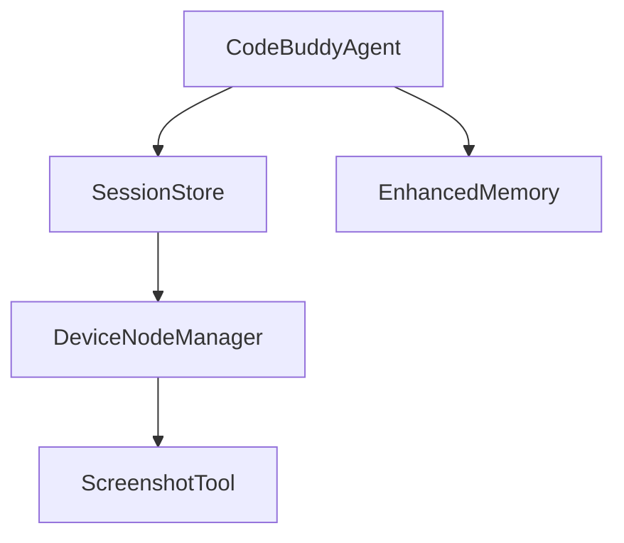

# Subsystems (continued)

The `src` directory serves as the primary repository for the application's core logic, encompassing everything from CLI command definitions to workflow pipeline orchestration. This modular structure ensures that specific functionalities, such as session management or device pairing, remain decoupled and maintainable, allowing developers to isolate and test individual components without impacting the broader system.

The architecture relies on a highly granular distribution of responsibilities, where each module is responsible for a specific domain of the application lifecycle. By separating concerns into distinct modules, the system facilitates easier debugging and more predictable state management across the agent's execution environment.

> **Key concept:** The modular architecture allows for the independent scaling of agent capabilities, such as `EnhancedMemory.loadMemories()` and `DeviceNodeManager.pairDevice()`, without requiring a full system rebuild or complex dependency resolution.

The following list details the remaining modules within the `src` directory, which house the primary business logic, command-line interfaces, and workflow orchestration layers. Developers should consult this list when navigating the codebase to identify the appropriate module for implementing new features or debugging existing system behaviors.

## src (28 modules)

- **src/nodes/index** (rank: 0.004, 19 functions)
- **src/utils/session-enhancements** (rank: 0.004, 22 functions)
- **src/workflows/index** (rank: 0.003, 0 functions)
- **src/workflows/pipeline** (rank: 0.003, 24 functions)
- **src/commands/cli/approvals-command** (rank: 0.002, 9 functions)
- **src/commands/cli/device-commands** (rank: 0.002, 1 functions)
- **src/commands/cli/node-commands** (rank: 0.002, 1 functions)
- **src/commands/cli/secrets-command** (rank: 0.002, 7 functions)
- **src/commands/execpolicy** (rank: 0.002, 1 functions)
- **src/commands/knowledge** (rank: 0.002, 1 functions)
- ... and 18 more

These modules are frequently accessed by the core agent logic to maintain session integrity and execute user-defined workflows. For instance, when a user initiates a command, the system leverages these modules to ensure that `SessionStore.createSession()` is called correctly before any workflow execution begins.

---

**See also:** [Architecture](./2-architecture.md) · [Subsystems](./3-subsystems.md) · [API Reference](./9-api-reference.md)

---