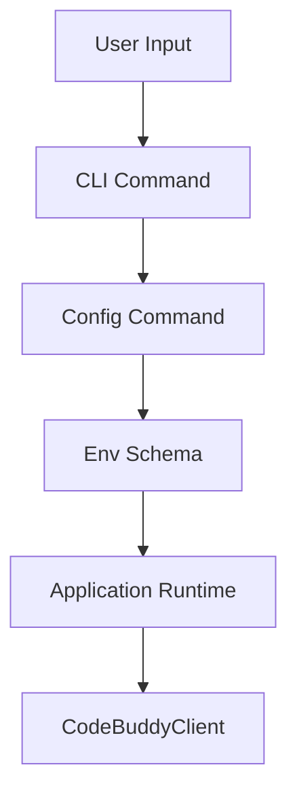

# Subsystems (continued)

This section details the remaining subsystems within the `src` directory, specifically focusing on environment configuration schemas and CLI command handling. These modules are critical for bootstrapping the application environment and ensuring user-defined configurations are correctly parsed and applied during runtime.

## src (2 modules)

### src/config/env-schema
This module defines the structural requirements for environment variables. It acts as the single source of truth for validation, ensuring that the application receives the expected configuration parameters before initialization. By enforcing these constraints, the system ensures that downstream components, such as `CodeBuddyClient.validateModel`, operate with verified and consistent environment data.

> **Key concept:** The `env-schema` module acts as a gatekeeper for application startup. By validating environment variables against a strict schema, it prevents runtime failures caused by missing or malformed configuration keys.

### src/commands/cli/config-command
Once the environment schema is validated and the configuration is loaded, the system delegates execution to specific command handlers. This module encapsulates the logic for CLI-based configuration management, providing the interface for users to inspect, modify, or reset application settings directly from the terminal.

- **src/config/env-schema** (rank: 0.004, 4 functions)
- **src/commands/cli/config-command** (rank: 0.002, 1 functions)

---

**See also:** [Subsystems](./3-subsystems.md) · [Configuration](./8-configuration.md) · [API Reference](./9-api-reference.md)