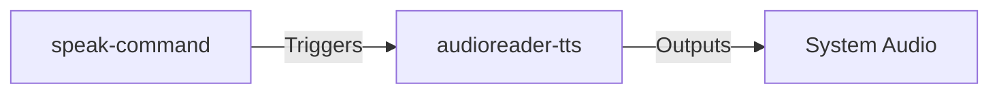

# Subsystems (continued)

This section details the specialized subsystems within the `src` directory responsible for voice-enabled interactions and command-line interface (CLI) speech synthesis. These modules are critical for accessibility and hands-free operation, bridging the gap between system output and user auditory feedback.

## src (2 modules)

### src/talk-mode/providers/audioreader-tts

This module serves as the primary provider for text-to-speech (TTS) operations within the application's talk mode. It abstracts the underlying audio synthesis engine, allowing the system to convert textual responses into audible speech streams while maintaining compatibility across different host environments.

> **Key concept:** The decoupling of the `speak-command` from the `audioreader-tts` provider allows for modular swapping of speech engines without modifying the CLI command logic, facilitating support for different operating system audio drivers.

### src/commands/cli/speak-command

Once the audio provider is initialized and configured, the system exposes this functionality to the user via specific command-line interfaces. The `speak-command` module implements the CLI interface for triggering speech synthesis directly from the terminal, acting as a wrapper that invokes the `audioreader-tts` provider to ensure command outputs are read aloud.

- **src/talk-mode/providers/audioreader-tts** (rank: 0.004, 7 functions)
- **src/commands/cli/speak-command** (rank: 0.002, 1 functions)

---

**See also:** [Subsystems](./3-subsystems.md) · [API Reference](./9-api-reference.md)

--- END ---