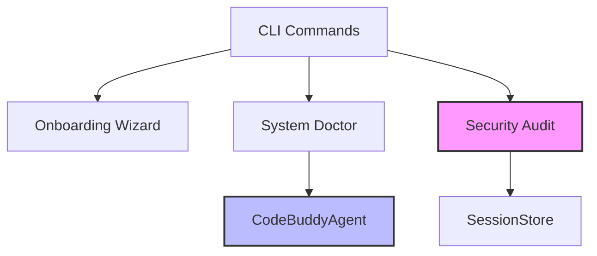

# Subsystems (continued)

This section details the auxiliary subsystems within the `src` directory, focusing on diagnostic, security, and user-facing utilities. These modules provide the foundational support required for system health monitoring, audit logging, and CLI interaction, ensuring the environment remains stable and secure during operation.

The diagnostic and security modules serve as the first line of defense for system integrity. The `src/doctor/index` module provides diagnostic capabilities to verify environment health, while `src/security/security-audit` implements compliance checks. These modules often interface with `SessionStore.loadSession` to validate that current session states align with established security policies before allowing further execution.

## src (4 modules)

- **src/doctor/index** (rank: 0.003, 9 functions)
- **src/security/security-audit** (rank: 0.003, 18 functions)
- **src/wizard/onboarding** (rank: 0.003, 4 functions)
- **src/commands/cli/utility-commands** (rank: 0.002, 1 functions)

> **Key concept:** The modular architecture separates diagnostic and administrative tasks from core agent logic, allowing for independent updates to security protocols and CLI utilities without impacting the primary execution flow.

The user-facing components, specifically `src/wizard/onboarding` and `src/commands/cli/utility-commands`, manage the initial configuration and operational interface. The onboarding wizard frequently invokes `CodeBuddyAgent.initializeAgentSystemPrompt` to provision the environment, ensuring that new users are correctly configured before interacting with the CLI utilities.

These modules operate alongside core persistence and agent logic, ensuring that state management remains consistent across all operational modes.

---

**See also:** [Subsystems](./3-subsystems.md) · [Security](./6-security.md) · [API Reference](./9-api-reference.md)

--- END ---